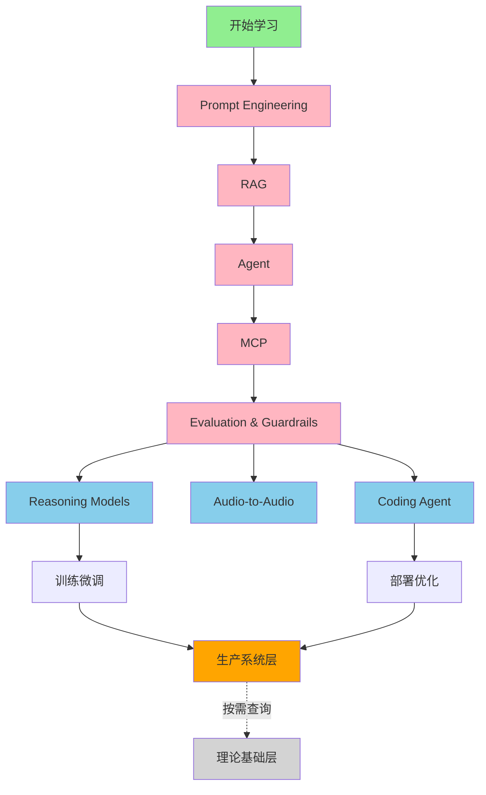

---
cssclasses:
  - ai
  - 知识图谱
  - 指南
tags:
  - ai学习
  - 知识图谱
  - AI
  - 路线图
title: AI 全栈技术知识图谱 (2025-2026)
date: 2025-12-09
authors:
  - wqz
description: 覆盖600+技术点的AI学习路线图,按优先级划分为P0必须掌握/P1需要理解/P2了解即可,包含Prompt工程/RAG/Agent/推理模型等20个模块
collection: ai
slug: ai-knowledge-graph
collection_order: 0
---

# **AI 全栈技术知识图谱 - 最终版**

---

## **📍 开篇：这份图谱的边界**

### **这是什么**

一张 **AI 工程认知地图**，不是程序员技能树。

### **这不是什么**

- ❌ 不是 Web 开发教程
- ❌ 不是后端工程入门
- ❌ 不是机器学习论文综述
- ❌ 不是深度学习数学推导

### **默认前置条件**

本专栏默认读者已具备：

- 基本编程能力（Python/JavaScript）
- HTTP/API 调用基础
- JSON/数据结构理解
- Git/命令行操作

**如果这些你还不会，先去补，不在本专栏展开。**

### **为什么要有这份图谱**

因为 AI 工程现在最大的问题不是"没资料"，而是：

- 信息碎片化（Medium/Twitter/YouTube 一地鸡毛）
- 优先级混乱（不知道先学什么）
- 焦虑感爆棚（总觉得自己漏了什么）

这份图谱的作用：

1. **建立坐标系** - 知道每个技术在哪一层
2. **明确优先级** - 🔥⭐📚 清晰标记
3. **提供路径** - 从入门到落地的完整轨迹

---

## **🗺️ AI 技术的四层建筑**

```
┌─────────────────────────────────────────┐
│ 第四层：应用层                           │
│ "我要用 AI 做什么"                       │
│ Prompt / RAG / Agent / MCP              │
├─────────────────────────────────────────┤
│ 第三层：能力层                           │
│ "AI 现在能做什么"                        │
│ Reasoning / Multimodal / Audio / Long   │
├─────────────────────────────────────────┤
│ 第二层：实现层                           │
│ "AI 怎么做到的"（工程上会用到的）        │
│ 训练 / 微调 / 优化 / 部署                │
├─────────────────────────────────────────┤
│ 第一层：理论层                           │
│ "为什么能做到"（按需查询，不用现在学）   │
│ ML / DL / Transformer / Tokenization    │
└─────────────────────────────────────────┘

┌─────────────────────────────────────────┐
│ 第零层：生产系统层（横切关注点）         │
│ "AI 项目最容易翻车的地方"                │
│ 成本 / 安全 / 监控 / 评估                │
└─────────────────────────────────────────┘
```

---

## **第一层：理论基础层（✅ 已完成）**

> **⚠️ 冷静声明**：
>
> 99% 的 AI 应用工程问题，不是因为你不懂反向传播，而是因为：
>
> - RAG 没设计好
> - Prompt 不稳定
> - 评估没体系
> - 成本和延迟失控
>
> **这一层不用现在学，需要时再查。**

### **1.1 机器学习基础**

- 监督/无监督/强化学习（知道区别即可）
- 梯度下降/优化器（知道是"调参数"的算法）
- 损失函数（知道是"衡量错误"的指标）

### **1.2 深度学习原理**

- 神经网络/反向传播（知道"训练循环"的概念）
- 激活函数/归一化（知道是"网络组件"）
- 残差连接/Dropout（知道是"稳定训练"的技巧）

### **1.3 CNN 卷积神经网络（👀 视觉基础）**

- 卷积核/Padding/Stride（知道是"提取特征的滤镜"）
- Pooling 池化（知道是"降维"）
- 历史地位（知道为什么被 Vision Transformer 挑战）

### **1.4 Transformer 详解**

- Self-Attention 机制（知道是"关注重点"的机制）
- Q/K/V 矩阵（知道是注意力的内部实现）
- 多头注意力（知道是"并行处理"）
- 位置编码（知道是"记住顺序"的方法）

### **1.5 Tokenization**

- BPE/WordPiece/SentencePiece（知道是"切词"的算法）
- Vocabulary 构建（知道 Token 怎么来的）
- Vocabulary 构建（知道 Token 怎么来的）
- Token 长度影响（知道为什么 API 按 Token 计费）

### **1.6 Embedding (🗺️ 语义坐标)**

- 向量空间（知道意义就是坐标）
- 余弦相似度（知道怎么算相关性）
- 语义运算（King - Man + Woman = Queen）

**🔗 何时需要深入这一层**：

- 做模型研究
- 读论文
- 面试答题
- 纯粹好奇

---

## **第二层：实现层（🚧 进行中）**

> **定位**：工程上真的会用到的模型训练与部署技巧

### **[2.1 模型训练与微调](/blog/model-training-finetuning)** 🔥

```
场景：通用模型不够用，需要定制
决策树：Prompt 够用吗？→ 不够 → 微调
```

**技术清单**：

- 🔥 **Fine-tuning vs Prompt** - 决策边界
- 🔥 **LoRA/QLoRA** - 低成本微调（只训练 1% 参数）
- 🔥 **Instruction Tuning** - 指令微调
- 🔥 **RLHF vs DPO** - 对齐技术（DPO 更简单）
- 🔥 **Synthetic Data** - 用 GPT-4 生成训练数据
- ⭐ Full Fine-tuning - 全量微调
- ⭐ Distillation - 用大模型教小模型
- ⭐ Reward Modeling - 奖励模型训练
- 📚 PPO - RLHF 用的算法（不用深究）
- 📚 Self-Instruct/Evol-Instruct - 数据增强方法

---

### **[2.2 模型优化与部署](/blog/optimization-deployment)** 🔥

```
场景：模型太大/太慢/太贵
目标：压缩/加速/降本
```

**技术清单**：

- 🔥 **Quantization (INT4/INT8)** - 量化（模型体积缩小 4-8 倍）
- 🔥 **GGUF** - 量化格式标准
- 🔥 **vLLM** - 生产推理引擎（比 HuggingFace 快 10 倍）
- 🔥 **llama.cpp** - CPU/Mac 推理
- 🔥 **Ollama** - 本地运行最简单工具
- ⭐ KV Cache - 解码加速原理
- ⭐ Continuous Batching - 动态批处理（vLLM 核心）
- ⭐ GPTQ/AWQ - 量化算法
- ⭐ TensorRT-LLM - NVIDIA 推理优化
- 📚 Flash Attention - 注意力加速（知道能加速即可）
- 📚 Speculative Decoding - 推测解码

---

### **2.3 Model Merging - 模型融合** 🔥

```
场景：开源社区黑科技，平民玩家捷径
核心：不用训练，直接"拼接"模型能力
```

**技术清单**：

- 🔥 **MergeKit** - 融合工具
- 🔥 **Frankenmerging** - 暴力拼接不同模型
- 🔥 **SLERP** - 球面插值（平滑融合）
- 🔥 **Task Arithmetic** - 任务向量加减
- ⭐ DARE - 稀疏融合技术
- ⭐ TIES - 处理权重冲突
- 📚 融合原理 - 权重空间线性性（不用深究）

**为什么重要**：很多 HuggingFace 榜单前列的模型是"缝合怪"

---

### **2.4 模型架构演进** ⭐

```
场景：理解不同架构的优劣
核心：Transformer 还是主流，但有新挑战者
```

**技术清单**：

- 🔥 **Transformer** - 主流架构
- 🔥 **Mixture of Experts (MoE)** - Mixtral/DeepSeek-MoE
- ⭐ Mamba/SSM - 挑战者（状态空间模型）
- ⭐ Multi-Head Attention - 多头注意力
- ⭐ RoPE - 旋转位置编码
- ⭐ Flash Attention - 高效实现
- 📚 RWKV/RetNet - 线性复杂度架构
- 📚 Sparse Attention - 稀疏注意力

**你需要知道的**：

- Transformer 为什么是主流
- MoE 为什么能做大（稀疏激活）
- 长上下文的技术瓶颈在哪

---

## **第三层：能力层（⚡ 2025-2026 热点）**

> **⚠️ 理智刹车片**：
>
> 能力层用于判断模型边界和趋势，**不代表每个项目都应强行引入**。
>
> 例如：
>
> - 不是每个应用都需要 Reasoning Models
> - 不是每个场景都要上 Audio-to-Audio
> - Long Context 不是万能药（成本高/延迟大）

### **3.1 Reasoning Models - 推理能力突破** 🔥🔥🔥

```
为什么重要：2025 最大突破，AI 能"深度思考"了
代表产品：o1 / DeepSeek-R1
核心价值：数学/代码/复杂推理任务准确率大幅提升
```

**技术清单**：

- 🔥 **Test-time Compute** - 推理时花更多算力换更好结果
- 🔥 **Process Reward Model (PRM)** - 奖励每一步推理过程
- 🔥 **RLAIF** - AI 自我验证（DeepSeek-R1 关键）
- 🔥 **DeepSeek-R1** - 推理模型界的"Llama"（开源里程碑）
- 🔥 **Reasoning Distillation** - 把推理能力蒸馏到 7B 小模型
- ⭐ o1/o1-mini/o3 - OpenAI 推理模型
- ⭐ Process vs Outcome Supervision - 两种奖励方式
- ⭐ STaR - 自我学习推理
- 📚 MCTS - 蒙特卡洛树搜索

**🔗 和应用层的关系**：

- Prompt 层面 → 用 CoT 触发推理
- Agent 层面 → 用推理模型做规划

**⚠️ 使用建议**：

- ✅ 适用：复杂推理、数学证明、代码调试
- ❌ 不适用：简单问答、实时对话（太慢太贵）

---

### **3.2 Audio-to-Audio - 原生语音交互** 🔥

```
为什么重要：真正的语音对话（不经过文字）
代表产品：GPT-4o Realtime / Gemini Live / MiniMax
核心价值：保留语气/情感/打断能力
```

**技术清单**：

- 🔥 **Token-in, Token-out** - 音频不转文字的原理
- 🔥 **Turn-taking** - 打断机制（自然对话的关键）
- 🔥 **GPT-4o Realtime API** - OpenAI 方案
- 🔥 **Gemini Live** - Google 方案
- 🔥 **MiniMax (海螺)** - 国内领先方案
- ⭐ Audio Tokens - 音频离散化表示
- ⭐ Latency 优化 - \<300ms 延迟要求
- 📚 Codec Models - 音频编解码器

**🔗 和应用层的关系**：

- 语音 Agent - 电话客服/语音助手
- 实时翻译 - 保留语气和情感

**⚠️ 使用建议**：

- ✅ 适用：客服、陪伴、教育
- ❌ 不适用：文本为主的场景（成本高）

---

### **3.3 Coding Agent - AI 编程革命** 🔥

```
为什么重要：IDE 深度集成，改变编程方式
代表产品：Cursor / Windsurf
核心价值：AI 能读整个项目，跨文件修改
```

**技术清单**：

- 🔥 **Cursor Composer** - 项目级修改
- 🔥 **Windsurf Cascade** - 深度 IDE 集成
- 🔥 **File Tree Understanding** - 读项目结构（依赖 MCP）
- 🔥 **Multi-file Editing** - 跨文件同步修改
- 🔥 **@-mentions** - 引用上下文的方式
- ⭐ Claude Code - 命令行 Coding Agent
- ⭐ Aider - 开源结对编程工具
- ⭐ HumanEval/MBPP - 代码能力评测
- 📚 AlphaCode - DeepMind 竞赛模型

**🔗 和应用层的关系**：

- MCP → 读取项目文件
- Agent → 规划修改步骤
- RAG → 检索代码库

---

### **3.4 Multimodal - 多模态能力** ⭐

```
现状：商业模型都支持图文了
核心：理解图片/生成图片/语音识别
```

**技术清单**：

- 🔥 **GPT-4V/Claude 3.5/Gemini 2.0** - 商业 VLM
- 🔥 **CLIP** - 图文联合表示（理解原理即可）
- 🔥 **Whisper** - 语音识别标准
- 🔥 **Stable Diffusion** - 开源图像生成
- 🔥 **ControlNet** - 精确控制生成
- ⭐ LLaVA - 开源视觉语言模型
- ⭐ DALL-E 3/Midjourney - 商业图像生成
- ⭐ LoRA for Diffusion - 低成本画风定制
- 📚 Diffusion 原理 - DDPM/DDIM（不用深究）

---

### **3.5 Long Context - 超长上下文** ⭐

```
现状：200K-1M tokens 成为标配
意义：不用 RAG 也能处理长文档
```

**技术清单**：

- 🔥 **Long Context (200K+)** - 能力边界
- 🔥 **Long Context vs RAG** - 何时用哪个
- ⭐ RoPE - 旋转位置编码（支持长上下文的技术）
- ⭐ Context Extension - 扩展技术
- 📚 Position Interpolation - 位置插值

**⚠️ 使用建议**：

- ✅ 适用：单文档分析、合同审查
- ❌ 不适用：多文档检索（用 RAG）、成本敏感场景

---

## **第四层：应用层（🚀 从这里开始）**

> **定位**：我有 GPT/Claude 的 API，怎么让它干活？

### **4.1 Prompt Engineering - 控制 AI 输出** 🔥

```
为什么要学：API 调用的核心技能
核心技术：Few-Shot / CoT / Structured Output
学习路径：Few-Shot (30min) → CoT (45min) → 做一个 Demo
```

**技术清单**：

- 🔥 **Few-Shot Learning** - 给例子让 AI 学习（性价比最高）
- 🔥 **Chain of Thought (CoT)** - 让 AI 一步步推理
- 🔥 **Structured Output** - 强制 JSON/XML 输出（对接代码必备）
- 🔥 **System Prompt** - 设定全局规则
- 🔥 **Prompt Injection Defense** - 防御"忽略之前指令"攻击
- ⭐ Zero-Shot - 直接问，测试模型底线
- ⭐ Self-Consistency - 生成多次取多数答案
- ⭐ ReAct - 推理 + 行动循环（Agent 基础）
- ⭐ Meta-Prompting - 让 AI 帮你写 Prompt
- 📚 Tree of Thoughts - 复杂推理（多路径探索）
- 📚 DSPy - 自动优化 Prompt 框架

**🔗 下一步**：学完 Prompt → 学 RAG（处理私有数据）

---

### **4.2 RAG - 让 AI 读你的文档** 🔥

```
为什么要学：AI 不知道你公司的数据，RAG 解决这个问题
核心技术：Embeddings → 检索 → Reranking
学习路径：Embeddings 原理 (1h) → 跑通一个 Demo (2h)
```

**技术清单**：

- 🔥 **Embeddings** - 文本变向量
  - Cosine Similarity - 算相似度
  - Sentence-BERT / BGE / E5 - 嵌入模型选择
- 🔥 **Chunking** - 切分文档
  - Fixed-size - 固定长度
  - Semantic - 按语义切
  - Recursive - 递归切分（LangChain 默认）
- 🔥 **Vector Database** - 存向量
  - Chroma - 轻量本地
  - Pinecone - 托管云服务
  - Milvus - 大规模分布式
- 🔥 **Hybrid Search** - BM25 + Vector（避免专有名词检索失败）
- 🔥 **Reranking** - Cross-Encoder 精排（粗排 50 个，精排 5 个）
- ⭐ HyDE - 生成假答案再检索（提升召回）
- ⭐ Parent-Child Retrieval - 小块检索，大块返回
- ⭐ GraphRAG - 知识图谱增强
- 📚 HNSW/FAISS - 向量索引算法（数据库内部实现）
- 📚 Self-RAG/CRAG - 自适应检索策略

**🔗 下一步**：学完 RAG → 学 Agent（让 AI 主动做事）

---

### **4.3 Agent - 让 AI 主动干活** 🔥

```
为什么要学：不只是问答，让 AI 执行任务
核心技术：ReAct + Function Calling + Memory
学习路径：理解 ReAct 循环 (1h) → 写一个能调 API 的 Agent (3h)
```

**技术清单**：

- 🔥 **ReAct Pattern** - Reason → Act → Observe 循环
- 🔥 **Function Calling** - 调用外部 API
  - JSON Schema - 描述函数接口
  - Tool Selection - 选择合适的工具
- 🔥 **Memory Management** - 记忆管理
  - Short-term - 对话历史
  - Long-term - 向量数据库存储
  - Summary - 摘要压缩
- 🔥 **Human-in-the-Loop** - 敏感操作人工确认
- ⭐ Plan-and-Solve - 先规划再执行
- ⭐ Reflection - 自我检查和修正
- ⭐ Multi-Agent - 多 Agent 协作
- 📚 AutoGPT/BabyAGI - 早期框架（已过时）
- 📚 LangChain/LangGraph - 开发框架

**🔗 下一步**：学完 Agent → 学 MCP（统一数据接入）

---

### **4.4 MCP - 统一数据接入协议** 🔥

```
为什么要学：Agent 的"USB 协议"，统一连接数据源
核心概念：Server（数据源）+ Client（AI 应用）
学习路径：理解 MCP 架构 (1h) → 接入一个 MCP Server (2h)
```

**技术清单**：

- 🔥 **MCP 核心概念** - AI 时代的 USB 协议
- 🔥 **Resources** - 暴露数据（文件/数据库）
- 🔥 **Tools** - 暴露功能（搜索/创建/修改）
- 🔥 **Prompts** - 预定义交互模式
- ⭐ 常见 MCP Server - Google Drive/Slack/Notion/GitHub
- ⭐ 编写 MCP Server - Python/TypeScript 实现
- 📚 协议细节 - JSON-RPC 2.0

**应用场景**：

- Coding Agent 读项目（Cursor/Windsurf）
- 企业知识库接入
- Personal AI 连接个人数据

---

### **4.5 Evaluation & Guardrails - 评估与约束** 🔥

```
为什么要学：Prompt/RAG/Agent 设计阶段就该内嵌评估思维
核心思想：不是上线后才评估，而是开发时就验证
```

**技术清单**：

- 🔥 **LLM 输出约束**
  - Structured Output 校验
  - Schema Validation（JSON/XML 格式验证）
- 🔥 **Guardrails** - 规则 + 模型双重校验
  - Content Filtering（有害内容过滤）
  - PII Detection（隐私信息检测）
  - Hallucination Detection（幻觉检测）
- 🔥 **Prompt 版本管理**
  - Prompt Versioning
  - A/B Testing
- 🔥 **LLM-as-a-Judge** - 用 GPT-4 评测输出质量
- ⭐ Eval Datasets - 评测数据集构建
- ⭐ Human Eval - 人工评估流程

**🔗 和其他层的关系**：

- Prompt → 设计时就加约束
- RAG → 检索结果需要验证
- Agent → 每步行动都要校验

---

## **第零层：生产系统层（🚨 AI 项目最容易翻车的地方）**

> **这不是"最后才学的"，而是"横切关注点"。**
>
> 每一层都要考虑这些问题。

### **0.1 成本优化** 🔥

```
现实：API 成本可能占预算的 50%+
目标：不牺牲效果的前提下降本
```

**技术清单**：

- 🔥 **Semantic Caching** - 缓存相似问题答案（节省 30-50% 成本）
- 🔥 **Model Routing** - 简单问题用小模型
  - GPT-4o 处理复杂任务
  - GPT-4o-mini 处理简单任务
  - 规则判断 + LLM 兜底
- 🔥 **Prompt Caching** - 提示词缓存（Anthropic 支持）
- 🔥 **Token Budgeting** - Token 预算管理
- ⭐ Batching - 批量处理请求
- ⭐ Response Streaming - 流式返回（降低感知延迟）

**常见坑**：

- ❌ 每次都调用 GPT-4o（贵且慢）
- ❌ 不做缓存（重复问题重复花钱）
- ❌ 不限制输出长度（Token 超预算）

---

### **0.2 安全与合规** 🔥

```
现实：一次数据泄露可能毁掉整个项目
目标：从设计阶段就考虑安全
```

**技术清单**：

- 🔥 **PII Detection** - 隐私信息检测和脱敏
- 🔥 **Jailbreak Defense** - 防越狱攻击
  - Delimiter-based Protection（用分隔符隔离用户输入）
  - Input Validation（输入验证）
  - Output Validation（输出验证）
- 🔥 **Content Filtering** - 有害内容过滤
- 🔥 **Access Control** - 权限控制（RBAC）
- ⭐ Data Governance - 数据治理
- ⭐ Audit Logging - 审计日志
- ⭐ Encryption - 传输和存储加密
- 📚 GDPR/SOC 2 Compliance - 合规细节

**常见坑**：

- ❌ 用户输入直接拼接到 Prompt（Prompt Injection）
- ❌ 不检测 PII 就调用 API（隐私泄露）
- ❌ 不记录日志（出问题无法溯源）

---

### **0.3 监控与评估** 🔥

```
现实：上线后不监控 = 盲飞
目标：实时发现问题，持续优化
```

**技术清单**：

- 🔥 **Tracing** - 链路追踪（LangSmith/Arize Phoenix）
  - 记录每一步的耗时、成本、输入输出
  - 可视化 Agent 的思考过程
- 🔥 **Cost Tracking** - 成本监控
  - Token 使用统计
  - 按用户/功能分摊成本
- 🔥 **Latency Monitoring** - 延迟监控
  - P50/P95/P99 延迟
  - 超时率
- 🔥 **Quality Metrics** - 质量指标
  - Hallucination Rate（幻觉率）
  - Relevance Score（相关性得分）
  - User Satisfaction（用户满意度）
- ⭐ A/B Testing - 效果对比
- ⭐ Alerting - 告警机制

**常见坑**：

- ❌ 只看平均延迟（忽略长尾）
- ❌ 不追踪成本（月底账单爆炸）
- ❌ 没有质量监控（幻觉问题用户先发现）

---

### **0.4 可靠性与容错** ⭐

```
现实：LLM API 会超时、会限流、会出错
目标：优雅降级，不崩溃
```

**技术清单**：

- 🔥 **Retry Logic** - 重试机制（指数退避）
- 🔥 **Timeout Handling** - 超时处理
- 🔥 **Rate Limiting** - 速率控制
- 🔥 **Fallback Strategy** - 降级策略
  - GPT-4o 超时 → 降级到 GPT-4o-mini
  - API 失败 → 返回缓存结果
- ⭐ Circuit Breaker - 熔断机制
- ⭐ Health Checks - 健康检查

---

## **📊 学习路径推荐**

### **第 1-2 周：应用层（全 P0）**

```
Prompt Engineering → RAG → Agent → MCP → Evaluation
预计 20-30 小时，做 3 个 Demo
```

**检验标准**：

- ✅ 能写出稳定的 Few-Shot Prompt
- ✅ 能搭建一个 RAG 系统（处理公司文档）
- ✅ 能写一个能调 API 的 Agent
- ✅ 理解 MCP 的价值

---

### **第 3-4 周：能力层热点（P0 风口）**

```
Reasoning Models → Audio-to-Audio → Coding Agent
预计 15-20 小时，体验前沿产品
```

**检验标准**：

- ✅ 知道什么任务适合用推理模型
- ✅ 体验过 GPT-4o Realtime 或 Gemini Live
- ✅ 会用 Cursor/Windsurf 编程

---

### **第 5-8 周：深化与扩展**

```
按需学习：
- 要微调 → 学实现层 2.1
- 要部署 → 学实现层 2.2
- 做企业项目 → 重点学生产系统层
```

---

### **长期持续**

```
- 每周看 Chatbot Arena 排行榜
- 每月跟进新模型发布
- 关注 arXiv 重点论文（精读 1-2 篇/月）
- 参与开源项目（GitHub）
```

---

## **🔗 章节依赖关系图**



---

## **✅ 最后的话**

这份图谱不是让你"从第一条学到最后一条"，而是：

1. **建立坐标系** - 知道每个技术在哪一层
2. **明确优先级** - 🔥 先学，⭐ 按需学，📚 需要时查
3. **规划路径** - 应用层 → 能力层 → 实现层 → 理论层

**记住**：

- 99% 的 AI 工程问题不是因为你不懂数学
- 而是因为 Prompt 不稳定、RAG 没设计好、成本失控
- 这份图谱帮你避开这些坑

**开始行动**：

- 第一周：学 Prompt + RAG
- 做一个 Demo：公司文档问答系统
- 然后再决定下一步学什么
