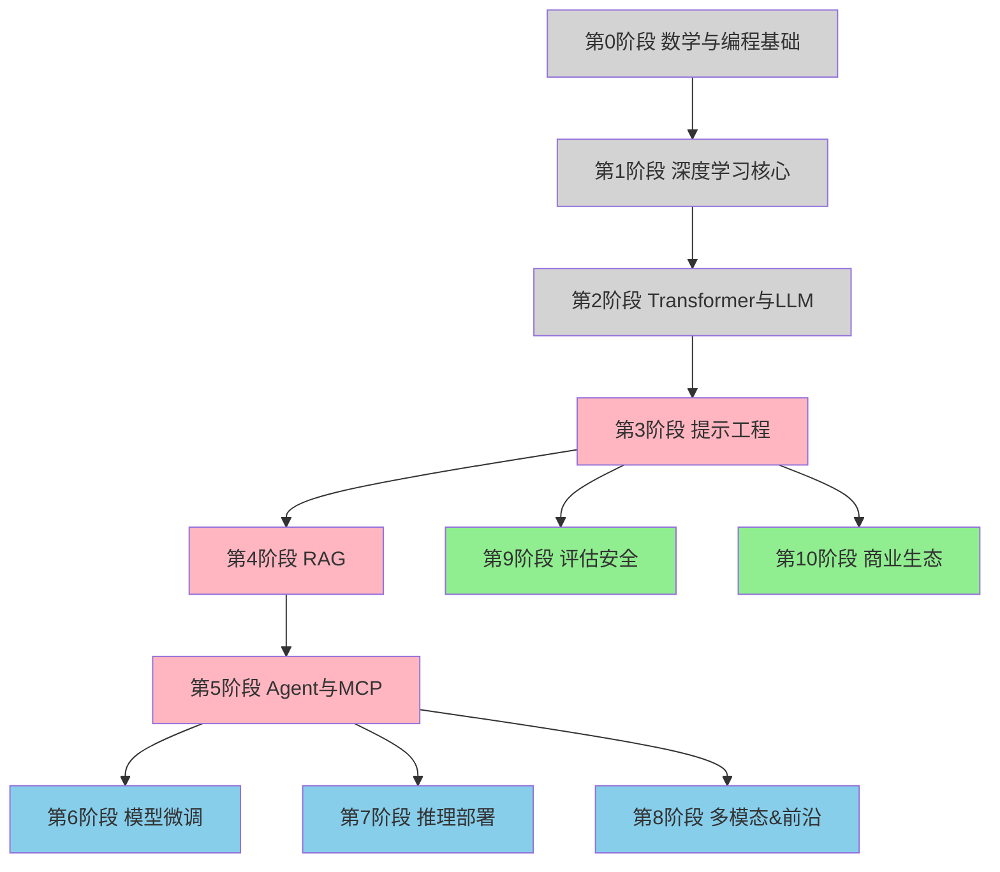

---
cssclasses:
  - ai
  - 知识图谱
  - 指南
tags:
  - ai学习
  - 知识图谱
  - AI
  - 路线图
title: AI 全栈技术知识图谱 (2025-2026)
date: 2025-12-09
authors:
  - wqz
description: 覆盖600+技术点的AI学习路线图，按学习顺序划分为第0-10阶段，每阶段标注P0必须掌握/P1需要理解/P2了解即可
collection: ai
slug: ai-knowledge-graph
collection_order: 0
---

# **AI 全栈技术知识图谱 - 2025-2026**

---

## **📍 开篇：怎么用这份图谱**

### **这是什么**

一张 **AI 工程学习路线图**，按学习顺序排列。你可以把它理解为"课程大纲"——在开始每个阶段之前，先来这里扫一眼该阶段的关键词，学完之后再回来，看看掌握了多少。

### **优先级说明**

每个技术点都有优先级标注，含义如下：

| 标记  | 含义         | 行动建议             |
| :---- | :----------- | :------------------- |
| 🔥 P0 | **必须掌握** | 现在就学，绕不过去   |
| ⭐ P1 | **需要理解** | 按需学，遇到了再深入 |
| 📚 P2 | **了解即可** | 知道这东西存在就够了 |

### **默认前置条件**

本图谱默认你已经具备：

- 基本编程能力（Python/JavaScript）
- HTTP/API 调用基础
- JSON/数据结构理解
- Git/命令行操作

**如果这些还不会，先去补，本图谱不展开。**

---

## **📊 全局路线图**

```
第0阶段  →  第1阶段  →  第2阶段  →  第3阶段  →  第4阶段  →  第5阶段
数学基础     深度学习     Transformer   提示工程     RAG         Agent

                                                              ↓
                                                         第6阶段  第7阶段
                                              ←  ←  ←  微调    部署优化

第8阶段  第9阶段  第10阶段
多模态   评估安全  商业生态  ← 可与第3-5阶段并行学习
```

> **建议路径**：0 → 1 → 2 → 3 → 4 → 5，这是核心主线。  
> 第6-7阶段（微调/部署）和第8-10阶段可以按需跳入。

---

## **第0阶段：数学与编程基础**

> 🎯 **目标**：建立直觉，不是变成数学家。够用就行。

### Python 基础

- 🔥 P0 **Python 语法与数据结构**（列表、字典、函数、类）
- 🔥 P0 **NumPy / PyTorch 张量操作**（矩阵运算是日后看代码的基础）
- ⭐ P1 虚拟环境管理（conda / venv）

### 线性代数

- 🔥 P0 **向量与矩阵**（AI 里的数据全是矩阵）
- 🔥 P0 **点积（Dot Product）**（注意力机制的核心运算）
- ⭐ P1 特征值/特征向量（理解 PCA 降维时用到）

### 概率统计

- 🔥 P0 **概率分布**（模型输出的是概率，不是答案）
- 🔥 P0 **最大似然估计**（理解"模型在优化什么"）
- ⭐ P1 贝叶斯定理（理解先验/后验）
- ⭐ P1 信息论基础（熵、交叉熵——损失函数的来源）

### 微积分

- 🔥 P0 **导数与链式法则**（反向传播的数学基础）
- ⭐ P1 梯度下降的直观理解

### 机器学习基础

- 🔥 P0 **监督学习 / 无监督学习**（两种学习范式）
- 🔥 P0 **训练集 / 验证集 / 测试集**（为什么要分，怎么分）
- 🔥 P0 **过拟合（Overfitting）**（模型在考试题上刷满分，但真题翻车）
- ⭐ P1 凸优化、拉格朗日乘子法

---

## **第1阶段：深度学习核心**

> 🎯 **目标**：理解神经网络是怎么"学"的，知道每个组件在干什么。

### 神经网络基础

- 🔥 P0 **神经元与多层感知机（MLP）**（AI 的基本单元）
- 🔥 P0 **激活函数**：ReLU / Sigmoid / Tanh（为什么不能全是线性？）
- 🔥 P0 **前向传播（Forward Pass）**（数据从左到右流动，得到预测）
- 🔥 P0 **反向传播（Backward Pass / Backpropagation）**（误差从右到左流动，分摊责任）
- 🔥 P0 **损失函数**：交叉熵（分类）/ MSE（回归）

### 训练技巧

- 🔥 P0 **优化器**：SGD → Adam → AdamW（怎么用梯度更新参数）
- 🔥 P0 **Dropout**（训练时随机"关掉"一些神经元，防过拟合）
- 🔥 P0 **Batch Normalization**（让每层的输入保持稳定分布）
- ⭐ P1 **残差连接（ResNet / Skip Connection）**（解决深层网络梯度消失问题）
- ⭐ P1 **Layer Normalization / RMSNorm**（Transformer 用的归一化，不是 BN）
- ⭐ P1 激活函数进阶：GELU / SiLU / Swish（现代 LLM 用的激活函数）
- 📚 P2 梯度裁剪（Gradient Clipping）
- 📚 P2 二阶优化方法、Lion 优化器

### CNN卷积网络

- 🔥 P0 **卷积（Convolution）与局部特征提取**（利用带着特征滤镜的手电筒扫描）
- 🔥 P0 **池化（Pooling）**（抓大放小，层层抽象与平移不变性）
- ⭐ P1 归纳偏置（和 Transformer 定制的全局相关性比较）

---

## **第2阶段：Transformer 与语言模型**

> 🎯 **目标**：理解现代 AI 的"发动机"——Transformer，以及 GPT/BERT 是怎么建在它上面的。

### 注意力机制

- 🔥 P0 **Self-Attention（自注意力）**（每个词同时"看"整个句子）
- 🔥 P0 **Q / K / V 矩阵**（Query-Key-Value：图书馆检索类比）
- 🔥 P0 **Multi-Head Attention（多头注意力）**（8个人同时从不同角度看）
- 🔥 P0 **Masked 自注意力**（GPT 生成时只看"已写的"，不能偷看后面）
- ⭐ P1 Cross-Attention（Encoder-Decoder 之间的信息交流）

### Transformer 架构

- 🔥 P0 **Encoder-Decoder 架构**（BERT 用 Encoder，GPT 用 Decoder）
- 🔥 P0 **MoE（混合专家模型，Mixture of Experts）**（GPT-4、DeepSeek、Mixtral 背后的省算力杀器，稀疏激活机制）
- 🔥 P0 **位置编码（Positional Encoding）**：Sinusoidal（原版）/ 可学习位置编码
- ⭐ P1 **RoPE（旋转位置编码）**（现代 LLM 的位置编码标准，支持长上下文）
- ⭐ P1 **Mamba / SSM（状态空间模型）**（被誉为 Transformer 最大挑战者的非注意力架构流派）
- 📚 P2 Transformer 变体（Transformer-XL、XLNet）

### 预训练模型

- 🔥 P0 **BERT**：MLM（完形填空）+ NSP（句子关系预测）→ 理解型模型
- 🔥 P0 **GPT**：自回归语言建模（预测下一个词）→ 生成型模型
- 📚 P2 ALBERT、ELECTRA、T5 架构

### 分词（Tokenization）

- 🔥 P0 **BPE（Byte Pair Encoding）**（主流分词算法，GPT系列用）
- 🔥 P0 **WordPiece**（BERT 用）
- ⭐ P1 SentencePiece（语言无关的分词框架）
- ⭐ P1 Unigram 语言模型、Byte-level BPE

---

## **第3阶段：提示工程（Prompt Engineering）**

> 🎯 **目标**：用好 API——不写一行训练代码，只靠 Prompt 就能解决 80% 的问题。

### 核心技术

- 🔥 P0 **Zero-shot**（直接问，测试模型底线）
- 🔥 P0 **Few-shot / In-Context Learning**（给例子让模型学）
- 🔥 P0 **System Prompt / Role Prompting**（设定全局身份和规则）
- 🔥 P0 **Chain-of-Thought（CoT）**（让模型"一步步想"，而不是直接猜答案）
- 🔥 P0 **结构化输出（JSON 模式）**（让 AI 输出能被代码解析的格式）
- 🔥 P0 **Prompt Injection 防御**（防止用户输入"忽略之前的指令"）
- ⭐ P1 **ReAct 模式**（Reason + Act：让模型思考然后行动，Agent 的前身）
- ⭐ P1 Self-Consistency（生成多次取多数答案）
- ⭐ P1 Meta-Prompting / Negative Prompting
- ⭐ P1 Prompt Chaining / Self-Refine
- ⭐ P1 Output Parsing（正则解析 AI 输出）
- 📚 P2 Tree of Thoughts（ToT）/ Graph of Thoughts（GoT）
- 📚 P2 DSPy（自动优化 Prompt）
- 📚 P2 Prompt Tuning / Prefix Tuning / P-Tuning v2
- 📚 P2 Prompt Compression（压缩长 Prompt）

---

## **第4阶段：检索增强生成（RAG）**

> 🎯 **目标**：解决"AI 不知道你公司的事"——把私有知识库接入 LLM。

### Embedding 与向量检索

- 🔥 P0 **Embedding 模型**（从 Word2Vec → BERT Embedding → 专用模型）
- 🔥 P0 **余弦相似度（Cosine Similarity）**（衡量两段文字的"语义距离"）
- 🔥 P0 **向量数据库**：Chroma（本地轻量）/ Pinecone（云托管）/ Milvus（大规模）
- ⭐ P1 Sentence-BERT / BGE / E5 / Instructor Embeddings（嵌入模型对比）
- 📚 P2 HNSW / IVF / FAISS（向量索引算法，数据库内部实现）
- 📚 P2 Product Quantization / Matryoshka Embeddings

### 文档处理

- 🔥 P0 **Chunking（文档切分）**：固定大小 / 语义切分 / 递归切分
- ⭐ P1 Parent-Child Retrieval（小块检索，大块返回）
- ⭐ P1 Contextual Compression（压缩检索结果）

### 检索策略

- 🔥 P0 **稠密检索（Dense Retrieval）**（用 Embedding 做语义搜索）
- 🔥 P0 **稀疏检索（BM25）**（关键词搜索，不懂语义但不怕专有名词）
- 🔥 P0 **混合搜索（Hybrid Search）**（两者结合，取长补短）
- 🔥 P0 **重排序（Cross-Encoder Reranker）**（粗排 50 个 → 精排 5 个）
- ⭐ P1 **HyDE（Hypothetical Document Embeddings）**（先生成"假答案"再检索）
- ⭐ P1 Multi-Query Retrieval / Query Expansion（多维度检索）
- ⭐ P1 GraphRAG（知识图谱增强 RAG）
- ⭐ P1 Long Context vs RAG（什么时候用长上下文替代 RAG？）
- 📚 P2 Self-RAG / CRAG（自适应检索）
- 📚 P2 RAPTOR / FLARE / IRCoT / ColBERT / SPLADE

### RAG 的专职评估体系

- 🔥 P0 **RAG 评估三元组**：上下文相关性 / 答案忠实度 / 答案相关性
- ⭐ P1 **Ragas / TruLens**（专门针对 RAG 系统的离线评估开源框架）

---

## **第5阶段：智能体（Agent）与工具使用**

> 🎯 **目标**：从"聊天机器人"升级到"能干活的 AI"——让模型自主规划和执行任务。

### Agent 核心

- 🔥 P0 **ReAct 循环**（思考 → 行动 → 观察，循环直到任务完成）
- 🔥 P0 **Function Calling / Tool Calling**（让模型调用外部 API）
- 🔥 P0 **JSON Schema 定义工具**（告诉模型"这个工具叫什么、有什么参数"）
- 🔥 P0 **记忆管理**：
  - 短期记忆：对话历史（Context Window）
  - 长期记忆：向量数据库存储（接 RAG）
  - 记忆总结：摘要压缩历史（节省 Token）
- 🔥 P0 **Plan-and-Solve**（先让模型写计划，再逐步执行）
- ⭐ P1 **Human-in-the-Loop**（敏感操作前让人类确认）
- ⭐ P1 Reflection / Self-Correction（让 Agent 检查自己的输出）
- ⭐ P1 Tool Retrieval（工具太多时，先检索合适的工具）
- ⭐ P1 LangChain / LangGraph 基础

### GUI Agent 与物理化

- 🔥 P0 **Computer Use（计算机控制操作）**（让 AI 直连鼠标键盘，像人一样看屏幕点击 UI，Claude引领）
- ⭐ P1 OmniParser / UI-TARS（跨越系统鸿沟的 GUI 识别和动作执行模型）
- 📚 P2 WebVoyager / Android in the Wild

### 多 Agent 协作

- 🔥 P0 **串行 / 并行 / 层次化 Agent**（单打独斗 vs 分工合作）
- 🔥 P0 **状态机与图（LangGraph）**（用有向图描述 Agent 的工作流）
- 📚 P2 AutoGPT / BabyAGI（早期框架，了解即可）
- 📚 P2 CrewAI / Autogen / CAMEL / Voyager
- 📚 P2 AgentBench（Agent 评测基准）

### MCP（Model Context Protocol）

- 🔥 P0 **为什么需要 MCP**（Agent 的"USB 协议"，统一数据接入）
- 🔥 P0 **Server / Client 架构**（数据源 vs AI 应用端）
- 🔥 P0 **三类能力**：Resources（数据）/ Tools（功能）/ Prompts（预定义交互）
- ⭐ P1 MCP vs Function Calling（区别在哪？）
- ⭐ P1 常见 MCP Server：文件系统 / Google Drive / Notion / GitHub / 数据库
- ⭐ P1 如何编写 MCP Server（Python / TypeScript）
- ⭐ P1 Transport Layer：stdio / HTTP / WebSocket
- 📚 P2 MCP 协议细节（JSON-RPC 2.0）/ Schema 定义 / Sampling 流程

---

## **第6阶段：模型微调与优化**

> 🎯 **目标**：当 Prompt + RAG 都不够用时，直接改变模型本身的能力。

### 微调决策

- 🔥 P0 **微调 vs 提示工程**（何时该微调，何时该 Prompt）
- 🔥 P0 **指令微调（Instruction Tuning / SFT）**（让基座模型学会"对话"）

### 高效微调

- 🔥 P0 **LoRA（低秩适应）**（只训练 1% 的参数，效果达到全量的 95%）
- 🔥 P0 **QLoRA（量化 + LoRA）**（消费级显卡也能微调 70B 模型）
- ⭐ P1 AdaLoRA / DoRA（LoRA 的改进版）
- ⭐ P1 Adapter Layers / Prefix Tuning

### 对齐技术

- 🔥 P0 **RLHF（人类反馈强化学习）**：奖励模型 + PPO（概念理解即可）
- 🔥 P0 **DPO（直接偏好优化）**（比 RLHF 稳定，现在更常用）
- 🔥 P0 **GRPO（群组相对策略优化）**（DeepSeek-R1 的致胜法宝，彻底丢弃 Critic 模型的极简强化学习架构）
- ⭐ P1 KTO / IPO / ORPO（DPO 的各种变体）
- ⭐ P1 Constitutional AI（宪法AI，Anthropic 的对齐方法）
- 📚 P2 PPO 细节 / Reward Modeling 深入

### 数据与合并

- ⭐ P1 **Synthetic Data（合成数据）**：Self-Instruct / Evol-Instruct（用 GPT-4 生成训练数据）
- ⭐ P1 **模型合并（Model Merging）**：SLERP / Task Arithmetic / MergeKit（不训练，直接"拼"）
- ⭐ P1 DARE / TIES-Merging / Model Soups / LoRA Merging
- 📚 P2 蒸馏（Distillation）/ Alpaca / Vicuna 案例

---

## **第7阶段：推理优化与部署**

> 🎯 **目标**：让模型跑得更快、更便宜、更稳——从本地到生产环境。

### 推理引擎

- 🔥 P0 **vLLM**（生产首选，连续批处理 + PagedAttention，比 HuggingFace 快 10x）
- 🔥 P0 **llama.cpp**（CPU / Mac 上跑大模型）
- 🔥 P0 **Ollama**（本地运行最简单的工具）
- ⭐ P1 TensorRT-LLM（NVIDIA 推理优化）/ TGI / LM Studio
- 📚 P2 ONNX Runtime / OpenVINO / CTranslate2

### 量化（模型瘦身）

- 🔥 P0 **INT8 / INT4 量化**（模型体积缩小 4-8 倍，质量损失可接受）
- 🔥 P0 **GGUF 格式**（llama.cpp 的通用量化格式）
- ⭐ P1 GPTQ / AWQ（量化算法对比）

### 推理加速

- 🔥 P0 **KV Cache**（解码阶段缓存计算结果，避免重复算）
- 🔥 P0 **Prompt Caching（提示词缓存）**（长上下文降本增效的神器，Claude/DeepSeek API与vLLM全靠它省钱）
- ⭐ P1 **Continuous Batching（连续批处理）**（动态处理请求，vLLM 的核心）
- ⭐ P1 **Speculative Decoding（推测解码）**（小模型先猜，大模型验证）
- ⭐ P1 Flash Attention / Flash Decoding（注意力机制的高效实现）
- ⭐ P1 Streaming LLM / Context Length Extension（PI / YaRN / NTK）
- 📚 P2 Medusa / Lookahead Decoding（Speculative Decoding 变体）

### 服务化

- 🔥 P0 **模型路由（Model Routing）**（简单问题小模型，复杂问题大模型）
- 🔥 P0 **语义缓存（Semantic Caching）**（相似问题复用答案，节省 30-50% 成本）

**🔗 对应文章**：[模型优化与部署](/blog/optimization-deployment)

---

## **第8阶段：多模态与前沿模型**

> 🎯 **目标**：了解 AI 能力的边界——图像、语音、推理，以及现在最热的进展。

### 视觉语言模型（VLM）

- 🔥 P0 **CLIP**（图文联合 Embedding，图和文放在同一个向量空间）
- 🔥 P0 **GPT-4V / Claude Vision / Gemini**（商业 VLM 能力）
- ⭐ P1 LLaVA（开源视觉语言模型）
- ⭐ P1 Qwen-VL / CogVLM / ImageBind
- 📚 P2 BLIP / BLIP-2 / InstructBLIP / Flamingo / KOSMOS

### 图像生成

- 🔥 P0 **Flux**（当前最强的开源文生图模型，颠覆了 SDXL 的地位，支持原生极速生成）
- 🔥 P0 **Stable Diffusion**（最主流稳定的传统扩撒模型路线及开源生态）
- 🔥 P0 **ControlNet**（精确控制生成结果：姿势 / 边缘 / 深度图）
- ⭐ P1 LoRA for Diffusion（低成本画风定制）
- ⭐ P1 SDXL / SD3 / IP-Adapter / DreamBooth / Textual Inversion
- 📚 P2 Diffusion 原理（DDPM / DDIM）/ Consistency Models / LCM

### 视频与 3D 生成（新前沿）

- 🔥 P0 **Sora / HunyuanVideo**（Sora开创了DiT架构物理世界模拟器，混元证明了开源路线的可用性）
- ⭐ P1 Gen-3 / Pika / Kling（快手可灵）
- ⭐ P1 AnimateDiff / ComfyUI 视频流工作流
- 📚 P2 Gaussian Splatting（3D高斯渲染，取代 NeRF 的三维革命）

### 语音

- 🔥 P0 **传统 Pipeline**：Whisper（ASR 语音识别）+ VALL-E / Bark（TTS 语音合成）
- 🔥 P0 **端到端语音模型**：GPT-4o Realtime / Gemini Live / MiniMax（直接音频to音频）
- ⭐ P1 AudioCraft / MusicGen

### 推理模型（Reasoning Models）

- 🔥 P0 **Test-time Compute Scaling**（推理时花更多算力 = 更好的答案）
- 🔥 P0 **Process Reward Model (PRM)**（奖励每一步推理过程，不只看最终结果）
- 🔥 P0 **DeepSeek-R1**（开源推理模型里程碑）
- 🔥 P0 **RLAIF**（AI 自我反馈替代人类反馈，DeepSeek-R1 的关键）
- ⭐ P1 o1 / o3 / QwQ / Gemini Thinking
- ⭐ P1 Best-of-N Sampling / Process vs Outcome Supervision
- ⭐ P1 Verifier Models / STaR（Self-Taught Reasoner）
- 📚 P2 MCTS（蒙特卡洛树搜索）/ Beam Search
- 📚 P2 Quiet-STaR / ReST / V-STaR

### 长上下文

- ⭐ P1 **Long Context vs RAG**（200K+ tokens，什么时候不用 RAG？）
- ⭐ P1 RoPE 位置插值（PI / YaRN）/ 1M tokens 应用

---

## **第9阶段：评估、安全与监控**

> 🎯 **目标**：AI 项目最容易翻车的地方——上线前后都要考虑。

### 评估方法

- 🔥 P0 **LLM-as-a-Judge**（用 GPT-4 自动评测输出质量）
- 🔥 P0 **公开基准**：MMLU / HumanEval / MT-Bench / Chatbot Arena
- ⭐ P1 TruthfulQA / GSM8K / MATH / AlpacaEval
- 📚 P2 ARC / HellaSwag / PIQA / DROP / BoolQ / WinoGrande
- 📚 P2 HELM / ToxiGen / BOLD / BBQ
- 📚 P2 专业基准：MedQA / LegalBench / FinQA / C-Eval / CMMLU
- 📚 P2 视觉基准：VQA / COCO / TextVQA

### 安全

- 🔥 P0 **Jailbreak 防御**（防止用户绕过安全限制）
- 🔥 P0 **Prompt Injection 防御**（用户输入被当成指令执行的风险）
- 🔥 P0 **PII 检测脱敏**（隐私信息不能流入 API）
- 🔥 P0 **内容过滤（Content Filtering）**
- 🔥 P0 **Red Teaming**（主动攻击自己找漏洞）
- ⭐ P1 Guardrails / NeMo Guardrails（规则+模型双重校验）
- 📚 P0 **幻觉检测（Hallucination Detection）**

### 生产监控

- 🔥 P0 **链路追踪**：LangSmith / Arize Phoenix（记录每一步的耗时、成本、输入输出）
- 🔥 P0 **成本分析**（Token 使用统计，按功能 / 用户分摊）
- 🔥 P0 **A/B 测试**（Prompt 改了，结果到底变好了吗？）
- ⭐ P1 延迟监控（P50 / P95 / P99）

---

## **第10阶段：商业与生态**

> 🎯 **目标**：了解市场上有什么，做选型决策时不瞎选。

### 商业模型 API

- 🔥 P0 **OpenAI**：GPT-4o / o1 / o3（综合最强，价格较高）
- 🔥 P0 **Anthropic Claude**：Claude 3.5 Sonnet（编码最强，上下文最长）
- 🔥 P0 **Google Gemini**：Gemini 2.0（多模态强，价格有优势）
- 🔥 P0 **国内**：文心一言 / 通义千问 / 讯飞星火（合规要求下的选择）
- ⭐ P1 Claude 3 Opus / Haiku / Gemini Pro / Ultra
- ⭐ P1 Command R / R+（RAG 优化）/ Mistral Large
- 📚 P2 AI21 Jurassic / Inflection Pi / 腾讯混元 / 商汤日日新

### 开源模型生态

- 🔥 P0 **LLaMA 3**（Meta 开源，最主流的基座）
- 🔥 P0 **Mistral / Mixtral**（欧洲开源，MoE 架构高效）
- 🔥 P0 **Qwen 2.5**（阿里，中文最强开源）
- 🔥 P0 **DeepSeek**（推理能力开源里程碑）
- 🔥 P0 **Phi-3**（微软，小模型性价比王）
- ⭐ P1 Yi / ChatGLM / InternLM / Baichuan（国内开源模型）
- ⭐ P1 Vicuna / Alpaca / WizardLM / Orca / Zephyr / Starling（SFT 社区模型）
- 📚 P2 Falcon / MPT / StableLM / Bloom / OPT / Pythia / GPT-NeoX

### 工具生态

- 🔥 P0 **LangChain / LlamaIndex**（AI 应用框架，RAG + Agent 首选）
- 🔥 P0 **Axolotl / Unsloth**（微调工具，QLoRA 首选）
- 🔥 P0 **vLLM / Ollama / TGI**（部署工具）
- ⭐ P1 Instructor / Marvin（结构化输出工具）
- ⭐ P1 Guidance / LMQL（受控生成）
- 📚 P2 HuggingFace Accelerate / PEFT / DeepSpeed / Megatron-LM
- 📚 P2 FastChat / OpenLLM / Weights & Biases / MLflow / lm-evaluation-harness

### 企业应用场景

- 🔥 P0 **Coding Agent**：Cursor / GitHub Copilot / Claude Code（改变编程方式）
- 🔥 P0 **文档问答**（RAG 最典型落地场景）
- 🔥 P0 **客服系统**（Agent + 情感分析 + 升级转人工）
- 🔥 P0 **数据分析助手**（Code Interpreter + Agent）
- ⭐ P1 GitHub Copilot vs Cursor / Aider 对比
- ⭐ P1 Devin / OpenHands / Code Interpreter / Sandbox
- ⭐ P1 CodeLlama / StarCoder / DeepSeek-Coder（开源编程模型）
- 📚 P2 AlphaCode / WizardCoder / Phind-CodeLlama / SWE-bench

---

## **🗺️ 章节依赖关系图**


```mermaid
graph TD
    S0[第0阶段 数学与编程基础] --> S1[第1阶段 深度学习核心]
    S1 --> S2[第2阶段 Transformer与LLM]
    S2 --> S3[第3阶段 提示工程]
    S3 --> S4[第4阶段 RAG]
    S4 --> S5[第5阶段 Agent与MCP]

    S5 --> S6[第6阶段 模型微调]
    S5 --> S7[第7阶段 推理部署]
    S5 --> S8[第8阶段 多模态&前沿]

    S3 --> S9[第9阶段 评估安全]
    S3 --> S10[第10阶段 商业生态]

    style S0 fill:#D3D3D3
    style S1 fill:#D3D3D3
    style S2 fill:#D3D3D3
    style S3 fill:#FFB6C1
    style S4 fill:#FFB6C1
    style S5 fill:#FFB6C1
    style S6 fill:#87CEEB
    style S7 fill:#87CEEB
    style S8 fill:#87CEEB
    style S9 fill:#90EE90
    style S10 fill:#90EE90
```

> **颜色说明**：
>
> - 灰色 = 理论基础（按需查询）
> - 粉色 = 应用核心（先学这里）
> - 蓝色 = 工程深化（有需求再学）
> - 绿色 = 生态认知（随时了解）

---

## **✅ 最后的话**

学 AI 最大的坑是**贪多求全**。

这份图谱不是让你从第 0 阶段到第 10 阶段全部学完，而是：

1. **第3阶段（Prompt）+ 第4阶段（RAG）+ 第5阶段（Agent）是核心主线**，优先打通
2. P0 的内容是现在的任务，P1 是遇到再查，P2 是知道有这东西就行
3. 第0-2阶段的理论部分，按需回头查，不必现在

**开始行动**：直接从第3阶段 Prompt Engineering 开始，做一个能用的 Demo，再往后走。
