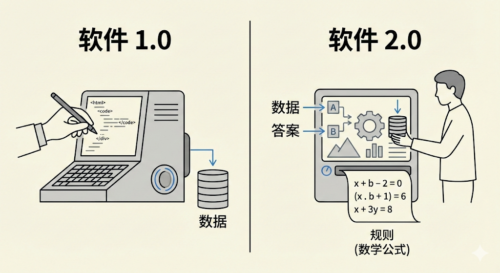
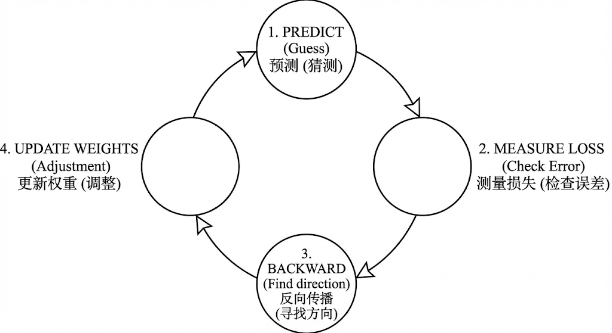

---
cssclasses:
  - ai
  - 教程
  - 基础理论
tags:
  - ai学习
  - 教程
  - AI
  - 机器学习
title: 0.1 机器学习入门与四大基石
date: 2026-02-01
authors:
  - wqz
description: 从编程范式转变讲起，系统理解机器学习的核心思想——监督学习、训练循环基础、过拟合的概念，建立 AI 学习的第一块基石。
collection: 第0阶段：数学与单机基础
slug: ml-basics
collection_order: 1
---

# 0.1 机器学习入门与四大基石

:::note 第0阶段：起点
这是整个 AI 学习之旅的起点。

在这一阶段，我们不整那些吓人的数学公式——线性代数、概率论、微积分这些可以在需要时查阅。  
我们的目标是建立**直觉**，搞清楚一件事：**为了让机器学会做一件事，工程师到底做了什么？**

这个基础不打牢，后面每一章都会像空中楼阁。
:::

---

## 1. 编程范式的转变：从 1.0 到 2.0

我们要学的不是一种新的编程语言，而是一种**全新的思考方式**。

### 传统编程（Software 1.0）

如果你是写业务代码的工程师，你每天做的事情大概是这样的：**你告诉计算机每一条具体的规则。**

如果你是写业务代码的工程师，你每天做的事情大概是这样的：**你告诉计算机每一条具体的规则。**

- **场景**：判断一张照片里是不是猫。
- **做法**：写 `if (有耳朵) and (有胡须) and (毛茸茸)...`
- **问题**：根本写不完！老虎也有耳朵胡须，玩具猫怎么算？规则稍微变一点，代码就得重写。

$$ 规则 + 数据 = 答案 $$

### 机器学习（Software 2.0）

既然规则太复杂写不出来，那能不能**让机器自己把规则找出来**？

我们不写规则了，给机器看**一万张猫的照片**和**一万张不是猫的照片**，然后告诉它："你自己找规律，反正左边这些必须叫'猫'，右边这些不行。"

机器经过一通计算，最后归纳出了一套超级复杂的数学公式（可能有一亿个参数）。这套公式，就是我们炼出来的**模型（Model）**。

$$ 答案 + 数据 = 规则 $$

**这就是机器学习的核心：用数据换取规则。**

---

## 2. 三大学习范式

和人类学习方式一样，机器学习也有三种范式。

### 2.1 监督学习（Supervised Learning）

:::tip 类比：学生刷题（带标准答案）
这是最主流、应用最广的方法。

- **老师（工程师）**：给你一本《五年高考三年模拟》，每道题后面都有答案。
- **学生（模型）**：做题 → 对答案 → 发现错了 → 修正脑子里的思路。
- **应用**：
  - **分类**：这封邮件是垃圾邮件吗？（是/否）
  - **回归**：这房子明年多少钱？（预测具体数值）
    :::

### 2.2 无监督学习（Unsupervised Learning）

:::tip 类比：把一堆乐高积木分类（没说明书）
老师这回不给答案了，就把一堆数据扔给你："你自己看看有什么规律。"

- **学生（模型）**：这几个红色的块块挺像的，堆一起；那些长条形状差不多，堆一起。
- **应用**：
  - **聚类**：把用户分成"高价值用户"、"薅羊毛用户"（不知道谁是谁，但行为模式很像）。
  - **关联规则**：买了啤酒的人通常也会买尿布。
    :::

### 2.3 强化学习（Reinforcement Learning）

:::tip 类比：训练小狗（给骨头或打屁股）
没有现成的数据集，而是通过**互动**来学习。**本质是：没有标准答案，只有长期回报。**

- **环境**：给模型一个场景（比如玩《马里奥》游戏）。
- **反馈**：
  - 往右走吃金币 → **奖励 +1**（做得好！）
  - 掉坑里摔死了 → **惩罚 -10**（别这么干！）
- **目标**：模型疯狂试错，最后学会了怎么拿最高分。
- **现实应用**：AlphaGo 下围棋、机器人走路、**DeepSeek-R1 的推理能力训练**（我们会在第8阶段详细介绍）。
  :::

---

## 3. 绕不开的数学直觉

虽然我们承诺不堆砌吓人的公式，但知识图谱里的这几个数学名词，是你学 AI 必须建立的**核心直觉**。它们构成了机器能"学"懂一切的数理基石。

### 3.1 概率统计：模型眼里的世界是不确定的

- **概率分布**：现代AI输出的往往不是绝对的答案（"这是猫"），而是概率分布（"90%是猫，10%是狗"）。理解这一点，就能理解为什么语言模型每次生成的回答都不一样。
- **最大似然估计（MLE）**：听起来很高深，其实就是"事后诸葛亮"。训练模型的过程，其实就是在寻找一组参数，使得这组参数**最有可能（似然最大化）**推导出我们手头正确的训练数据。
- **贝叶斯定理**：不仅是推荐系统的底层逻辑，也是人类学习的逻辑。它告诉模型如何根据"新收集的证据（后验）"来修正原本的"固有印象（先验）"。
- **信息论（熵与交叉熵）**："熵"在物理学里代表混乱，在信息论里代表**不确定性**。衡量"模型的预测概率"和"真实答案"之间有多大差异的尺子，就是我们要学的**交叉熵**。

### 3.2 微积分与凸优化：如何找到最优解

- **导数与链式法则**：导数就是斜率（下山的坡度）。而在有很多步骤的复杂计算中，如何把最终的误差"一层层向前传导回去"？这就靠高数里最重要的**链式法则**。它就是下一章我们要学的**反向传播**的灵魂。
- **凸优化与拉格朗日乘子法**：早期的机器学习（比如传统的支持向量机 SVM）非常追求数学完美，利用这些方法能在理论上证明找到了"全局最优的唯一解"；但现在的深层神经网络面对的地形太复杂了（非凸优化），我们大多只能靠"梯度下降"这种摸石头过河的方法找可行解。

### 3.3 线性代数：AI 世界的"乐高积木"

- **标量、向量、矩阵与张量（Tensor）**：AI 里的数据到底长什么样？一个孤立的数字叫**标量**；一排数字叫**向量**；一张由数字组成的二维表格叫**矩阵**；三维及以上的数字魔方统称**张量**。大名鼎鼎的 **PyTorch**，本质上就是一个超级强大的"张量计算器"（类似于自带 GPU 加速的高级 NumPy）。
- **矩阵乘法与点积（Dot Product）**：神经网络前向传播的本质，就是把你的输入数据矩阵和无穷无尽的权重矩阵相乘。到了第2阶段你会发现，让 Transformer 一战封神的注意力机制，核心动作不过是极其精妙地计算了几次**点积**（算出两个向量在某个维度上有多少"相似度"）。
- **广播机制（Broadcasting）**：写 AI 代码最常碰到的概念。当你把一个"小矩阵"（比如偏置常量）加到"大矩阵"上时，底层框架会自动把小矩阵**复制并拉伸**到和大矩阵一样的形状再计算。理解了这个，你的网络模型才不会一上线就疯狂报"维度不匹配"的错。

---

## 4. 工程师黑话对照表

以后看论文、看文档，你会反复看到这几个词，先把它们映射到人话：

| 黑话（Term）                | 人话映射             | 例子                           |
| :-------------------------- | :------------------- | :----------------------------- |
| **Dataset（数据集）**       | 教材库               | 一万张猫的照片                 |
| **Features（特征，X）**     | 题目的已知条件       | 照片的像素、房子的面积地段     |
| **Labels（标签，y）**       | 标准答案             | "这是一只猫"、"房价 500 万"    |
| **Model（模型）**           | 负责做题的脑子       | 一个巨大的数学函数 $f(x)$      |
| **Parameters（权重/参数）** | 脑子里的神经连接强弱 | 训练出来的"规则"本身           |
| **Training（训练）**        | 刷题的过程           | 调整参数，让正确率越来越高     |
| **Inference（推理）**       | 考试                 | 训练结束，拿新题让模型输出答案 |
| **Evaluation（评估）**      | 判卷老师             | 衡量模型在真实场景下是否有用   |

---

## 5. 机器"学习"的本质：训练循环

这是本章最重要的部分。所谓"训练模型"，其实就是在跑一个**死循环**。

想象一个蒙着眼睛的人摸着下山：

**第一步：猜（Forward Pass / 前向传播）**
模型拿到一道题，先根据当前参数瞎猜一个答案。

> _模型：我觉得这是猫！_

**第二步：对答案（Loss Function / 损失函数）**
用**损失函数**来衡量猜得有多离谱。Loss 越高表示错得越离谱。

> _裁判：错！这是狗。你的答案离正确答案差了十万八千里（Loss = 1000）。_

**第三步：找方向（Gradient / 梯度）**
计算出要往哪个方向调参数，才能让 Loss 变小。就把梯度理解成"坡度"——指出下山的方向。

> _模型：那我该往哪个方向改？是把参数调大点还是调小点？_

**第四步：改错（Optimizer / 优化器）**
用**优化器**按照梯度方向，微调模型里的参数。

> _优化器：刚才那个参数调小一点点，下次应该能对。_

**这个循环跑几百万次，直到 Loss 几乎变成 0，我们就说：训练完成了。**

---

## 6. 一个必须知道的陷阱：过拟合

Loss 越低 = 模型越好？**不对。**

> **过拟合（Overfitting）**：模型在训练集上 Loss 极低，但在新数据上一塌糊涂。
> 就像一个学生把历年真题答案全背下来了，但换一道新题就不会了。

这也是为什么我们要把数据分成三份：

- **训练集（Training Set）**：用来训练，调整参数。
- **验证集（Validation Set）**：训练过程中监控"有没有过拟合"，不用于更新参数。
- **测试集（Test Set）**：训练完成后，最终考试用一次，评估真实水平。

:::warning 工程提示
永远不要用测试集来做任何决策（比如选模型、调超参数），否则测试集就变成了"另一个训练集"，你的评估结果就没有意义了。
:::

---

## 7. 总结

1. **机器学习** = 用数据换规则，让机器自己找规律。
2. **监督学习** 是最主流的范式，本质就是带答案的刷题。而强化学习则是 DeepSeek-R1 等终极推理模型的秘密基石。
3. **训练循环** = 猜答案 → 算 Loss误差 → 找下山梯度 → 优化器改参数，循环往复。
4. **过拟合** 是永恒的陷阱，训练集/验证集/测试集的划分是基本功。

有了这个“黑箱循环框架”，这就足够了。
关于具体的 **损失函数（交叉熵/MSE）** 和 **优化器（SGD/AdamW等）** 有哪些分类，这属于构建具体模型时的底层黑科技，我们将在下一阶段详细解答。

---

**下一章预告**：
现在我们知道了机器是怎么"学"的——但如果问题复杂到了“识别图片是一只猫”、或者“理解一段长语言”？仅仅靠简单的线性数学公式绝对搞不定。

这就需要一个层级极其庞大、能画出任意弯曲边界的超级"脑子"——欢迎进入**第1阶段：深度学习核心**。
我们将在这个阶段，把神经网络这个黑箱扒开，看看人工神经元和链式法则的真面目。

---

**下一章**: [1.1 神经网络骨架（MLP与反向传播）](/blog/neural-network-mlp-backprop)
