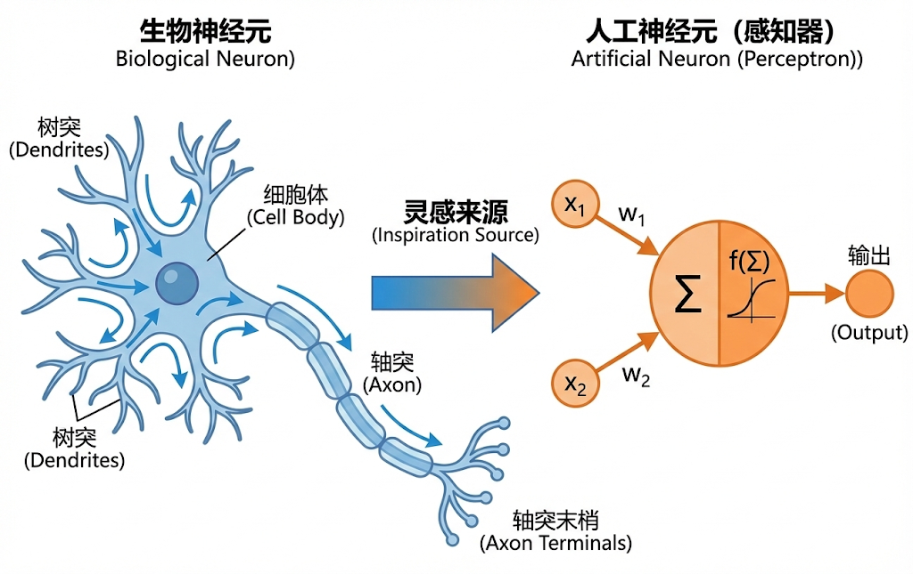
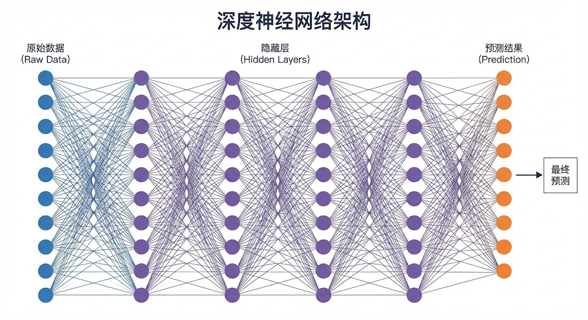

---
cssclasses:
  - ai
  - 基础理论
tags:
  - ai学习
  - 深度学习
  - 神经网络
  - 反向传播
title: 1.1 神经网络骨架（MLP与反向传播）
date: 2026-02-02
authors:
  - wqz
description: 从"为什么需要深度学习"讲起，系统拆解神经元、激活函数、前向与反向传播，以及交叉熵/MSE 损失函数剖析，为你打开神经网络的纯血大门。
collection: 第1阶段：深度学习核心
slug: neural-network-mlp-backprop
collection_order: 1
---

# 1.1 神经网络骨架（MLP与反向传播）

:::note 核心骨架
在**第0阶段**，我们知道了机器学习的闭环：给数据、定规则、跑训练。
但那个“模型函数”长什么样？

这一章的目标：搞清楚神经网络最底层、最原教旨主义的内部构造：多层感知机（MLP）是怎样通过“激活函数”扭曲空间的，而“反向传播”又是怎样精妙分发错误责任的。
我们将不留任何余地地剖析它。
:::

---

## 1. 为什么需要"深度"学习？

在第0阶段的猫狗分类例子里，如果所有猫都长得标准，一个简单的线性公式（画一条直线把猫和非猫分开）可能就够了。

但现实世界太复杂了：

但现实世界太复杂了：那些被拍下的猫可能正蜷缩成极其抽象的毛团而导致形状彻底畸变，也可能潜伏在暗灰色的草丛和阴影里被直接抹去了原有的辨识色。更别提由于设备老旧，有些照片直接褪色成了纯黑白。

**简单的线性分类器遇到这些情况直接歇菜。** 这好比你想用一把直尺去测量海岸线的长度——工具太简单，无法描述复杂的现实。

为了处理这种**非线性（Non-linear）**的复杂问题，我们需要一个更复杂的脑子——**神经网络（Neural Networks）**。

---

## 2. 神经网络：模仿人脑的积木

### 2.1 神经元（Neuron）

生物神经元的工作方式很简单：



在生物学意义上，一根神经元依靠**树突**从四面八方接收其他相连同伴传来的电信号。接收完毕后，**细胞体**负责将所有杂乱的电流强度进行汇总累加，若累加的刺激强度越过了那条临界阈值并变得足够“兴奋”，它便会毫不犹豫地通过长长的**轴突**将这一股强大的电流脉冲直接发射到下一个神经元上去。

我们在电脑里造的**人工神经元**逻辑完全一样：

$$\text{输出} = \text{激活函数}\left(\sum_i \text{输入}_i \times \text{权重}_i + \text{偏置}\right)$$

拆解开来，这里- **输入 ($x$)**：从外界接收的信号（比如图片的像素点、前一层传来的特征）。

- **权重 ($w$)**：表示这个输入有多重要。如果 $w$ 很大，说明神经元对这个输入非常敏感。
- **偏置 ($b$)**：神经元自己的"触底门槛"，决定了它天生有多容易被激活。
- **求和与扭曲**：先把前面三样东西算一算（$w \cdot x + b$），然后交给**激活函数 (Activation Function)** 进行扭曲。

### 2.2 多层感知机（MLP）

把很多神经元**堆成多层**，就是**多层感知机（Multi-Layer Perceptron，MLP）**，也叫**全连接网络**：

这就是将神经元大规模堆叠并排布成好几个密集团队后的结构——**全连接网络（Multi-Layer Perceptron，MLP）**。它通常拥有三个严阵以待的区域：负责吞吐海量图片原始像素点的**输入层**，负责在黑暗黑盒里进行逐级特征抽取的庞大**隐藏层**，以及负责最终宣判概率结论（比如“这是个猫的概率是99%”）的**输出层**。

```
输入层  →  隐藏层1  →  隐藏层2  →  输出层
像素值     线条/边缘    形状/部件    是猫/不是猫
```



**"深度"就是"层数多"**。层数越多，模型能理解的概念就越抽象、越高级。

---

## 3. 激活函数：它到底是干嘛的？

**问题**：为什么神经元算完乘法和加法后，非要多此一举，加上一个"激活函数"？

**答案**：为了能画出**弯曲**的线，而不是只会画**直线**。

### 3.1 为什么我们需要"弯曲"？

假设你在做一个**预测房价**的简单 AI：直接抛出面积去预测房子的总价。如果你仅仅在网络里用死板的加减乘除计算，就算往中间堆叠了一万层也没有意义——因为**一万根直线的叠加，依然是一条直线**。这就意味着它会粗暴笃定任何事物都在恒定无限增长，往往会推演出 10 万平米的房子竟然价值 2 万亿的荒诞反常识结论。

真实世界的数据往往是**非线性（弯曲或折断）**的。

- 假如没有激活函数，不管你叠多少层神经元，哪怕你叠了 1000 层，它本质上还是在做无聊的乘法和加法（线性变换）。
- 线性变换永远只能画出"直线"或"平面的纸"。如果你的任务是把混在一起的一堆红球和蓝球分开，而它们本就弯弯曲曲地缠绕在一起，你是不可能用一条直线切开的。
- 激活函数就像一双手，把这张"平面的纸"进行揉捏、折叠、扭曲，最终让网络拥有了拟合世界万物的能力。这就叫**非线性表达能力**。

### 3.2 常见激活函数对比

#### 3.2.1 ReLU（最主流的经典方案：水闸）

$$\text{ReLU}(x) = \max(0, x)$$

:::tip 类比：水闸 💧

就像是一座截流的大坝水闸，当输入累加的信号居然是一个**负数或者极小的负面情绪**时，ReLU 直接冰冷地宣布关闸防洪，一滴水都不准流出去（强制输出为 0）。反之只要信号变为正数哪怕只是一丁点，它立马全面敞开大门进行原样等比放行。

就这么简单的一刀切，让神经网络彻底学会了过滤：直接舍弃掉那些带来噪音的无界负面信号，只传递真正有辨识度的高能特征。

**为什么好用**：它的计算极其便宜快捷，训练极其痛快平稳。哪怕到了今天，许多工业级的 CNN 与 ResNet 都仍在仰仗于这位水闸将军的恩赐。
:::

#### 3.2.2 Sigmoid / Tanh（历史遗物，了解即可）

$$\text{Sigmoid}(x) = \frac{1}{1 + e^{-x}}, \quad \text{Tanh}(x) = \frac{e^x - e^{-x}}{e^x + e^{-x}}$$

早期神经网络用的激活函数，会把信号压缩到一个固定范围（比如 0 到 1 之间）。

**缺点**：信号太强或太弱时，梯度几乎变成 0，导致反向传播时"消息传不回去"（梯度消失）。现在的隐藏层基本不用了，偶尔在输出层用用。

#### 3.2.3 GELU / SiLU（现代 LLM 用的）

$$\text{GELU}(x) \approx x \cdot \sigma(1.702x)$$

可以把它们理解成"**更聪明的水闸**"——不是像 ReLU 那样非黑即白（要么完全关掉，要么原样放行），而是根据信号强度**平滑过渡**。

现代大语言模型如 GPT 家族与 LLaMA 已经开始抛弃这套非黑即白的一刀切理论，而是将其逐步换成了“可以带着一点人情味的平滑水闸”。以 GELU（或是十分相近的 SiLU）为例，当它们遭遇极其强烈的负面信号时它照旧会彻底锁死通道；但在应对那些微微有些摇摆、轻微偏负的黯淡信号时，它不再残忍断交，而是会稍微留下一条极细的门缝让那么丁点负面残留也溜过去试探传导余温。而当它转向纯粹的正向信号高歌猛进时它便又恢复了无碍放行。

正是这种极其细微且带着导数连续切角的顺滑曲线过渡，使得当前被推上千万张并行显卡的极深网络系统里，能比那些棱角分明的 ReLU 跑出更加稳定强劲且毫无阻滞的健康梯度潜流流动。

**为什么 LLM 要换成这个**：更平滑的过渡让梯度在大规模训练时流动得更稳定，效果更好。GPT 系列用 GELU，LLaMA / Mistral / Qwen 用 SiLU $\text{SiLU}(x) = x \cdot \sigma(x)$。

> **你只需要记住**：ReLU → 经典场景（CNN）；GELU/SiLU → 现代 LLM 标配。选哪个，框架会帮你决定。

---

## 4. 反向传播：训练的引擎

还记得第0阶段的训练循环吗？

```
猜答案 → 算 Loss → 找方向（梯度）→ 优化器改参数
```

"找方向"这一步，具体是**反向传播（Backpropagation）**在做：

- **前向传播（Forward Pass）**：
  数据从左到右流过网络，得到一个预测结果，然后算出 Loss。

- **反向传播（Backward Pass）**：
  Loss 从右向左"反向"流动，利用**链式法则（Chain Rule）**，精准计算每一个权重参数对这次错误"负多大责任"（这就是梯度）。

> ```
> 输出层 → 告诉隐藏层3："是你算错了！"
> 隐藏层3 → 告诉隐藏层2："我被你坑了！"
> ...一直传到第一层
> ```

责任大的参数狠狠改，责任小的略微调整。这就是神经网络能够学习的根本原因。

:::warning 工程注意
理论上层数越深越好，但深度越大，梯度在反向传播时会越来越弱——传着传着就消失了（**梯度消失**问题）。这也是后来出现残差连接的原因。
:::

---

## 5. 训练循环的重要拼图：损失函数与优化器

知道了反向传播怎么找方向，我们还需要两把尺子和一个教练。

### 5.1 损失函数（Loss Function）——衡量"错误"的尺子

Loss Function 的作用只有一个：**告诉模型，你现在错得有多离谱。**

> [!TIP]
> **类比：射击比赛 🎯**
>
> 试想你在参加一把极度严苛的射击定级赛。如果你脱靶了仅仅 1 米，虽然偏离了靶心，但有些严苛程度似乎还能忍受。可如果你干脆利落地脱靶了整整 10 米远，**MSE（均方误差）** 这种极其极其暴戾的损失函数就会当场翻脸。因为它计算出来的并不是误差恶化了原先的 10 倍，而是惨烈无比的 **100 倍**暴击惩罚！也就是平方级别的灾难性放大痛击。
> 这种对大范围跑偏深恶痛绝的极致惩戒设定，极度逼迫着每一次神经网络的反向传播必须首先全力剿灭那些最夸张严重的长尾失误地带。这也导致一贯被称为回归问题“老大哥”的 MSE 彻底化身为预估温度、气压与大宗商品连续浮动数值无可匹敌的头号终极判官。
> 与其对应的赛道相反，当我们站在那些并不是衡量距离感而是需要铁血裁决“它是猫还是狗”的这类的非黑即白分类场上时，**Cross Entropy (交叉熵)** 便举起了独裁制霸的权杖。它根本不关心你物理距离上跑偏了多少厘米远，它全盘盯死的是你在上报错误答案时究竟有着怎样嚣张狂妄的确信度。如果你仅仅只有一丁点模棱两可的微弱信心说这是一条狗，它大发慈悲只对你记下微末寥寥的损失教训；然而假如你极其蛮横狂傲地抱着 100% 盲目的坚决态度把一头雄狮强行按头认成了猫，它那隐藏着极限对数函数惩罚的重手铁锤将会当场引爆出势将冲破无穷大阻力的惊天报错警报狂飙！

> **一句话记住**：Loss 越低 = 模型越好。训练的目标就是 **Minimize Loss**。

### 5.2 Loss函数的硬核解剖

为了衡量预测和真相隔了多远，除了我们提到的 MSE 外，AI 处理分类问题时几乎一律采用**交叉熵 (Cross Entropy)**，它的数学思想更为深邃：

- 如果预测对了（比如 99% 的概率猜是猫，实际也是猫），惩罚极小。
- 但如果**错得很离谱还很自信**（比如 99% 概率猜是猫，实际却是狗），交叉熵会给出一个**爆炸级的无穷大惩罚**。
- 这个无穷大的惩罚在反向传播时，会产生极其猛烈的梯度，瞬间把那些“自信且愚蠢”的参数拉回正轨。如果是 MSE 面对这种“信心满满的错误”，由于导数函数的特性，很多时候会引发可悲的“梯度消失”（惩罚传不回去，模型原地摆烂）。

> **一句话记住**：回归数值用 MSE；算概率分类必用 Cross Entropy。

---

## 6. 总结

:::note 第一支柱总结

1. **神经元**：本质上就是 `(x·w + b)` 然后套上激活函数扭曲一下。
2. **激活函数**：没有它，网络就只是一堆无聊的直线。ReLU 像水闸，GELU 像带有弧度的水闸。
3. **反向传播**：模型能学习的唯一引擎。通过链式法则把 Loss 一层层往前推，精准定位每一个该挨板子的参数。
4. **损失函数**：回归数值用 MSE，分类算概率必须用交叉熵。

:::

但这就是神经网络的最强体态了吗？不是的。
仅仅通过 MLP 的死记硬背，参数在下山的过程中很容易引发剧烈的**维度震荡**、由于步子太大**掉下悬崖（梯度爆炸）**，甚至背完答案后无法理解新题（**严重过拟合**）。

如何控制住这头暴躁的猛兽？

**下一章预告**：
我们将为 MLP 披上真正的铠甲。从下山的神兵利器（AdamW 优化器），到封锁过拟合的 Dropout，直至后来拯救千层网络于水火之中的划时代基石——**BatchNorm 与局部跳跃（残差连接）**。

---

**下一章**: [1.2 核心优化技术（优化器、BN与残差）](/blog/dl-optimizer-bn-resnet)
