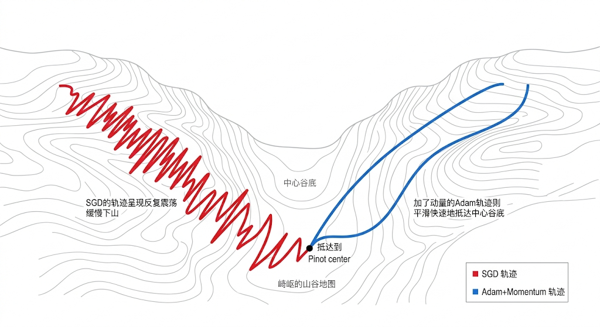
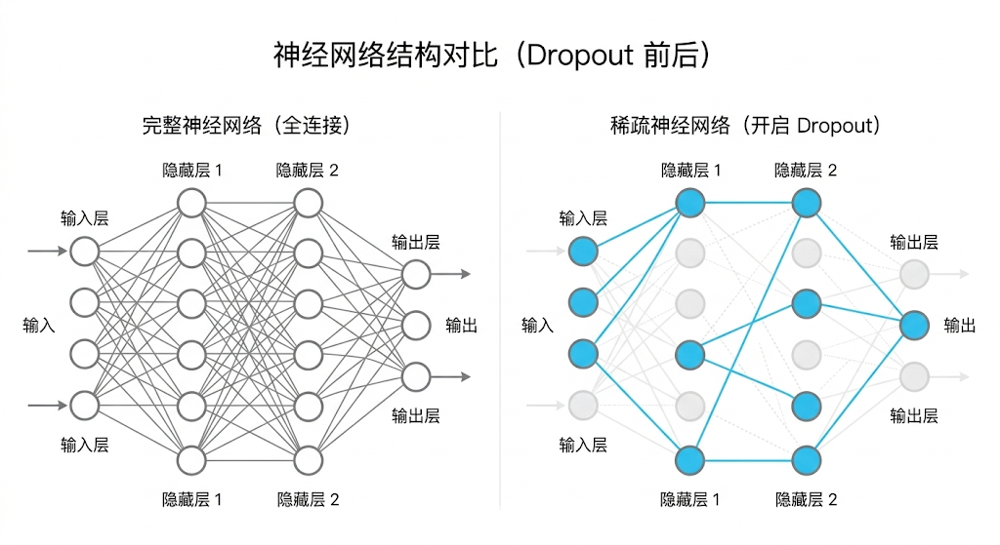
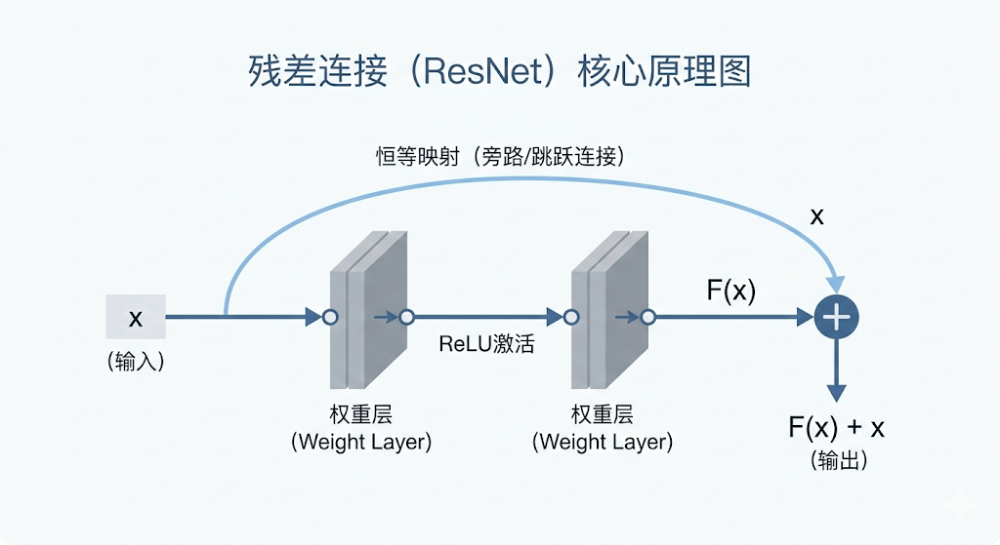

---
cssclasses:
  - ai
  - 基础实战
tags:
  - ai学习
  - 深度学习
  - 优化器
  - resnet
  - normalization
title: 1.2 核心优化技术（优化器、BN与残差）
date: 2026-02-03
authors:
  - wqz
description: 当网络不断加深，梯度消失与过拟合接踵而至。详解 SGD 到 AdamW 的进化史，以及 Dropout、残差连接与归一化技术如何联手拯救深度学习。
collection: 第1阶段：深度学习核心
slug: dl-optimizer-bn-resnet
collection_order: 2
---

# 1.2 核心优化技术（优化器、BN与残差）

:::info 从理论走向工程
在上一节（**1.1 神经网络骨架**）中，我们见识了神经网络的底层引擎：神经元负责**感知与扭曲**，反向传播（链式法则）负责**将损失分发定罪**。

但这只是图纸上的理想状态。
一旦你真的把层数堆到几十重、塞进上千万条数据，这头名为“梯度下降”的猛兽就会彻底失控：

- 步子迈大了，它在山谷里疯狂震荡（不收敛）；
- 步子迈小了，训练慢得让人；
- 层数太深，后方的“指责信号”根本传不到前线（梯度消失）；
- 它还喜欢投机取巧，死记硬背训练集的答案（过拟合）。

本节将介绍深度学习发展史上，那几项挽狂澜于既倒的**纯工程黑科技**。
:::

---

## 1. 教练的进化：优化器 (Optimizer)

既然“反向传播”算出了**方向**（梯度），也知道了错在哪（Loss），**怎么改**才能让 Loss 稳健缩小？
这就需要优化器控制下山的步伐，其中最具决定性的参数就是**学习率（Learning Rate）**。

### 1.1 开山鼻祖：SGD（随机梯度下降）

最朴素的逻辑，看见坡就下，朝最陡的方向走固定的一定步子。

- **致命弱点**：如果遇到一个狭长的山谷，由于坡度陡但其实谷底在沿长轴方向，SGD 会在山谷两壁上疯狂反复横跳（震荡），迟迟不敢走向真正的谷底。

### 1.2 加上惯性：Momentum

物理学给了工程师灵感：给下山的小球加上**动量（惯性）**。

- **原理**：如果连续几次都在朝东边走，那下次跨步时就把往东的步伐加大；如果一会儿往南一会儿往北，南北的幅度就会被惯性抵消。
- **效果**：它极大地缓解了 SGD 的无脑震荡，像一辆安装了悬挂系统的越野车。

### 1.3 现代标配与 LLM 御用：Adam 与 AdamW



既然方向可以加惯性，那**不同维度的学习步长**能不能因人而异？
如果在某一个参数维度上地形非常平坦，那就步子迈大点；如果某一个维度崎岖，就自动把学习率降低。

这就是 **Adam (Adaptive Moment Estimation)**：目前绝大部分深度学习模型的默认优化器。

- **AdamW**：由于 Adam 在最后对抗“过拟合”的数值衰减上存在一个隐秘的代数 bug。研究人员修复了这个 bug 提出了 AdamW，它同时拥有自适应步长极速收敛的优势，又能让模型泛化能力更强。**目前所有的大语言模型（LLM，包括 LLaMA、GPT等）一开场，优化器必填 AdamW。**

### 1.4 P2 前沿：Lion 优化器

寻找最优解的算力成本越来越高，Google 近年提出了极简的 Lion。
如果不算精确梯度的具体数值，**只看梯度的“符号（正负号）”**呢？只要知道向左还是向右，闭着眼睛猛冲就行了。不仅霸道，更是被证明比 Adam 还能节省显存。

---

## 2. 驯服过拟合：正则化与 Dropout

AI 也喜欢“死记硬背历年模拟卷（训练集）”，到了“真正的考场（测试集）”就翻车，这叫**过拟合**。
参数越多，模型背答案的能力越强。

### Dropout（随机失活）

这是深度学习史上最简单、也最天才的发明之一：
**在训练时，随机拔掉一部分神经元的网线（比如 30%）。**



- **为什么会有用？**
  如果一个公司里总有 30% 的人随时会旷工，为了保证项目正常交付，大家就**不能搞单点依赖**，每个人都得学点真本事，独立承担任务。
  这逼迫神经网络里的每一个节点，不能依靠前面特定的几张面孔来投机取巧，必须各自去提取真正通用、抗干扰的特征。

```python
# PyTorch 中一行代码搞定
import torch.nn as nn
self.dropout = nn.Dropout(p=0.3)  # 30% 的概率摸鱼
```

> **黄金法则**：千万记住！Dropout 只在**训练时**开启。等真正上线考试（推理预测）时，要恢复所有的神经元全量出击。

---

## 3. 把网络推向深渊再捞起来：残差连接 (ResNet)

在 2015 年前，哪怕再有钱、算力再高，没人敢把神经网络叠到 20 层以上。
因为存在死穴：**梯度消失**。
根据链式法则，小于 1 的导数连乘 20 次，到最前面的浅层时梯度已经接近无限小。浅层网络根本收不到指令，形同瘫痪。

2015年何凯明提出的 **残差网络（ResNet）**，打破了深度学习的天花板，一举将网络推上了 150+ 层。

### 黄金跳跃（Skip Connection）

做法粗暴：如果你在后面几层可能什么都学不到，那我就在这个模块旁边直接修一条**“高速公路”**，把原始的输入原封不动地“跨层相加”到后面。



$$ \text{Out} = \text{Network}(x) + x $$

- **容错率极高**：哪怕中间那一坨 `Network(x)` 彻底训烂了输出为 0，最坏也就是把输入原样透传。
- **梯度高速公路**：在反向传播时，如果通过神经元那条路梯度消失了，损失信号可以**沿着这条 "+" 号的直连通路，光速、毫无折损地直达网络的前线！**

**Transformer 为什么能叠 96 层甚至更多？它的骨架深处，依然铭刻着残差连接的烙印。**

---

## 4. 数据也要排队洗澡：归一化 (Normalization)

除了把梯度传回去，数据在往前输送的过程中也会出事。

试想一条流水线，第一层神经元把输出放大到了 1000，第二层神经元却习惯处理 -1 到 1 的数字，第二层当场罢工（这就叫内部协变量偏移）。
所以我们要强制在两层之间设一道海关：把过来的数字，**强行捏回均值为 0，方差为 1 的标准正态分布。**

### 4.1 BatchNorm (批归一化，图像时代的王)

- **原理**：一次抓一堆数据（一个 Batch），计算这堆数据里**某一个特征列**的均值和方差，强行抹平他们的尺度。
- **结局**：它是 CNN 训练极速起飞的核心功臣。但由于它太依赖“同一批抓到的数据”（如果每一批长短不一，它就懵了），因此在自然语言处理里遭到了淘汰。

### 4.2 LayerNorm (层归一化，语言时代的基石)

在自然语言领域，一句话可能有 5 个词，另一段话有 50 个词。“跨句子横着算”完全行不通。

- **原理**：LayerNorm 改成了**“竖着对单句话”**内部所有维度的特征自己求均值和方差。
- **地位**：它是 Transformer 的命脉。没有 LayerNorm，注意力机制的数字会瞬间爆炸成 `NaN`。

### 4.3 极限精简：RMSNorm

既然只是想要平滑尺度，我们有必要严格计算“均值”吗？
**RMSNorm (均方根归一化)** 一脚踢开了大模型减均值的计算步骤，仅保留方差。
牺牲了可以忽略不计的一丁点表现，换来了肉眼可见的提速——**今天你叫得上名号的开源多模态与语言模型（如 LLaMA、Qwen全系），用的全部都是 RMSNorm。**

---

## 5. 总结与路线串联

:::note 炼丹术总结

- **控制步幅（优化器）**：从 SGD 到当红顶流 AdamW，旨在不震荡、不停滞地驶入山谷。
- **防止死记硬背（正则化）**：Dropout 让部分神经元失活，逼迫整体提取有用通用特征。
- **冲破深度极限（残差连接）**：无损的高速公路传递，让百层乃至千层网络的反向传播成为可能。
- **稳定信号传输（归一化）**：从大锅饭的 BatchNorm 到专门伺候变长序列的 LayerNorm/RMSNorm，确保层与层不发生量级代差。
  :::

现在，无论它是深陷欠拟合的泥潭，还是濒临过拟合的悬崖，无论是横跨 100 层的深渊还是面对不平滑曲面，你都已经给这个叫“多层感知器”的裸体机甲，挂载了全套的生存装备。

但这套骨架还缺一样东西：
**它没有专门的定制器官。**
当它被投入名为“像素”与“图像识别”的绞肉机里时，由于没有专门的结构（全连接的参数实在太多了），它将彻底被显存压垮。

我们需要为它换上特殊的机械臂。
**下一章，我们将介绍一种专门利用“探照灯与局部手电筒”席卷视觉时代的网络器官——CNN 卷积层。**

---

**下一章**: [1.3 CNN卷积网络](/blog/cnn-bridge)
