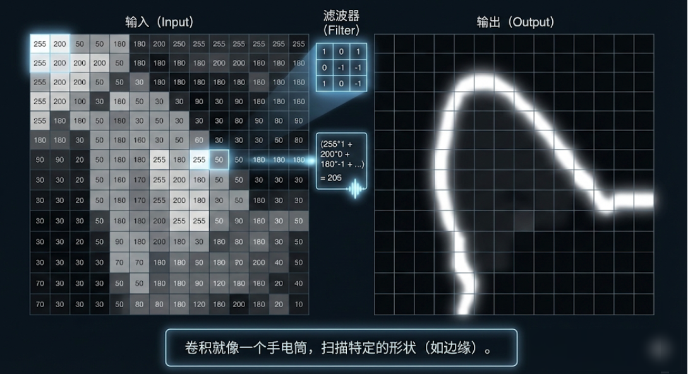
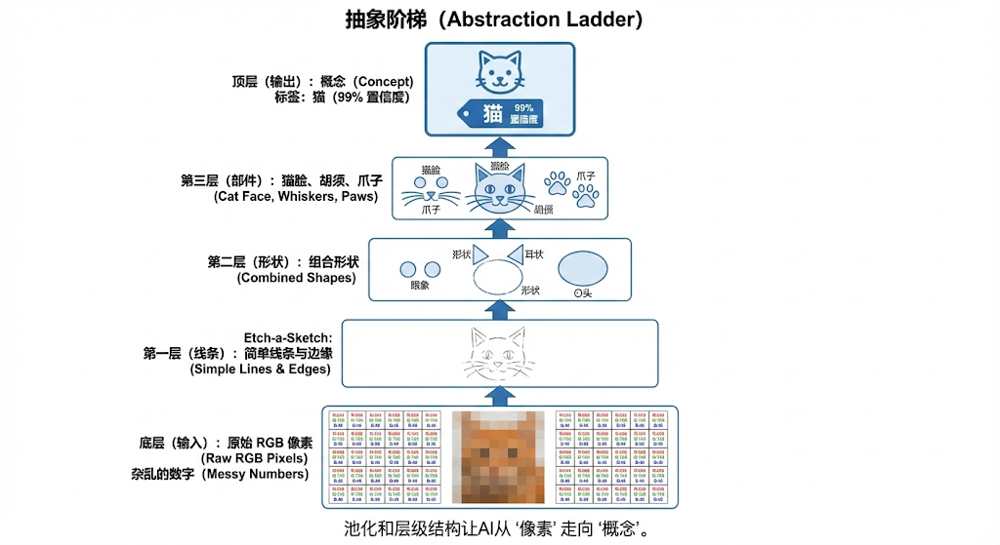
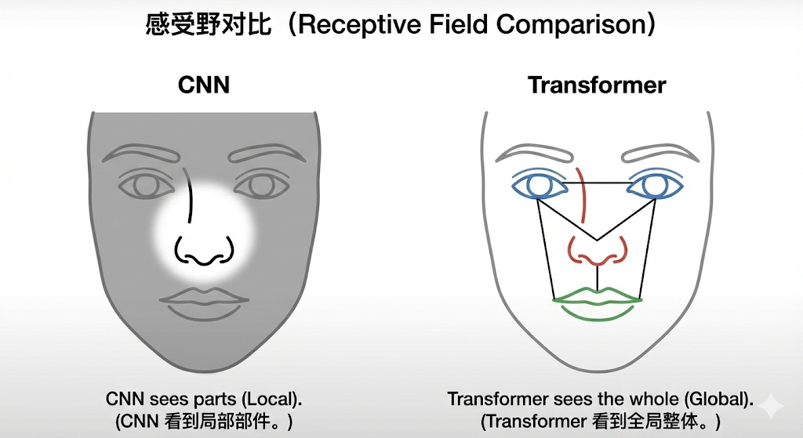

---
cssclasses:
  - ai
  - 基础理论
tags:
  - ai学习
  - cnn
  - 计算机视觉
  - 深度学习
title: CNN卷积网络 - 视觉的局部到全局
date: 2026-02-04
authors:
  - wqz
description: 在 Transformer 统治世界之前，它是 AI 的眼睛。通过局部特征提取与层层抽象，理解 CNN 是如何看懂世界的。
collection: 第1阶段：深度学习核心
slug: cnn-bridge
collection_order: 2
---

# CNN卷积网络 - 视觉的局部到全局

:::note 第1阶段：第2篇
在上一篇，我们学习了神经网络的骨架：神经元、层、反向传播。

但如果你直接把一张高清照片喂给全连接网络（MLP），不仅电脑会死机，网络的"观察方式"也不符合常理。
这一章，我们通过 **CNN（卷积神经网络）** 来看 AI 是如何优雅地处理图像的。
虽然今天 Vision Transformer（ViT）风头正盛，但 CNN 揭示的"提取局部特征，并逐层抽象"的思想，是深度学习中最经典的绝招。
:::

---

## 1. 为什么全连接网络搞不定图片？

所谓**全连接网络 (Fully Connected Network)**，就是每一层的每个神经元，都要去死记硬背上一层的所有输入。

假设你要处理一张用手机拍的照片（1200 万像素）。如果用全连接网络，把每个像素点都当成一个输入：

$$ 1200\text{万像素} \times 3 (\text{RGB颜色}) \times 1000 (\text{随便一层隐藏层}) \approx 360 \text{亿个参数} $$

这还只是第一层！你电脑的显卡内存当场就会爆炸。

**更要命的是，它没有"视觉常识"：**

当你找照片里的猫时，你是死盯着左上角那个像素点的 RGB 变动吗？
当然不是，你看的是**特征**：这儿有个尖尖的耳朵，那儿有个带胡须的鼻子。
而且，不管这只猫是在左边还是右边（平移），它都还是一只猫。全连接网络根本不懂这个道理，左边的猫和右边的猫对它来说完全是两幅毫不相干的输入。

---

## 2. 卷积的直觉：拿着滤镜的手电筒

CNN 改变了游戏规则。它的核心操作叫 **卷积 (Convolution)**。

别怕这个词，在图像处理里，卷积就是拿着一个**带图案滤镜的手电筒**去扫图片。

> 

1.  **滤镜 (Filter / Kernel)**：这是一个很小的矩阵（比如 3x3 像素）。
    - 滤镜 A 专门用来找**横线**。
    - 滤镜 B 专门用来找**竖线**。
    - 滤镜 C 专门用来找**对角尖角**。
2.  **滑动扫描 (Sliding)**：拿着滤镜从图片左上角一点点滑动到右下角，就像在做全身扫描。
3.  **激活匹配**：如果底下的图块刚好和滤镜的图案长得很像，结果数值就会"爆表"（高亮显示出来）。

这样一扫，我们不用去记几千万个单独的像素，而是直接把图片变成了几张**特征图（Feature Maps）**——一张标记了所有横线在哪，一张标记了所有竖线在哪。

---

## 3. 层层建构：Pooling (池化) 的抽象艺术

找到了横线竖线又怎样呢？这依然不是猫。

这就是为什么我们需要**很多个卷积层叠在一起**，中间还要加一个核心操作——**Pooling（池化）**。

池化的逻辑极其简单但有效：**生成缩略图，顺便抓大放小。**
比如 2x2 的格子里，取最大那个数值，抛弃掉三个不重要的细节。图片瞬间缩小 4 倍，但**关键特征的相对位置被强行保留并放大了**。

经过一系列的 `卷积 → 激活 → 池化` 堆叠，神奇的事情发生了：网络学会了**像搭积木一样层层抽象**。

- **Layer 1**：看到很多基础的边缘和线条（横线、竖线）。
- **Layer 2**：线条组成了部件（角落、圆弧这种基础形状）。
- **Layer 3**：部件拼凑成了器官（**猫耳朵**、**猫眼睛**、**胡须**）。
- **Layer 4**：将各个器官的概念整合，得出高维结论——（**这是一只完整的猫**）。

> 

这就是深度学习为什么带个"深"字。没有深度，就无法在一团杂乱的像素泥潭里，捏造出拥有高级语义的抽象概念。

---

## 4. 为什么在大模型时代，CNN 退居二线了？

统治了计算机视觉差不多 10 年（2012 AlexNet 到 2020 年初）后，CNN 的霸主地位受到了挑战。
现在大火的多模态大模型（比如 GPT-4o 的视觉能力、Sora），底层的视觉架构正全面转向基于 Transformer 的架构（如 ViT，Vision Transformer）。

主要原因有两个：

### 1. 视野限制：只见树木，不见森林

CNN 天生是**看局部**的（比如只能看 3x3 的格子）。虽然堆叠很多层之后最终能覆盖整张图，但它骨子里很难在一开始就建立起跨越整张图两端的**全局联系**。

而 Transformer 的注意力机制（Attention）截然不同——**它第一眼就会让图片的每个切块，互相之间打个招呼建立联系**。

:::warning 💡 归纳偏置 (Inductive Bias) 的双刃剑

- **CNN 是个"规矩"的好学生**（强归纳偏置）：它心里预设了"图像的相邻像素一定有关系"的物理常识。所以给它少量数据，它很快就能出成绩。
- **Transformer 是个"目中无规矩"的天才**（弱归纳偏置）：它什么先验规律都不假设，认为万物皆可互相关联。刚开始拿少量数据教它，它表现很烂；但只要喂海量数据给它，它自己领悟出的规律远比人类教的"空间局部性"更强悍。上限极高。
  :::

> 

### 2. 追求秦始皇式的"书同文、车同轨"

文本是序列，音频是序列。如果把图片也切成一个个小方块当成序列……那我们干脆全用同一套 Transformer 引擎处理算了！
这就是现在**多模态统一模型**（Omni-model）的工程美学，用同一套内核理解文字、声音和图像。

---

## 5. 总结

:::note 第1阶段核心知识点（CNN篇）

1. **卷积操作**：带着图案滤镜做滑动扫描，通过极少的参数完成局部特征提取。
2. **平移不变性**：猫在画面左边还是右边，都能被同一个滤镜提取出来。
3. **池化（Pooling）**：生成缩小版的特征图，抛弃不必要的噪音，强制提取更高维度的轮廓。
4. **层层抽象**：从像素 → 线条 → 器官 → 语义概念。
5. **历史意义**：CNN 定义了过去十年的计算机视觉，今天在端侧芯片上仍占绝对主导；但最前沿云端模型正在走向 Transformer 大一统。
   :::

---

**下一阶段预告**：
CNN 解决了**空间上**的局部关系——但如果是**时间上极其漫游**的关系呢？比如怎样理解一整本书、甚至理解跨越半个小时对话中的上下文？

这便是改变人类科技进程架构的诞生。准备好，我们将跨入**第2阶段：Transformer与语言模型**的璀璨星河。

---

**下一章**: [Transformer基础](/blog/transformer-basics)
