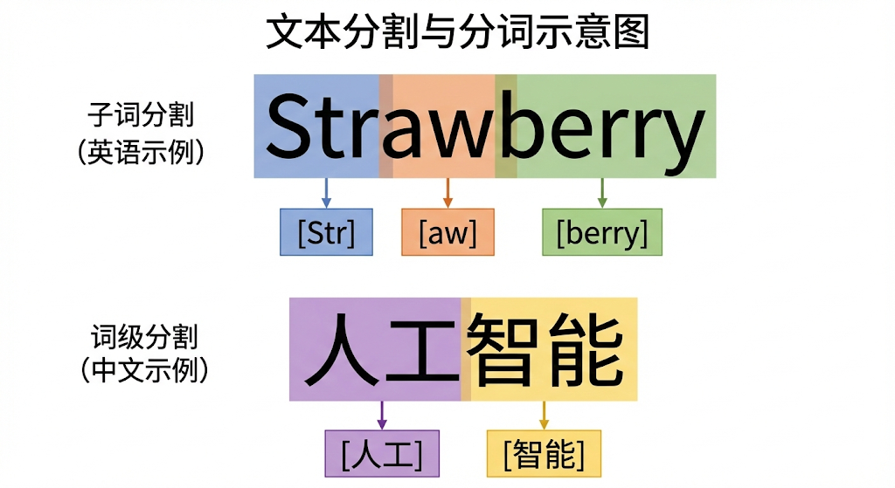

---
cssclasses:
  - ai
  - 基础理论
tags:
  - ai学习
  - tokenization
  - bpe
  - nlp
title: Tokenization详解 - AI的这口饭是怎么吃的
date: 2026-02-05
authors:
  - wqz
description: 为什么 Strawberry 有 3 个 r 但 AI 数不对？揭秘大模型的“咀嚼系统” —— 分词。
collection: 第2阶段：Transformer与语言模型
slug: tokenization-explained
collection_order: 2
---

# Tokenization详解 - AI的“咀嚼系统”

:::info 为什么要有这一章？
你一定见过这种奇怪现象：

- GPT-4 这种顶级模型，有时候连简单的“Strawberry 里有几个 r”都会数错。
- API 计费是按 **Token** 算的，而不是按字数或单词数算的。
- 有时候中文稍微改一个字，模型的回答风格就突然变了。

这一切的根源，都在于 AI 的“嘴巴” —— **Tokenization (分词)**。
:::

---

## 1. 计算机看不懂字，只看得懂数

我们在第一章说过，模型本质上就是一个巨大的数学函数。函数的输入只能是**数字**。
所以，当我们把 "I love AI" 喂给模型时，必须先把它变成一串数字。

问题来了：**怎么切？**

### 方案 A：按字母切 (Character Level)

把每个字母变成一个数字。`a=1, b=2, c=3...`

- **优点**：字表很小（26个字母+符号，不到200个）。
- **缺点**：**序列太长了！** 一篇 1000 字的文章可能会变成 5000 个字母。Transformer 的注意力机制计算复杂度是 $O(N^2)$，序列变长一点，计算量爆炸增长。**模型会变得极慢。**

### 方案 B：按单词切 (Word Level)

把每个英语单词变成一个数字。`apple=1, banana=2...`

- **优点**：序列短，语义清晰。
- **缺点**：**词表无限大！** 英语有几十万个词，而且每天都在造新词（比如 `iPhone`, `ChatGPT`）。如果遇到没见过的词（Out of Vocabulary），模型就瞎了，只能标记为 `<UNK>` (Unknown)。

---

## 2. 中庸之道：Subword Tokenization (BPE)

为了平衡“序列长度”和“词表大小”，现代大模型（GPT, Llama, Claude）都采用了一种折中方案：**子词分词 (Subword Tokenization)**。

最经典的算法叫 **BPE (Byte Pair Encoding)**。

### 🧩 类比：乐高积木

想象语言是乐高积木搭成的。

- 我们不需要为每一个“城堡”、“汽车”都造一个专门的零件（太占地）。
- 我们也不想只用最小的 1x1 豆豆去搭（太累）。
- 我们保留一些**常用的组件**：比如 2x4 的砖、轮子、窗户。

**BPE 的逻辑就是：把经常在一起出现的字符组合，合并成一个 Token。**

### 举个例子

假设我们要处理单词 `unhappiness`（不快乐）：

1.  **按字切**：`u, n, h, a, p, p, i, n, e, s, s` (11个 token) -> 太长。
2.  **按词切**：`unhappiness` (1个 token) -> 词表里可能没有这个冷门词。
3.  **BPE 切法**：
    - 模型在训练数据里发现 `un` 经常出现（unhappy, undo）。
    - 发现 `ness` 经常出现（kindness, darkness）。
    - 于是把它们存进词表。
    - 最终切分：`un` + `happi` + `ness` (3个 Token)。

> 

这样既缩短了序列，又能处理没见过的生僻词（只要能拆成认识的零件就行）。

### 2.1 现代分词的“门派之争”

基于子词（Subword）的核心思想，AI 界繁衍出了几个最主流的分词流派。它们代表了不同时期顶尖模型的选择：

- 🔥 **BPE 与 字节级 BPE (BBPE)**：从字母开始，每次挑出一对“最常挨在一起的兄弟”并合体。后来演进出 **Byte-level BPE**（GPT 系列专属），它不再从语言的字母表开始合并，而是直接从计算机底层的 **256 个字节 (Byte)** 开始。这样不管你输入的是火星文还是 Emoji，它都能切成字节吞下去，彻底消灭了 `<UNK>` 乱码。
- 🔥 **WordPiece**：和 BPE 类似，但它合并的标准不是盲目追求“谁重逢最多次数”，而是基于语言模型“合并后能不能让整句话的概率最大化”。它会在切碎的词根前面打上 `##` 标记（如 `run` + `##ning`）。这是 **BERT** 时代的绝对御用标准。
- ⭐ **Unigram 语言模型**：做法和前两者完全“逆向”。它一上来先假设一个庞大（比如上百万）的词表，然后一边训练，一边评估每个词的保留价值，把那些“对预测没啥用”的词大刀阔斧地砍掉。
- ⭐ **SentencePiece 框架**：你可以把它理解为“不挑食的万能切词刀”。像英文有天然的空格，切词很容易；但在中文、日文里词和词是连在一起的。Google 发布的 **SentencePiece** 把所有输入（连同空格一起）全部看作纯原始的 Unicode 字符流，屏蔽了语言间的排版差异。它是目前许多主流开源模型（如 LLaMA / Mistral）最喜欢用的**通用分词底层框架**。

---

## 3. 为什么 Strawberry 数不对？(Tokenization 的诅咒)

现在你能理解为什么 AI 数不清单词里的字母了吗？

当你问 GPT-4：_“Strawberry 里有几个 r？”_

在人类眼里：
S-t-**r**-a-w-b-e-**r**-**r**-y （清晰的3个r）

在模型眼里：
`[Token 135]` + `[Token 892]`
（可能是 `Straw` + `berry`，或者是其他奇怪的组合）

**模型根本“看不见”单词里面的字母！** 它看到的是两个 ID。就像这种感觉：
我问你：**“张伟”这个名字里有几个撇？**
你第一反应是“张伟”这个整体概念，除非你在脑子里把字写出来（画图），否则很难直接数出来。

:::tip 如何解决？
如果你强迫模型**把单词拆开写**，它就能数对了：

> User: 把 strawberry 拆成字母然后数数有几个 r。
> AI: s-t-r-a-w-b-e-r-r-y。这里有 3 个 r。

这就是 **CoT (思维链)** 的雏形。
:::

---

## 4. 关键工程指标：Vocabulary & Cost

对于工程师来说，Tokenization 直接关系到**钱**和**性能**。

### 词表大小 (Vocab Size)

- **GPT-4 / Llama 3**：词表通常在 100k - 128k 左右。
- **中文优化**：国产模型（如 DeepSeek, Qwen）通常会扩展中文词表。
  - GPT 对于“你好世界”可能需要 4-5 个 token（因为它不懂中文词组，切得很碎）。
  - DeepSeek 可能只需要 2 个 token（“你好”+“世界”）。
  - **结果**：用国产模型处理中文，**速度更快，更省钱**。

:::info 冷知识：遇到生僻字会崩溃吗？(Byte Fallback)
以前的老模型（如 BERT）遇到词表里没有的字，会直接显示 `[UNK]` (Unknown)，这很蠢。
现在的模型（如 GPT-4 / Llama）用了 **Byte Fallback** 技术：
如果遇到一个生僻字（比如罕见的 Emoji 或古汉字）不在词表里，它会自动退化成 **UTF-8 字节**（比如三个字节拼成一个汉字）来处理。
所以现代大模型几乎**永远不会**出现 `[UNK]`，它能处理人类所有的符号。
:::

### Token 换算经验值

- **英文**：1000 tokens $\approx$ 750 单词。
- **中文**：1000 tokens $\approx$ 500-700 汉字（视模型而定）。

---

## 5. 总结

:::note 本章核心知识点

1.  **Token $\neq$ 单词 $\neq$ 字符**。它是语义的最小单位，通常是“词根”或“常见组合”。
2.  **BPE 算法**：通过合并高频字符对，在“词表大小”和“序列长度”之间找到了平衡。
3.  **弱点**：因为模型看不见 Token 内部的字母，所以在做**字数统计、回文判断、字符级操作**时会变笨。
    :::

---

**下一章预告**：
如果你能坚持看到这里，恭喜你，**第 0-2 阶段（基础理论部分）**通关了！🎉
你已经懂了机器学习的逻辑、深度学习的深度、Transformer 的机制、以及 Token 的奥秘。当把语言变成机器认识的数字 ID (Token) 后，理论上我们就拥有了控制大模型的钥匙。

真正高效的极客黑客并不是亲自敲动辄千卡的炼丹训练代码，而是玩转这串钥匙——通过"提示词"释放大模型的超级算力。
下一章，让我们跨出苦涩的底层理论，正式踏入充满 Vibe Coding 魔法的实战区：**第3阶段：提示工程 (Prompt Engineering)**。

---

**下一章**: [提示工程详解](/blog/prompt-engineering-guide)
