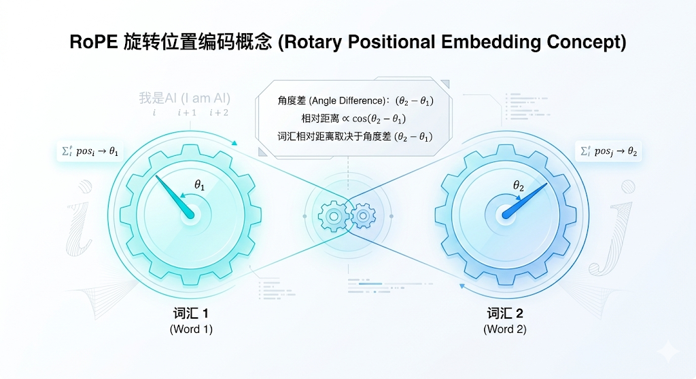
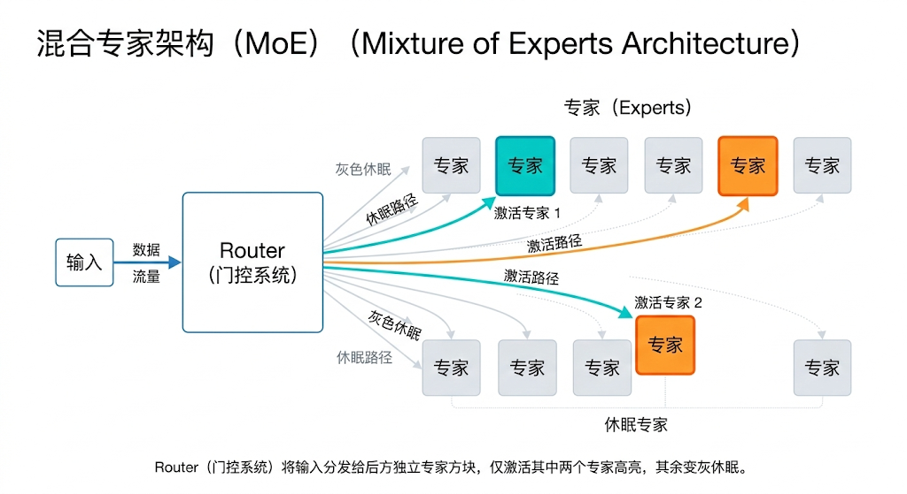
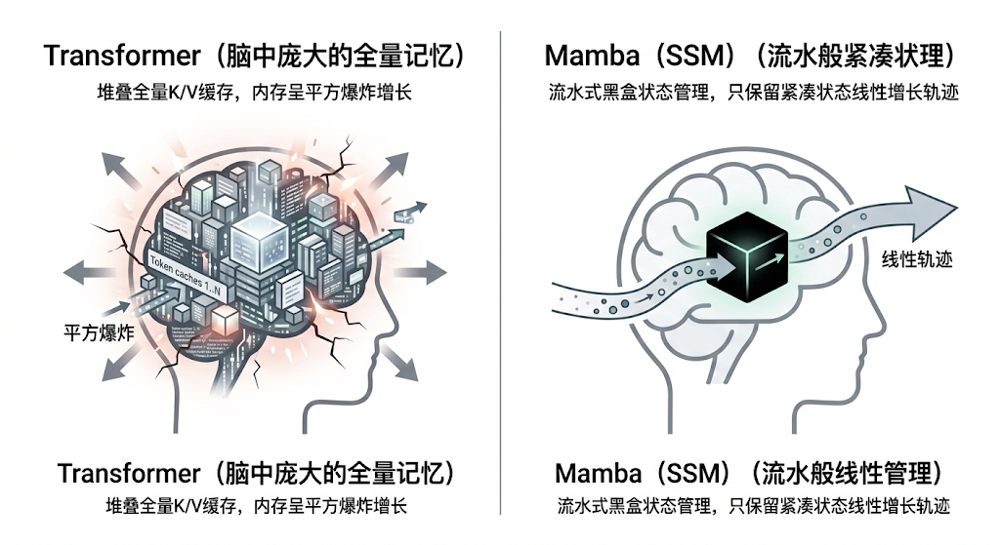

---
cssclasses:
  - ai
  - 架构前沿
tags:
  - ai学习
  - transformer
  - rope
  - moe
  - mamba
title: 2.3 现代大模型前沿组件（RoPE与MoE）
date: 2026-02-07
authors:
  - wqz
description: Transformer 只是一具骨架。了解现代大模型如何利用 RoPE 解决长上下文记忆、用 KV Cache 和 MoE 打败算力刺客，以及神秘挑战者 Mamba 凭什么叫板。
collection: 第2阶段：Transformer与语言模型
slug: advanced-transformer-components
collection_order: 3
---

# 2.3 现代大模型前沿组件（RoPE与MoE）

:::note 走出原始丛林
在上一节（**2.2 Transformer架构拆解**）中，我们明白了 **Self-Attention** 是如何在一眼之内、无视距离地让单词之间互通款曲的。
这篇发表于 2017 年的架构，确立了“并行+注意力”的盛世。

但如果你真的拿这套原始配置去跑今天的千亿参数模型，你会：

- 当用户丢给你一本 10 万字的小说，它会因为“绝对坐标刻度”不够长而当场变乱码。
- 为了算一个字，模型要把所有千亿参数在硬盘和内存间轮转一次，每次聊天都会破产。
- 注意力矩阵的算力需求是**字数的平方指数级爆炸**，长度翻倍，它直接死机。

为了解决这些要命的工程极限，顶尖学者们为 Transformer 进行了一次次疯狂的器官替换与魔改。
:::

---

## 1. 记住远近：RoPE (旋转位置编码)

在上一章我们提到过，Transformer 默认是个“词袋（Bag of Words）”，它不知道语序。
原始论文的解决方法是硬塞：用固定的 $\sin/\cos$ 几何波浪，强行赋予第 1 个字和第 1000 个字一个“绝对坐标”。

### 1.1 绝对坐标的局限：不会拐弯的木头

如果我的模型只被训练过支持最大 2048 个字的长度。你突然丢给我一本 1 万字的小说，那些落在 2048 号位置开外的坐标它从来没见过，结果显然是灾难性的。
更惨的是，人类理解语言靠的是**相对位置**。
不管“中国”和“北京”这两个词是在文章的第 1 段出现，还是在第 500 段出现，只要它俩挨在一起（相对距离是 1），注意力机制就应该能秒懂它们的羁绊。

### 1.2 齿轮的魔法：旋转位置编码 (Rotary Position Embedding, RoPE)

这无疑是近几年模型架构最大的突破之一，由中国团队提出，现已**全面制霸统治 LLM 界**（LLaMA/Qwen/DeepSeek/Mistral 的标配）。

**原理**：
它不再给每个位置死板地加黑板擦，而是利用复数空间的旋转。
你可以想象成：给每个输入的词向量装上了一个**表盘齿轮**。

- 如果是在第一个位置，齿轮转了 10 度。
- 到第二天，齿轮转了 20 度。
- **神奇的数学巧合**：当 Q（借书卡）带着 10 度的旋转去碰 K（标签）带着 30 度的旋转时，它们的点积结果，在数学公式展开后，**奇迹般地只和它们的夹角差（20度，也就是相对距离 2）有关！**

**史诗级 Buff**：因为模型学会了看“相对距离”，工程师只需要在微调时稍微“降低齿轮旋转的速度（RoPE Scaling）”，就能把原本只能看 8000 字的模型，无痛拓宽视野，拉伸到可以阅读 100 万字的神器（比如最近风靡的长文本模型技术）。

---

## 2. 算力刺客与 KV Cache

如果你理解了 Decoder-only 模型（GPT系列），你一定知道生成文字是“蹦字机”：
根据“我”，算出“爱”；根据“我爱”，算出“你”。

**问题来了：**
算“你”的时候，“我”和“爱”是不是又要重新走一遍那几百层的网络，去生成 Q、K、V 矩阵然后再点积？
当你写到第 1 万个字的时候，前面的 9999 个字又要为了这 1 个字重新跑一遍千亿级网络？
如果每次都这么折腾，全球的电站加起来都不够烧的。

### 时光机缓存：KV Cache

为了不重复劳动，工程师祭出了 **KV Cache**。
既然之前计算第 3 个字的时候它和前面词的相互评价（Key 和 Value 矩阵）已经算过了，那我就在 GPU 显存里划一块区域，**强行把它们存下来！**
所以预测下一个字的时候，前面 1 万个字的 $K$ 和 $V$ 是现成的内存数据，模型只需要算出当前这第 10001 个字的 $Q$，去把内存扫一遍拿结果即可。

> **代价**：推理极速狂飙，但显存开销极大（随着你的对话变长，显存会被塞满）。这就是为什么商业大模型长对话额度非常昂贵的核心秘密。

---

## 3. 终极省流密码：MoE (混合专家架构)

当大语言模型的参数从百亿堆到了数千亿，就算是有了 KV Cache，每蹦一个字，显卡也得要把几千亿的模型权重参数给载入一次算力单元（这叫显存带宽瓶颈）。

于是 **MoE（Mixture of Experts）** 被推上了神坛（这也是 GPT-4 和 DeepSeek 一战封神的核心机密）。

### 3.1 从大锅饭到门卫分包

如果模型是一座拥有几千亿个参数神经元的综合大楼（稠密模型 Dense）。每一句话进来，全楼几万个人都要开个会走一遍过河卒子。
**MoE 的逻辑是疯狂拆分**：

- 把这层楼原本一体的 MLP（前馈网络），硬生生劈成 168 个小房间，每个房间叫一个**专家（Expert）**。
- 在楼下安一个轻量的**路由器（Router 门控系统）**。

### 3.2 稀疏激活：多快好省

当输入词语“代码”跑到这一层时，Router 扫描一眼它的权重，大喊：
“这个词是代码结构，第 3 号（逻辑专家）和 第 8 号（符号专家）出列干活！其余的 166 个专家**就地睡觉（挂在硬盘里，不进显存）**！”

这就叫 **稀疏激活 (Sparse Activation)**。
虽然 DeepSeek-V3 的总参数量高达 6710 亿！但你每一次发一句话，**真正被唤醒参与计算的脑细胞（激活参数）只有仅仅 370 亿。**
正是因为 MoE 把算力费用打了个两折，大模型的价格战才能杀得刀刀见红，平民也能用上绝顶聪明的 AI。

---

## 4. 图腾挑战者：Mamba 与 SSM

无论再怎么利用 KV 缓存和专家分包，Transformer 依然有一个原罪：
**注意力的平方定律** ($O(N^2)$)。
你输入 1 千个词，计算量是 1 百万。你输入 1 万个字，计算量变 1 亿！如果你想让 AI 当你的全年 24 小时代码私人监听器（上千万字），Transformer 的架构会在物理上被热穿透。

这时候，一个名为 **SSM (状态空间模型)**，带着最强刺客 **Mamba** 浮出了水面。

### 4.1 Mamba 的硬核降维

Mamba 的宗族回溯到了当年被 Transformer 按在地上摩擦的 **RNN (循环神经网络)**。
RNN 的最大优点是：**它看文章就像看流水，不管你看一万字还是十万字，它脑子里始终只保留着“今天的一个固定大小的记忆黑匣子”**。计算量呈完美的线性增长。

但当年 RNN 因为“不能并行”、“会得失智症（遗忘前文）”被淘汰了。
而 Mamba 的作者通过变态的高阶微分方程组（硬件感知算法），成功让它在训练时实现了**大规模并行运算**，并且它能根据当前的话题，**聪明地决定要记住哪些核心，忘掉哪些废话**。

### 4.2 终章未决

目前的 Mamba，凭借无与伦比的长文本理解低迷算力消耗，在部分指标上已经追平了等量级的 Transformer。虽然目前在百亿模型以上的赛道，Transformer（结合 MoE）依然靠生态红利压制着一切反叛，但 Mamba 代表的无极限窗口潜力，已经是学界公认最有可能的下一代替代者。

---

## 5. 第二阶段知识串联总结

恭喜你！到这里，你已经征服了现代 AI 技术浪潮里最硬核、最底层的第二阶段：

1. **语言数字化的基座**：你懂了 `Tokenization` 是怎么把一段中文切分成带有字典序号的碎片（带上其背后的词汇表税率）。
2. **通天塔图纸**：你懂了 `Transformer` 的骨架是通过 `QKV Attention` 并行对齐了距离的鸿沟。
3. **现代长腿魔改**：你领略了利用相对距离理解长文本的 `RoPE`、用来对抗高昂算力的 `KV Cache` 与 `MoE 专家门控`。

我们学习这个，并不是为了去当下一个手搓大模型的黄仁勋。而是当你未来面对一堆开源模型调参界面时，你将清楚地知道每个旋钮究竟捏在哪一层骨髓。

**下一章预告：**
当这个千亿参数、搭载着各种黑科技引擎的大模型出场时，它已经学完了人类几千年的藏经阁。
但你突然发现：**你不会用它**。
它经常胡说八道、或者给出敷衍的废话。
怎样才能成为这台千亿猛兽的驯兽师？从给它设定指令、逼它自我反思开始。

欢迎从“理论造轮子”正式跨入“上层应用”大门：**第3阶段：提示工程（Prompt Engineering）**。

---

**下一章**: [提示工程](/blog/prompt-engineering)
