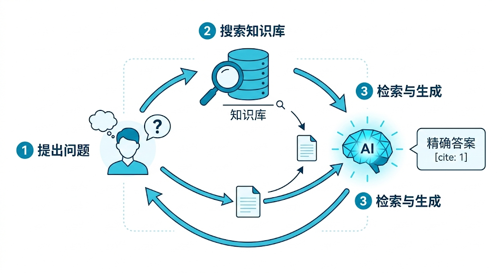

---
cssclasses:
  - ai
  - 核心架构
tags:
  - ai学习
  - rag
  - 向量检索
  - chunking
  - 混合检索
title: 4.2 RAG基础架构：从切分到混合检索
date: 2026-02-12
authors:
  - wqz
description: 当大模型没读过你们公司的机密文档时，如何让它不仅能回答，还能给出准确的引用来源？详解 RAG 的落地基础架构。
collection: 第4阶段：检索增强生成
slug: rag-infrastructure-hybrid-search
collection_order: 2
---

# 4.2 RAG基础架构：从切分到混合检索

:::info 解决大模型的最终幻觉
无论提示词（Prompt）写得多么天花乱坠，大模型依然有两个无法凭借算力解决的死穴：记忆停滞（只记得训练截止日期前发生的事），以及私有壁垒（绝对不可能读过你们公司内网的财报）。

如果你问一个不在它预训练数据里的问题，它就会一本正经地胡说八道（产生幻觉）。怎么破？那就**不要让它去靠死记硬背猜答案，而是把参考书翻开摆在它面前，让它做阅读理解**。

这就是 RAG (Retrieval-Augmented Generation，检索增强生成)。
:::

---

## 1. 什么是 RAG？(开卷考试范式)

RAG 的逻辑极其朴素，它就像是一个**外包客服**的工作流程：

1. **用户提问**：“我们公司这个月的报销标准降了吗？”
2. **检索 (Retrieve)**：客服一愣（因为他没背过公司财报），转身冲进公司的资料档案室，通过电脑系统检索搜出了包含“报销标准”的相关规定。
3. **增强 (Augment)**：客服把这些规定和用户的问题拼在一起：“根据这篇文档显示，这个月差旅报销降了50块钱。现在用户的原问题是：报销标准降了吗？”
4. **生成 (Generate)**：大模型发挥它卓越的总结能力，输出最终答案：“您好，根据最新规定，本月报销标准已下调。”

这就是 RAG：让大模型停止猜测，强制它转为进行**严格带引用的阅读理解**。

---

## 2. 第一道关卡：文本切分 (Chunking)

在 4.1 章节中，我们讲过 **Embedding 模型**能把文本转成坐标。但在把公司的知识变坐标存进库之前，你必须面临一个极其现实的物理难题。

你绝不能把一整本厚达 1000 页的《员工手册》直接打包存成一个单独的向量坐标。大模型的注意力机制在面对过量信息时容易失焦，且向量维度有限，几万字挤在一个坐标点里，其特征信息会被彻底稀释成一锅粥。你必须把它**切碎（Chunking）**。

切碎文本远不是用刀一分为二那么简单，目前工程落地中有几种截然不同的切分哲学。

最粗暴的做法是**固定大小切分**。比如设定每 500 个字无情地切一刀。这种方法写代码最快，但也最容易酿成惨剧：它极有可能把一句重要的话从中间拦腰斩断，导致前半截留在上一个区块，后半截落在下一个区块，让检索系统捞出来的全是残暴的断头语的垃圾数据。

为了避免断章取义，聪明一点的做法是**重叠切分 (Overlap)**。在切的时候设定 50 个字的重合区，就像铺瓦片一样，上一片和下一片叠在一起，从而拼死保住关键概念在边界处不丢失。

而目前真正考究的方案则是**语义树切分**。它放弃了死板的字数限制，而是让脚本去精准识别文章里的 Markdown 标题层级（比如 `##` 或是段落换行符），顺着作者原生的逻辑脉络一刀一刀剥离，保证切下来的每一块肉都是语义连贯、有头有尾的独立章节。

---

## 3. 把坐标锁入武器库：向量数据库

把海量的碎片存成向量坐标后，我们需要一个专门对抗“几十亿浮点数坐标大搜索”的基建。如果在这种高维空间里还想用传统 MySQL 敲一句 `where name = '张伟'`，这种远古的匹配引擎在动辄几百维的浮点矩阵前会当场宕机。

这时，向量数据库迎来了它的繁荣时代。

对于想要在自己笔记本上快速跑通 RAG 概念的独立开发者，像 **Chroma** 或 **FAISS** 这种本地兵器绝对是首选。它们极其轻量，一个 pip 安装命令就能拉起，非常适合个人用来打造一本私人电子绝密日记的检索引擎。

当你步入企业级开发，并且不愿意养一帮运维团队天天盯着服务器发愁时，各大云厂商趁机推出了 **Pinecone** 这类云原生托管库。你只管把向量坐标往云端一扔，查询速度和集群扩容的脏活他们全包了，代价仅仅是每个月账单上的那几串美元数字。

真正的百星大厂或是对数据保密极度苛求的金融机构，则会毫不犹豫地在物理机房部署 **Milvus** 或 **Qdrant** 这类重量级的开源企业版大杀器。它们不仅能扛住十亿量级规模的深海搜索，还能完美跑在多张 GPU 卡上实现暴力的硬件加速查询。

---

## 4. 终结路径之争：混合检索 (Hybrid Search)

有了库，碎片也切好了，当用户一句极度口语化的提问抛过来时，怎么把最相关的碎片捞出来？这引发了古典检索派和现代向量派的长久血战。

在纯粹的**稠密检索（Dense Retrieval / 向量搜索）**眼中，它极度擅长体会“言外之意”。当你搜索“苹果公司”时，由于它在多维空间里的坐标离“库克”极近，它能极其聪明地把只提了库克的文章给捞回来。但它的软肋同样致命：当你搜索极度生僻且毫无语义关联的商品代号（比如“XM-99型工业齿轮”）时，Embedding 模型由于没怎么见过这个词，经常会把它映射到不知所云的角落里彻底抓瞎。

而老牌搜索引擎的基石——**稀疏检索（Sparse Retrieval / 如 BM25）**刚好是它的互补反面。它完全不懂什么是语义，它就是一个死磕极端字面比对的偏执狂。搜“开心”绝对找不到“喜悦”，但若是让它在百万字档里去找那串硬骨头代号“XM-99”，它能精确到标点符号一抓一个准。

经过无数次翻车与重构，目前的工业界已将这两种路径完美合体。**混合搜索 (Hybrid Search)** 成为了所有 RAG 系统的最终正解。系统会同时派出两路大军，一路用向量撒网捕捞大概意思，一路用 BM25 死抠专有名词缩写，最后加权把两边的战利品揉在一起，极大地拔高了知识库的命准率天花板。

---

## 5. 最后一道大门：重排序 (Reranker)

假设混合检索辛辛苦苦给你捞回来了 50 块潜在的碎片。你能把这 50 块碎片全塞给大模型吗？
绝不能。这不仅会耗费极度昂贵的 Token 算力账单，更致命的是，大模型那原本就极其有限的跨度注意力（Attention）会被垃圾信息严重冲淡，极易抓错重点。

因此，在文档送入大模型口中之前，必须设立最后一位无情的打分裁判：**Cross-Encoder Reranker（交叉编码重排序）**。

与之前只需要算个向量坐标方向的方法不同，Reranker 要求极高，它会不厌其烦地把“用户的原问题”和每一块碎片放在一起，极其死磕地跑一遍深度的双向阅读理解，最终给出一个精确到小数点的 0 到 1 的相关度打分。在这把锋利的筛子过滤下，90% 的浑水摸鱼碎片当场被斩落马下，最终只有得分最高的那 3 到 5 块最纯正的上下文才会被谨慎地喂给大模型。

这就是现代 RAG 极其经典的心法铁律：**混合召回负责把网撒得又大又广，而重排序裁判则负责挥舞剔骨尖刀，留下那仅存的精华核心。**

---

**下一章预告**：
基础的 RAG 链路已经跑通。但随着用户问题的日益魔幻刁钻，简单的“关键词撞库”和甚至引入了重排序也还是无法搜出真正有用的信息。
当用户的隐晦问法甚至连正确的搜索词都不带时，怎么把埋藏在地底的上下文挖出来？
**4.3 RAG进阶路线：召回黑科技与长文本博弈**，我们将深入了解多路查询、大预言家伪造扩写等惊艳的业界极客思路。
