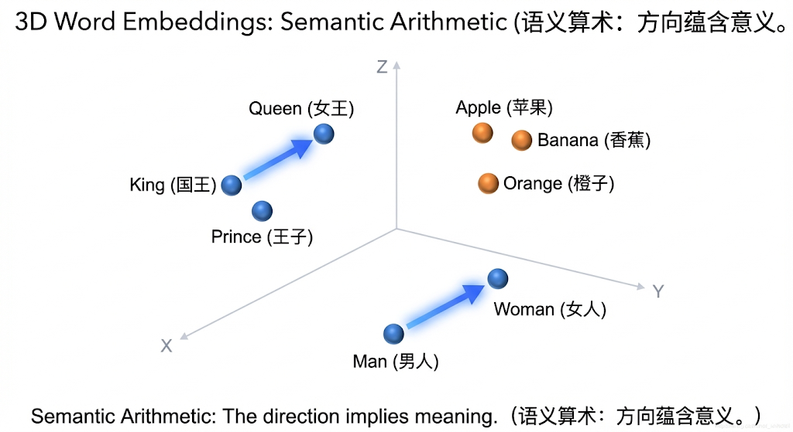

---
cssclasses:
  - ai
  - 基础理论
tags:
  - ai学习
  - embedding
  - 向量
  - rag
title: Embedding详解 - 万物皆是坐标
date: 2026-02-11
authors:
  - wqz
description: 既然 AI 只认识数字，它是怎么理解“国王”和“王后”有关系的？详解 AI 的语义空间。
collection: 第4阶段：检索增强生成
slug: embeddings-explained
collection_order: 1
---

# Embedding详解 - 万物皆是坐标

:::info RAG 的前半生：把文字变成数学坐标
在进入真正的检索（RAG）之前，我们需要解决一个本质问题：
既然 AI 的世界里全都是张量和矩阵，那它是如何理解“苹果”和“香蕉”是亲戚，“张伟”和“伟大”其实毫无关联的呢？

只有弄懂了它的高维空间映射逻辑，我们才能明白后面的那些 Chroma / Milvus 向量数据库到底存了些什么。这就引出了我们的核心基建 —— **Embedding (嵌入模型)**。
:::

---

## 1. 什么是 Embedding？

简单说，就是**把字典里的每一个 ID，映射到一个高维空间里的坐标 (Vector)**。

想象你走进了一家巨大的无人超市。

- **Token ID** 就像是商品的条形码（无意义的数字）。
- **Embedding** 就像是商品在超市里的**具体位置坐标** `(货架3, 层数2, 左侧10米)`。

在这个“语义超市”里，摆放是有规律的：

- 🍎 苹果旁边一定是 🍌 香蕉（水果区）。
- 🧴虽然洗发水瓶子形状像饮料，但它离苹果很远（日化区）。

**Embedding 就是让 AI 即使不认识字，只要看坐标，就知道“苹果”和“香蕉”是亲戚。**

---

## 2. 只有坐标，没有魔法

在数学上，Token 变成了一个长长的浮点数列表（通常是 768 维、1536 维甚至更多）。

```python
# 'Cat' 的 Embedding 向量 (简化版)
[0.12, -0.45, 0.88, ..., 0.03]
```

每一维数字代表什么？
没有人确切知道。但在概念上，你可以想象：

- 第 1 维代表“是否是生物”
- 第 2 维代表“像不像动物”
- 第 3 维代表“高贵程度”
- ...

当模型训练完成后，神奇的事情发生了：

### 经典的“国王与王后”算术题

如果在向量空间里做减法：

$$ \vec{King} - \vec{Man} + \vec{Woman} \approx \vec{Queen} $$

这意味着：**在这个空间里，“性别”是一个固定的方向。** 把“国王”身上的“男性属性”减掉，加上“女性属性”，它就自动飞到了“王后”的坐标点。

这就是 AI “理解”意义的方式：**意义就是空间关系。**

> - 

---

## 3. 余弦相似度 (Cosine Similarity)

既然变成了坐标，我们就可以算**距离**。
在 AI 里，我们通常不算直线距离（欧氏距离），而是算 **夹角**（余弦相似度）。

- 方向一致（夹角 0 度） = 意思完全一样 (1.0)
- 方向垂直（夹角 90 度） = 毫无关系 (0.0)
- 方向相反（夹角 180 度） = 意思完全相反 (-1.0)

这就是为什么 RAG（知识库问答）能找到你想要的文档。
它不是在搜关键词，而是在**高维空间里找离你问题坐标最近的那段话**。

### 为什么不用欧氏距离？

你可能会问，两点之间不应该算**直线距离**（欧氏距离 Euclidean Distance）吗？
确实有三种常见的算距离方法：

1.  **欧氏距离 (Euclidean)**：拉尺子量距离。
    - 缺点：它对“长短”敏感。如果一篇短文章和一篇长文章内容一样，只是重复了一遍，它们的向量方向一样，但长度不同，欧氏距离会认为它们差别很大。
2.  **点积 (Dot Product)**：向量相乘。
    - 特点：考虑了长度。经常用在 Transformer 内部（Attention 里的 $QK^T$ 就是点积），因为那里需要保留“强度”信息。
3.  **余弦相似度 (Cosine Similarity)**：只看方向，不管长度。
    - **最常用**：在判断语义时，我们只关心“主题是否一致”（方向），不关心“废话多少”（长度）。所以 RAG 基本上都用这个。

:::tip 简单的直觉

- **欧氏距离**：看谁离我最近（空间距离）。
- **点积**：看谁投影最强（方向一致 + 自身强大）。
- **余弦相似度**：看谁跟我长得最像（方向一致）。
  :::

## 4. 工业落地：拿什么算？(P1 进阶)

知道了坐标和距离测算原理，真实开发中我们要面临一个灵魂拷问：谁来负责把文字变成坐标？

不要用 GPT 去强行算 Embedding！术业有专攻，这事得交给专门的模型干：

- **Sentence-BERT (SBERT)**：早年霸主，第一次把句子放进同等的空间对比。
- **BGE (BAAI General Embedding)**：智源开源的神级模型，**中文/多语言场景的首选 P0 模型**。
- **E5 / Instructor Embeddings**：擅长根据你给的“指令前缀”动态调整坐标方向。比如提示它“用来检索医疗信息”，它生成的坐标就偏向医疗空间。

（有了模型算出来的这几百万个坐标，下一步就是靠数据库存起来，我们在下一章专门讲。）

---

## 5. 总结：向量的终极意义

我们通过 Embedding 模型，彻底把人类的离散语言，变成了可以在空间中自由度量夹角的**连续性坐标系**。

:::note 本期重点

- **本质**：Embedding 是把离散语言印刻在高维数学空间上的神童技术。
- **距离**：判定两个词义是否相近，我们多用“余弦相似度（看方向同义性）”而不是原生的数学直线距离。
- **选型方案**：要算极品坐标，请挂载专精模型（如 `BGE`）。
  :::

有了能算距离的坐标，这就为我们下一节真正的“智能资料库员”打下了底座。

---

**下一章预告**：
现在，你的电脑里已经装满了大大小小的“语义坐标”，那当用户发来一个提问时，我们该怎么把这些知识精准无误地捞出来喂给大模型？
欢迎进入 RAG（检索增强生成）的核心主干。

---

**下一章**: [RAG 核心原理](/blog/rag-core-principles)
