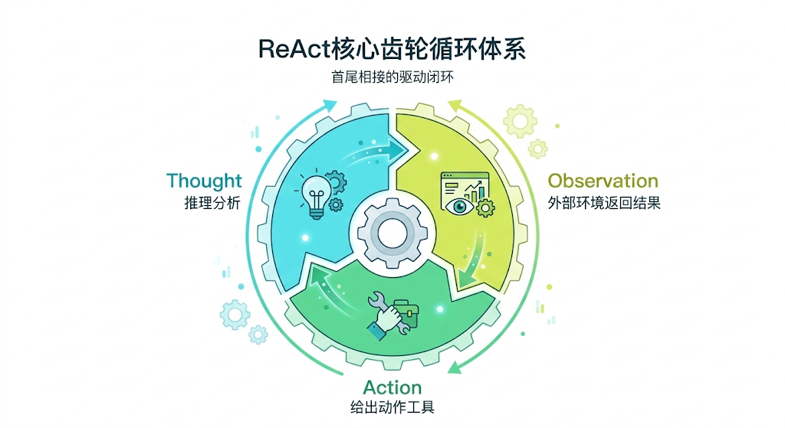
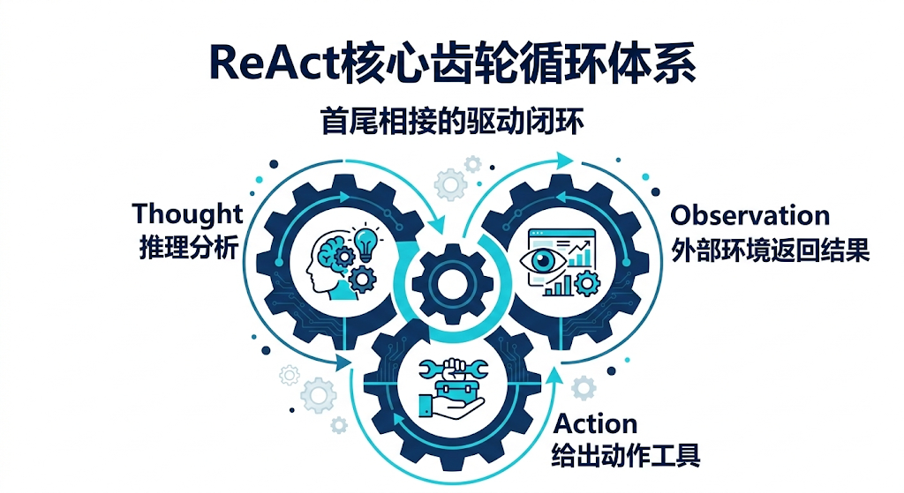
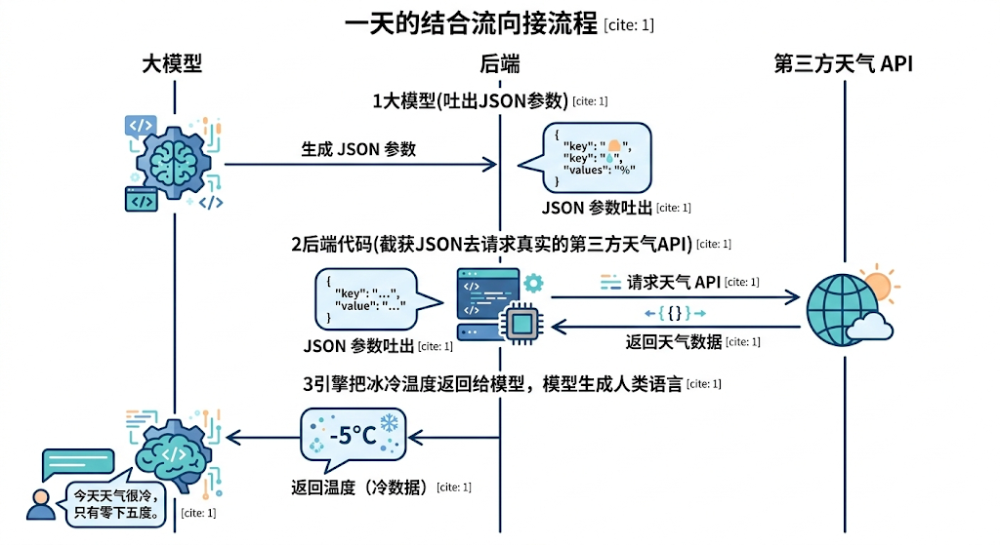

---
cssclasses:
  - ai
  - 架构前沿
tags:
  - ai学习
  - agent
  - react
  - tool-calling
title: 5.1 基础引擎：ReAct与ToolCalling
date: 2026-02-15
authors:
  - wqz
description: LLM 如何摆脱被动的纸上谈兵？揭开 Agent 从问答机变成行动派的底层核心机制：ReAct 循环与 Tool Calling 的 JSON 契约。
collection: 第5阶段：Agent智能体
slug: ai-agent-react-tool-calling
collection_order: 1
---

# 5.1 基础引擎：ReAct 与 Tool Calling

:::note 从被动解答到主动出击
在第 4 阶段的 **RAG 体系**中，我们已经见识了 AI 查阅资料的能耐。但它依然是个被动的书呆子：你提一个问题，它帮你查资料，最后总结成一段话给你。

但如果你想要一个能**自动帮你订机票、自动拉群发邮件、甚至自动跑代码修 Bug** 的数字员工呢？
如果 AI 不长出“手”，它懂再多大道理也只是纸上谈兵。

如何让模型长出双手？如何让它在遇到复杂任务时不再盲目瞎猜，而是学会“遇到山峰就调出登山镐，遇到大河就调出皮划艇”？
这就是 **Agent（智能体）** 要解决的问题。

作为本系列的最核心连载，本章我们将拆解 Agent 的绝对底层发动机：**ReAct** 脑回路和 **Tool Calling（工具调用）** 协议。
:::

---

## 1. 概念跨越：到底什么是 Agent？

如果你经常刷科技新闻，一定会觉得这个词被滥用了。似乎只要是个聊天框，厂商都叫它 Agent。

但在现代 AI 工程体系里，Agent 有极度严格的划分边界。

- **普通的 LLM 聊天（ChatGPT）**：你输入 Prompt ➝ 它根据训练数据预测下一个词 ➝ 输出文本。结束。
- **RAG 搜索（Perplexity）**：你输入问题 ➝ 脚本去数据库搜索文本 ➝ 交给 LLM 组装 ➝ 输出文本。结束。
- **真正的 Agent（Devin 或 AutoGPT）**：你下发一个抽象目标 ➝ 模型自己**拆解目标** ➝ 决定**要用什么工具** ➝ 看到工具的**返回结果** ➝ 纠正路线 ➝ 继续决定**下一个动作**，直到任务彻底跑完。

Agent 的本质，就是把大语言模型从一个“答题机器”，降级成为了一个“小脑（控制器）”。而用来驱动这个小脑的核心操作系统指令，就叫 **ReAct**。



---

## 2. 大脑的齿轮：ReAct 循环

在真实世界里，人们是怎么完成一件复杂事情的？
假如让你去超市买一箱可乐。你首先会**思考 (Thought)**：好渴需要买可乐，没带钱包得用手机。接着采取**行动 (Action)**：走到小区超市。但到了之后你**观察 (Observation)**到超市关门了。于是你会再次陷入**思考 (Thought)**：马路对面有个自动售货机。最后执行新的**行动 (Action)**：过马路刷脸买到了可乐，顺利拿到结果。

2022年，普林斯顿大学的研究人员发表了著名的 **ReAct 论文 (Reasoning + Acting)**。他们发现，只要在给大模型的神奇 Prompt（系统提示词）里，教会它像人类一样**交替进行“思考”和“行动”**，模型就能在一连串的循环中完成极其复杂的推理任务！

### 2.1 ReAct 的系统长提示词模板

如果把目前市面上所有的 Agent 剥光，底层可能只是一段类似于下面这样的死磕 Prompt（也就是 Agent 框架为你封装好的核心循环）：

```text
你是一个智能助手，必须按照以下严谨的格式来不断循环，直到给出最终答案：

【思考】：你对于当前状况的推理过程。需要什么信息？目标还差多少？
【行动】：需要采取的动作，只能从 [搜索天气, 查计算器, 发送邮件] 中选择一个！并给出传入的参数。
【观察】：这个观察结果不是由你生成的。系统运行了你的行动后，会把真实的客观结果返回给你看。

当你觉得所有信息都收齐了，请输出：
【最终答案】：你的回答。
```

### 2.2 循环演示

有了这个紧箍咒，面对“北京明天适合穿短袖吗？”，Agent 的大脑中会自动开启一场充满闭环逻辑的自言自语，它会按步骤一步步执行：

1. **Thought（思考）**：用户问能不能穿短袖，我得先知道北京明天的天气。
2. **Action（行动）**：调用获取天气工具 `get_weather(location="北京", date="明天")`。此时大模型原地挂起等待。
3. **Observation（观察）**：_(系统工程代码在外部查好后返回)_ 天气预报显示大风降温，最高温 10 度。
4. **Thought（思考）**：拿到结果了！10 度太冷，绝对不能穿短袖，收集的信息已经集齐。
5. **最终答案**：得出结论，一本正经地输出最终答案，告诉用户务必要穿冬装。

**这就是 Agent 拥有“灵魂”的全部机密。**
模型本身并没有去调接口，它只是在文本框里输出了一个名为“Action 1”的字符串。
是挂载在系统里的工程代码，截获了这个短语，跑去替它执行了 API，然后再把结果像喂饭一样，通过“Observation”塞回了上下文里让它继续读。



---

## 3. 长出双手：Tool Calling (Function Calling 工作流)

其实，老一代的 AI（比如 OpenAI 年初刚开放 GPT-3.5 接口时），都是强行用上面那种死板的 Text Prompt 来解析结果的（依靠正则大军强行切割它输出的字符 `Action: xxx`）。
但文字是极度暧昧的。万一模型哪天抽风，没按格式或者连着说了一大堆废话，后端的代码就会因为无法抽取指令而当场崩溃。

所以，OpenAI 在 2023 年底推出了一个碾压全行业的核武器级基建更新：**Function Calling**（目前各家开源模型也已拉齐，统称 **Tool Calling 工具调用**）。

### 3.1 JSON Schema：人机之间的铁血契约

不要指望这帮大模型懂什么叫代码。
在它的眼里，所谓的工具，只是你递给它的一本极其详尽的**字典说明书 (JSON Schema)**。

当你发起对话时，你除了发送消息，还会顺带向大模型传送一个类似这样的护身符：

```json
{
  "name": "get_weather",
  "description": "获取某个城市的当日天气情况",
  "parameters": {
    "type": "object",
    "properties": {
      "location": {
        "type": "string",
        "description": "城市名称，例如：北京、上海"
      },
      "unit": {
        "type": "string",
        "enum": ["celsius", "fahrenheit"]
      }
    },
    "required": ["location"]
  }
}
```

大语言模型（像 DeepSeek 或 GPT-4o）在训练阶段吃下过海量的此类契约。当它在判断这道题需要天气时，它**在内部生成了隐藏的思考（Thought）**，然后在模型返回端，它**拒绝生成普通的聊天文本（content为 null）**，而是直接吐出了一个机器可读的、百分百符合格式的指令参数块：

```json
"tool_calls": [
  {
    "id": "call_123",
    "type": "function",
    "function": {
      "name": "get_weather",
      "arguments": "{\"location\": \"北京\", \"unit\": \"celsius\"}"
    }
  }
]
```

### 3.2 兵临城下：真实代码的执行

此时你的后台代码拿到了这个精准无比的 JSON：

1. **解析意图**：一切由虚转实，后台识别出模型想按天气按钮并抠出了“北京”这个关键参数。
2. **执行代码**：紧接着你的 Python 或 Node.js 脚本全面接管控制权，拿着企业秘钥向真实的第三方天气 API 发起跨网请求。
3. **拿到结果**：经过短暂的等待，生涩的接口数据 `{ "temp": 15, "desc": "多云" }` 被成功拉取到了服务端内存中。

### 3.3 圆环闭合

4. **投喂并回复**：你再把这段冰冷的客观数据，贴上 `role: tool` 和刚才的 `tool_call_id` 面包屑作为观测结果，第三次塞回大模型的聊天记忆池里。
   这下它终于满意了，拿着温度，生成了完美的自然人类语言回复。



---

## 4. 总结

:::note 第一支柱总结

- **ReAct** 的核心意义是一场架构上的降维打击。它不再奢求模型一次性就蒙对最终答案，而是强迫模型像人类一样走一步看一步，每次行动后必须停下来等待环境的真实反馈，真正赋予了模型解决多步长尾问题的根基。
- **Tool Calling** 则是人机之间的格式契约。它彻底消解了自然语言的暧昧性，将其强行转化为百分之百精确的 JSON 传参。有了它之后，团队分工变得极度明确：AI 舒舒服服地待在云端长脑子当指挥官负责下发标准化的动作意图，而真正在泥地里干脏活累活跟外网交互的执行者，永远是你服务器上的那些函数代码。

:::

> **一句话真理**：任何再花哨的 AI 产品，只要它能查网页、发邮件、跑代码，把盖子掀开，底层全都是这套 `Tool Calling + ReAct` 在循环狂飙。

既然连入了工具集，具备了单独把一个任务干好的行动力。
那如果遇到超级庞大的跨日任务（比如：请你扮演客服，追踪帮我退一下这个月的机票然后重新预订），它应该怎么去记住之前的决策？它怎么在无数的小失误中自己把它掰正？

**下一章预告**：
当一只没有记忆力的鱼拥有了双臂，它依然无法造出大坝。
下一章，我们将为它引入 **Agent 的认知与工作记忆**！
探讨它的短期、长期海绵记忆，以及能让 AI 自我打脸救场的终极技能——反思（Reflection）与自校正（Self-Correction）。

---

**下一章**: [5.2 认知架构：记忆管理与自主规划](/blog/ai-agent-memory-planning)
