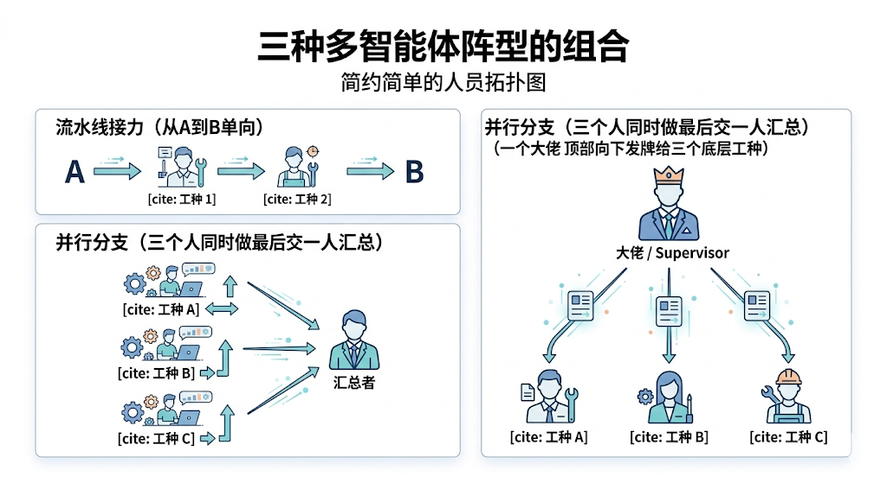
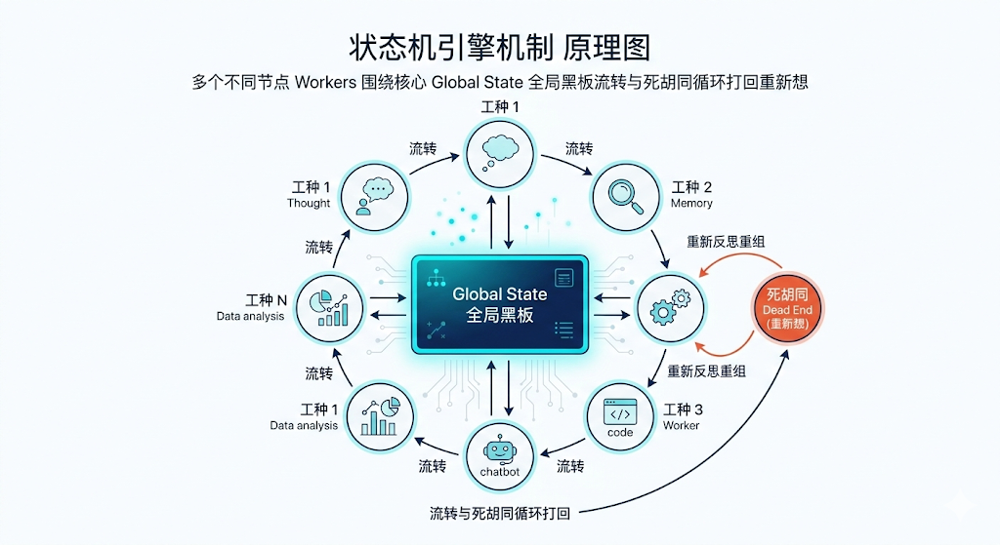
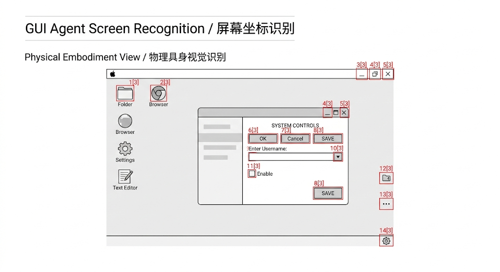

---
cssclasses:
  - ai
  - 架构前沿
tags:
  - ai学习
  - agent
  - multi-agent
  - langgraph
  - computer-use
  - mcp
title: 5.3 前沿物种：多Agent协作与物理具身
date: 2026-02-17
authors:
  - wqz
description: 当任务过于庞大，我们需要一支由 AI 组成的虚拟“特种部队”互相监管；当 API 接口消失，AI 如何直接利用多模态接管你的电脑屏幕？解析前沿的 GUI 智能体与 MCP 底座。
collection: 第5阶段：Agent智能体
slug: ai-agent-multi-collaboration-gui
collection_order: 3
---

# 5.3 前沿物种：多 Agent 协作与物理具身

:::note 赛博时代的“公司组织架构”
在第 5.1 和 5.2 中，我们培养出了一名全能型士兵。它懂得调工具（Tool Calling），也会一边规划一边自我反省（Plan-and-Solve）。
但如果你是一家互联网公司的老板，你会让同一个人同时去干设计、敲代码、测试甚至去前台扫地吗？
全才=平庸。当系统里的任务规模大到几万行代码的层级时，即便是 GPT-4 这种怪物，把它全塞在同一个记忆池和上下文里，它也会出现“首尾不顾”的精神分裂。

解决之道非常熟悉：建公司、分发部门、**多节点协作**。
本章，也是 Agent 连载的最终回！我们将放眼目前业界最火热的两大尖端突破：

本章作为体系连载的最终回，我们将目光投向当下业界疯狂追逐的两大尖端突破：其一，是借助诸如 **LangGraph** 这样的状态机流转框架，硬生生把单兵作战组装成了有着严格上下游协作纪律的数字化特种部队；其二，是试图摆脱那些干巴巴的 API 接口参数束缚直接附着进屏幕里，用如同人类一样的识别力注视电脑 UI 界面，进而强行操控宿主键盘鼠标的末日兵器——**GUI 智能体（Computer Use）**。
:::

---

## 1. 让 AI 管理 AI：多 Agent 协作网络

当你向 AI 下令：“帮我爬取知乎的最新热帖，把文字提纯，然后写个爬虫网站部署上线”。
在一个成熟的多智能体（**Multi-Agent**）系统里，底层其实召唤了 4 个性格不同的“人”，且用的是 4 组完全不同的 System Prompt（系统人设）。

### 1.1 经典阵型：流水线 / 层级分遣队

目前主流的“AI 公司”组建方案，逃不出这三种兵团部署：

目前各大虚拟数字工场主要靠三种打磨得极其成熟的组织阵型维系日常运转：

1. **单向流水线接力**：如同最干瘪无趣的工厂作业，前端爬虫模型抓回噪声数据，连看都不看直接扔给下游的作家模型，作家写完再次长篇累牍发包给苛刻的主编模型挑刺打回。每个人只盯着上一层级输送的弹药专心干活。
2. **跨领域并行作业**：面临深度研报时，系统同时激活爬取财报、翻找研报、侦听全网情绪等三个独立的 Agent 并行冲锋。这三股线索数据最终在统一战区汇合，交由负责统筹的 Agent 一锅乱炖出绝世长文。
3. **Supervisor 分遣队首长指挥局**：处于鄙视链的最顶端。最高位的节点（如 GPT-4o）绝对不下场干脏活，它的唯一功能是**接收任务和无情发牌**。面临模糊需求时，它随叫随停地指令绘画节点去画图，或让搜索节点去爬链接；只要手下人上交的格式偏了丝毫，首长也会用极其冷冽的态度把他们打回重练。

---

## 2. 把大山连接成网：LangGraph / 状态机

你可能会问：这几个乱串的 Agent 怎么通讯？他们怎么知道上一个人有没有发癫陷入死循环？

这时候曾经统御大模型框架界的 LangChain 给出了它的杀手级进化答案——**LangGraph**。
（国内也有许多强力的对等平替平台，例如 Coze 的工作流、Dify 的蓝图）。

**它的核心思维叫做：状态机 (State Machine) 与循环有向图。**

### 2.1 不可篡改的大黑板 (Global State)

如果几个 AI 在一个屋子里聊天一定乱套。
LangGraph 设计了一块永远不会被单个 Agent 私自覆盖的“大黑板（**State 对象**）”。
不论是总结家还是代码工程师，每个人执行完动作后，只能往这块黑板上**添加**几句话。下一个人被唤醒时，读取黑板上的全量进度继续走。这就避免了任何一个角色丢失了全局上下文（类似于 Redux 数据流）。

### 2.2 定义边与死胡同救星 (Edges/Conditional Nodes)

通过写代码，你可以像画流程图一样死死限制这帮无法无天的语言模型：

通过依靠传统后端工程师编写的代码节点，你可以像画 Visio 流程图那样，给这群智商爆表却又发散的大语言模型拴上项圈狗链。
比如在网状图的核心区域强行接上一根**代码断言执行节点**：

- 只要大模型把脚本代码写完，系统不再有商有量，而是直接把它拖进无情冰冷的沙盒环境当场编译试跑。
- 它一旦抛出错来或是逻辑雪崩，这台主引擎系统就顺着名为条件判断的长途箭簇弧线，把这摊血淋淋的报错文本砸回到写代码模型脸上，强制它闭门思过重新思考。

这也是现代中枢彻底摆脱“AI 总是幻觉”等恶名的最深层原动力——人类利用了极度死板但千锤百炼的传统 if-else 工程脚手架做成了铁笼，生猛地约束和驯服了那一团团充斥着计算的野生神经元。

---

## 3. 把双手按在桌面上：计算机接管与 GUI Agent

Agent 这个词虽然性感，但在 2024 年末之前，所谓的“工具调用 (Tool Calling)” 依然非常软骨头。
它的底层逻辑是：**你必须已经把你要操控的软件后台包好了一个极其明锐的 JSON Web API 接口让大模型发过去。**
但现实世界里，有几款应用开放了 API 呢？如果你想让它帮你去一个防爬极其变态的网页里点两下验证码、买两张电影票，或者打开你的 Adobe Photoshop 进行扣图，它就是个睁眼瞎。

直到多模态界的一道闪电劈下：**视觉大语言模型（VLM）与 Computer Use**。

### 3.1 惊天巨变：能看懂屏幕的眼睛（如 OmniParser/UI-TARS）

各大研究所以及 Anthropic（Claude背后的母公司）等巨头破发了震撼全网的 **计算机接管协议 (Computer Use)**。

它们怎么跨过没有 API 的物理世界的？
**依靠多模态的“OCR + 像素拆解”！**

这个横空出世的技术路线完全打破了次元壁。当你想要定一张从不开放接口的老旧航司系统机票时，挂载在本地的守护进程就会化身无情的连拍相机，每隔极短时间就把你当前的整个屏幕像素切下来截屏，一窝蜂发送给身处云端有着极强视觉解析力的大脑中枢。

这些在黑暗封闭的训练服务器中早被生吞硬啃过海量全操作系统的超级眼球，只要略加扫视分析，无论是微软复古的层级下拉栏还是被网页前端层层包裹的微缩勾选按钮皆被解构无余。它甚至利用专门的强力解析引擎，把原本属于人类主观世界认知里的“登录按键”、隐藏搜索输入框剥离得一干二净，并且自动且毫不留情地为所有热点打上了极具压迫感的红框以及整整齐齐的数字标签阵列。

### 3.2 下达坐标，直接接管

于是，此时的 Agent 不再回复 JSON 的 HTTP 请求调用，而是发出了冰冷的键盘键位坐标指令：

> `Action: 移动光标到像素位置 (120, 856)，执行 Left_Click；`
> `Action: 输入 "给老陈的请假邮件"，回车；`
> `Action: 滑动滚动条至按钮 [8] 并点击。`

**这就是物理具身级别 Agent 的威力。** 它就像是坐在你电脑桌前的一个看不见的幽灵雇员。这等同于终结了所有只提供网页界面但不提供接口的老旧公司闭源生态（比如各类复杂的私有财务系统、微信、甚至是一万年没更新过的内网 OA）。只要人在屏幕上能看得懂，能用鼠标点的东西，GUI 智能体就能踏碎虚空，强制跑通业务流。

---

## 4. 全世界的接口万众归一：MCP 协议

当 GUI Agent 依然处在昂贵且缓慢的前夜。为了在日常让更多的软件能够光速、无缝地接入像 Claude 或 ChatGPT 这样的聊天窗口，各大应用提供商还需要面对一个大麻烦：大家各自研发的开放接口文档、JSON 标准全都鸡同鸭讲，根本凑不到一盘。

这时候 Anthropic （又是它）推出了一个极具野心的开源底层契约：**MCP (Model Context Protocol / 模型上下文协议)**。

它就像是**充电插头里的 Type-C 接口**。

MCP (Model Context Protocol / 模型上下文协议) 就像是**充电插头里的 Type-C 接口**。

- **服务端**：不论你是私密的 GitHub 仓库、钉钉审批流接口，还是本地 MySQL 离线数据库，后端程序员只需花点功夫加个空壳，把数据入口包装成抽象统一的 MCP 服务端端点。
- **客户端**：市面上无论是硬核的 Cursor 客户端，还是普通的聊天界面，只需接入这一开源规范，便直接跨过了原本横亘人机之间极易崩溃的网络一对一适配泥沼。
- **结果**：这恰似一场物理融合革命——手持一把万能的 Type-C 线缆朝着隔离的系统群猛扎进去，建立起即插即用的神经链接。

这相当于终极的**通用工具集市化**。"带着满世界几十万个标准化 MCP 工具，在本地直接插上网线"。

---

## 5. 第5阶段 终曲与认知升华

:::note 第5阶段：Agent 体系大通关
当你读到这里，大模型早已不仅仅是你提问和解惑的被动百科字典了：

当你读到这里，大模型的定位早已发生了天翻地覆的扭转：在掌握了 ReAct 与强约束的 Tool Calling 后，它顺利在这个数字宇宙里为自己接上了孔武有力的网络触手。

- **在认知上**：由于检索阵列与长时仓库的支持，它长出了深邃的海马体；它懂得克制冲动去画里程碑甘特图，在一次次报错屈辱里完成自我鞭挞与纠错重建。
- **在协同上**：LangGraph 这个极权主义主控面板场，让一头头极其细分的专门模型在相互审判的网络战壕里搭建起了全自动的流水线。
- **在物理接管上**：遇上彻底焊死的应用孤堡，它暴虐地亮出多模态深空魔眼，在像素级别的屏幕监视里精准锁定所有的输入框轮廓，强制接管鼠标光标，将它与物理世界最后的隔离层彻底碾碎擦除。
  :::

但别忘了，驱动这个庞大躯体行动的中枢神经，依然是那些**庞大且高度复杂的系统提示词（System Prompt）工程指令**。
在它的执行失败、幻觉暴走、或者格式出错时，其实是你没有在这个中枢里写入最精准的纪律。

**下一章预告**：
我们将要把这台巨大的引擎拆回原型。回到一切“神级指令”产生的地方。
如何和它进行精神连接？如何用最科学的手法书写那些长达数千字的“神级系统指令（System Prompt）”，让其按照你规定好的逻辑（甚至以链式逻辑思考 CoT）执行一切？

欢迎正式迈入，对人类主宰者最重要的指挥棒驾驭学！**第3阶段：提示工程（Prompt Engineering）**。

---

**下一章**: [提示工程](/blog/prompt-engineering)
