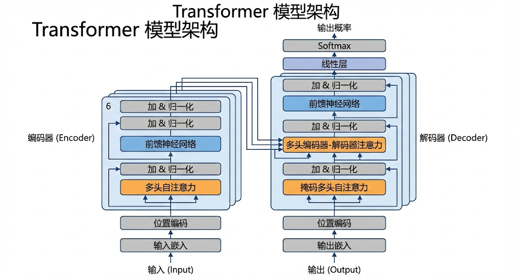

---
cssclasses:
  - ai
  - 基础理论
tags:
  - ai学习
  - transformer
  - attention
title: Transformer基础 - 现代AI的基石
date: 2026-02-03
authors:
  - wqz
description: 详解 Self-Attention 机制，为什么它能取代 RNN 成为 LLM 的地基
collection: 第零部分：基础理论层
slug: transformer-basics
collection_order: 4
---

# Transformer基础 - 所有的魔法始于 Attention

:::note 为什么这章最重要？
如果你听说过 ChatGPT、DeepSeek、Claude，或者任何现代的大语言模型 (LLM)，它们的名字里很少带 "Transformer"，但它们的身体里**全都是 Transformer**。
不夸张地说，**没有 2017 年的那篇论文《Attention Is All You Need》，就没有今天的 AI 繁荣。**
:::

---

## 1. 为什么我们需要 Transformer？(A Brief History)

要理解 Transformer 为什么伟大，我们得先看看在它出现之前，AI 是怎么“读”文章的。

### 1.1 图像 vs 语言：空间 vs 时间

在上一章 **CNN** 里，我们处理的是**图像**。
图像是一种**空间 (Spatial)** 数据。照片左上角的猫耳朵，和右下角的猫尾巴，是**同时存在**的。AI 可以一眼看完整张图。

但**语言**完全不同。语言是一种**时间序列 (Time Sequence)** 数据。
当你读这句话时，你是从左往右一个字一个字读的。你必须先读了“我”，再读“爱”，最后读“你”。颠倒顺序，意思全变。

### 1.2 曾经的霸主：RNN (循环神经网络)

为了模仿人类这种“按顺序读”的特性，工程师发明了 **RNN (Recurrent Neural Network)**。

它的逻辑非常直观：**像个抄写员一样，读一个字，在脑子里记一下，带着记忆去读下一个字。**

:::info RNN 的核心直觉
$$ h*t = \text{Activation}(W \times x_t + W \times h*{t-1}) $$

这里的 $h_{t-1}$ 就是**上一步的记忆**。
意思是：**今天的我 = 今天的输入 + 昨天的记忆**。
:::

### 1.3 抄写员的崩溃 (The Bottleneck)

RNN 统治了 NLP 领域几十年，但它有两个致命的生理缺陷，导致它永远无法做大做强：

1.  **无法并行 (No Parallelism)**：
    它必须等读完第 1 个字，生成了记忆，才能读第 2 个字。这意味着**它没法用几千块显卡同时加速**。
    不管你有多少算力，你都得排队。这在数据量爆炸的今天，简直是龟速。

2.  **健忘 (Short-term Memory)**：
    虽然理论上它能保留记忆，但实际上，读了一两百字后，开头的记忆就模糊了（梯度消失问题）。
    它能记住“汤姆...”，但读到文章结尾时，可能已经忘了汤姆是猫还是老鼠。

**这就导致了死局：想变强就要读更多书，但读多了既慢又记不住。**

直到 2017 年，Google 团队通过一篇《Attention Is All You Need》打破了僵局。
他们提出了一个疯狂的想法：**为什么要按顺序读？为什么不能像看图一样，一眼把整篇文章看完？**

工程师们想：**能不能别一个字一个字读？能不能一口气把整篇文章读进去，然后一眼看出哪个词和哪个词有关系？**

于是，Transformer 诞生了。它的核心思想只有一句话：**抛弃循环，拥抱并行，用注意力机制 (Attention) 解决一切。**

---

## 2. 核心机制：Self-Attention (自注意力)

这是 Transformer 最“魔法”的地方。

**Self-Attention** 的意思是：当模型在读“**苹果**”这个词的时候，它会同时看向句子里的其他词（比如“手机”、“不仅”、“好吃”），然后决定这些词跟“苹果”有多大关系。

- 如果上下文是“这个**苹果**真好吃”，它会关注“好吃”（哦，这是水果）。
- 如果上下文是“这个**苹果**最新款”，它会关注“新款”（哦，这是电子产品）。

### 🔍 图书馆检索的类比 (Query, Key, Value)

为了实现这个机制，Transformer 把每个词都拆成了三个向量：**Query (Q)**, **Key (K)**, **Value (V)**。

这听起来很玄学，但其实特别像**在图书馆找书**（或者 SQL 查询）：

:::tip 类比：查阅资料
假设你手里有一张**借书卡 (Query / Q)**，你要去图书馆找书。
图书馆的架子上摆满了书，每本书脊上都贴着**分类标签 (Key / K)**，书里面夹着真正的**内容 (Value / V)**。

1.  **Q 和 K 匹配**：你拿着你的借书卡 (Q)，去跟架子上的标签 (K) 一一比对（点积运算）。
2.  **计算相关性**：
    - 有的标签完全对不上（相关性 ≈ 0）。
    - 有的标签有点像（相关性 ≈ 0.5）。
    - 有的标签完全吻合（相关性 ≈ 0.99）。
    - 这个过程叫 **Softmax**（归一化），变成了“注意力权重”。
3.  **取出 V**：根据刚才算出来的权重，把对应的书本内容 (V) 取出来，加权融合。
    :::

:::info 公式的直觉
这个公式决定了每个词“看”哪里：
:::

$$
Attention(Q, K, V) = \text{softmax}\left(\frac{QK^T}{\sqrt{d_k}}\right)V
$$

:::note 公式解读

- $QK^T$：拿借书卡去对标签（算相似度）。
- `softmax`：把相似度变成百分比（权重）。
- $\times V$：按百分比把内容拿出来提取特征。
  :::

:::tip 为什么要除以 $\sqrt{d_k}$ (Scaling)？
你可能会注意到公式里有个奇怪的除法：除以 $\sqrt{d_k}$。
这是为了**防止梯度消失**。
如果向量维度 $d_k$ 很大，点积的结果会变得巨大。这会导致 `softmax` 函数进入“饱和区”（梯度接近 0），模型就学不动了。
做这个除法是为了把数值拉回合理的范围（比如 -1 到 1 之间)。这也是 Transformer 能叠几十层还能训练得动的关键细节之一。
:::

通过这一步，每个词都“吸取”了整个句子的上下文信息。

---

## 3. Multi-Head Attention (多头注意力)

如果只用一组 Q、K、V，可能只能捕捉到一种关系（比如“语法关系”）。但语言是复杂的，我们需要从多个角度看问题。

**Multi-Head Attention** 就是：**找 8 个人同时去图书馆找书，每人关注点不一样。**

> **注意**：这些关注点（语法、语义等）不是工程师人工指定的，而是模型在训练过程中**自己总结出来的**。

- **Head 1** 关注语法（动词后面接名词）。
- **Head 2** 关注指代（"它" 指的是 "猫"）。
- **Head 3** 关注语义（"苹果" 和 "好吃"）。

最后把这 8 个人的结果拼起来（Concat），就得到了一份超级全面的理解。

> 

---

## 4. Positional Encoding (位置编码)

Transformer 有个大 Bug：如果你把句子里的词打乱顺序（“我爱你”变成“你爱我”），对它来说是一模一样的！

因为它是**并行**处理的，没有先后顺序的概念。

为了解决这个问题，我们在输入的时候，给每个词贴上一个**位置标签 (Positional Encoding)**。

- 给第一个词加个记号：“我是 No.1”。
- 给第二个词加个记号：“我是 No.2”。

这样模型就知道谁在前谁在后了。

> **⚠ 工程直觉**：如果不加这个编码，Transformer 眼里的句子就是一袋打散的单词（Bag of Words）。“我爱你”和“你爱我”对它来说没有任何区别，语序信息会全部丢失。

---

## 5. 整体架构：Encoder 与 Decoder

把上面这些组件组装起来，就变成了完整的 Transformer。

> 

它分为两半：

1.  **Encoder (编码器) - 左半边**：
    - **任务**：只负责“读”和“理解”。狠狠地榨取输入文本的信息。
    - **代表作**：**BERT** (Bidirectional Encoder Representations from Transformers)。它最擅长做完形填空、情感分析、分类任务。

2.  **Decoder (解码器) - 右半边**：
    - **任务**：只负责“写”和“生成”。根据已经写的内容，猜下一个字是什么。
    - **代表作**：**GPT** (Generative Pre-trained Transformer)。它最擅长写文章、聊天。

:::note 时代的演变
原版论文《Attention Is All You Need》是用来做**机器翻译**的（Encoder 读英文 -> Decoder 写中文）。
但后来的发展分道扬镳了：

- BERT 拿走了左边，专门做**理解**。
- GPT 拿走了右边，专门做**生成**。
- **今天的 DeepSeek / ChatGPT / Claude，主流范式仍然是 Decoder-only 架构**（虽然各家在工程和结构上都已经做了大幅改造和融合）。
  :::

---

## 6. 总结

:::note 本章核心知识点

1.  **Transformer 的胜利**：是因为它抛弃了串行，实现了大规模并行计算，让训练超大模型成为可能。
2.  **Self-Attention**：是核心引擎，通过 Q/K/V 机制，让每个词都能动态地关注上下文。
3.  **大模型的基石**：你今天用到的所有 AI，不论是 BERT 还是 GPT，都是在这个地基上盖起来的高楼。
    :::

**下一章预告**：
当然，机器读懂了句子之间的关系，但它读进去的到底是什么？是单词？还是字母？
为什么 GPT-4 能处理各种语言，甚至代码？
这就涉及到了 AI 的“咀嚼系统” —— **Tokenization (分词)**。

---

**下一章**: [Tokenization详解](/blog/tokenization-explained)
