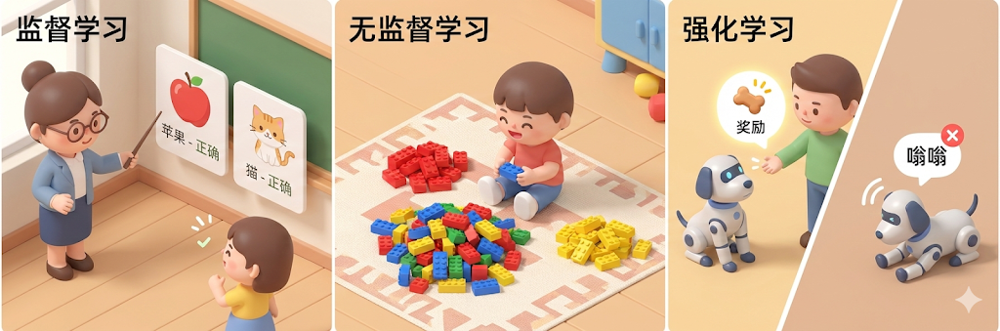

---
cssclasses:
  - ai
  - 教程
  - 基础理论
tags:
  - ai学习
  - 教程
  - AI
  - 机器学习
title: 机器学习基础 - AI的底层逻辑
date: 2026-02-01
authors:
  - wqz
description: 理解机器学习的核心范式,为什么这些P2理论是现代AI的基础
collection: 第零部分：基础理论层
slug: ml-basics
collection_order: 1
---

# 机器学习基础 - AI的底层逻辑

> **💡 写在前面**
> 这一章我们不整那些吓人的数学公式（什么偏导数、矩阵乘法先放一边）。
> 我们的目标是建立**直觉**，搞清楚：**为了让机器学会做一件事，工程师到底做了什么？**

---

## 1. 编程范式的转移：从 1.0 到 2.0

我们要学的不是一种新的编程语言，而是一种**全新的思考方式**。

### 传统的编程（Software 1.0）

如果你是一个写业务代码的工程师，你每天做的事情大概是这样的：
**你告诉计算机每一条具体的规则。**

- **场景**：判断一张照片里是不是猫。
- **做法**：你得写 `if (有耳朵) and (有胡须) and (毛茸茸)...`
- **问题**：这根本写不完！老虎也有耳朵胡须，玩具猫怎么算？规则稍微变一点，代码就得重写。

> **公式**：`规则 + 数据 = 答案`

### 机器学习（Software 2.0）

现在我们换个思路。既然规则太复杂写不出来，那能不能**让机器自己把规则找出来**？

我们不写规则了，我们给机器看**一万张猫的照片**和**一万张不是猫的照片**，然后跟它说："你自己找规律，反正左边这些必须叫'猫'，右边这些不行。"

机器经过一通计算，最后它总结出了一套超级复杂的数学公式（可能有一亿个参数），这套公式能完美区分猫和狗。这套公式，就是我们炼出来的**模型**。

> **公式**：`答案 + 数据 = 规则`

**这就是机器学习的核心：用数据换取规则。**

---

## 2. 三大核心流派：机器是怎么"学"的？

其实和人类学习的过程一模一样。

### 2.1 监督学习 (Supervised Learning)

👉 **类比：学生刷题（带标准答案）**

这是最主流、应用最广的方法。

- **老师（工程师）**：给你这本《五年高考三年模拟》，每道题后面都有答案。
- **学生（模型）**：做题 -> 对答案 -> 发现错了 -> 修正脑子里的思路。
- **应用**：
  - **分类**：这封邮件是垃圾邮件吗？（是/否）
  - **回归**：这房子明年只要多少钱？（预测具体数值）

### 2.2 无监督学习 (Unsupervised Learning)

👉 **类比：把一堆乐高积木分类（没说明书）**

老师这回不给答案了，就把一堆数据扔给你："你自己看看有什么规律。"

- **学生（模型）**：哎，这几个红色的块块挺像的，堆一起；那些长条的形状差不多，堆一起。
- **应用**：
  - **聚类**：把用户分成"高价值用户"、"薅羊毛用户"（虽然我一开始不知道他们叫什么，但行为模式很像）。
  - **关联规则**：买了啤酒的人通常也会买尿布。

### 2.3 强化学习 (Reinforcement Learning)

👉 **类比：训练小狗（给骨头或打屁股）**

没有现成的数据集，而是通过**互动**来学习。

- **环境**：给模型一个场景（比如玩《马里奥》游戏）。
- **反馈**：
  - 往右走吃金币 -> **奖励 +1**（做得好！）
  - 掉坑里摔死了 -> **惩罚 -10**（别这么干！）
- **目标**：模型疯狂试错，最后学会了怎么拿最高分。
- **应用**：AlphaGo 下围棋、机器人走路、DeepSeek-R1 的推理能力训练。

---

## 3. 工程师黑话指南（核心词汇）

以后看论文、看文档，你会反复看到这几个词，先把它们映射到人话。

| 黑话 (Term)                | 人话映射             | 例子                                 |
| :------------------------- | :------------------- | :----------------------------------- |
| **Dataset (数据集)**       | 教材库               | 一万张猫的照片                       |
| **Features (特征, X)**     | 题目的已知条件       | 照片的像素、房子的面积、地段         |
| **Labels (标签, y)**       | 标准答案             | "这是一只猫"、"房价500万"            |
| **Model (模型)**           | 那个负责做题的脑子   | 一个巨大的数学函数 $f(x)$            |
| **Parameters (权重/参数)** | 脑子里的神经连接强弱 | 也就是我们最后训练出来的"规则"本身   |
| **Training (训练)**        | 刷题的过程           | 调整参数，让正确率越来越高           |
| **Inference (推理)**       | 考试                 | 训练已经结束，拿新题来由模型输出答案 |

---

## 4. 机器"学习"的本质：The Learning Loop

这是本章最重要的部分。所谓的"训练模型"，其实就是在跑一个**死循环**。

想象一个蒙着眼睛的人下山：

1.  **猜 (Predict/Forward Pass)**
    模型拿到一道题，先瞎猜一个答案。
    - _模型内心OS：我觉得这是猫！_

2.  **对答案 (Loss Function)**
    用**损失函数 (Loss Function)** 来衡量猜得有多离谱。
    - _裁判：错！这是狗。你的答案离正确答案差了十万八千里（Loss = 1000）。_

3.  **找方向 (Gradient)**
    这就涉及到了传说中的"梯度"。你就把它理解为**坡度**。
    - _模型：那我该往哪个方向改呢？是把参数调大点还是调小点？_

4.  **改错 (Optimizer)**
    用**优化器 (Optimizer)** 修改模型里的参数。
    - _优化器：刚才那个参数调小一点点，下次应该能对。_

**这个循环跑几百万次（Epochs），直到 Loss 几乎变成 0，我们就说：训练好了！**

---

## 5. 总结

1.  **机器学习**就是用**数据**反推**规则**。
2.  我们最常用的**监督学习**，本质上就是带答案的刷题。
3.  **训练**的过程，就是不断**猜答案 -> 挨骂（Loss高） -> 改错**的循环。

**下一章预告**：
既然知道了原理，那现在最火的大模型（LLM）到底属于哪一种？为什么说 Transformer 改变了一切？我们将进入 **《1.3 Transformer与注意力机制》**。

---

## **【延伸阅读】**

- _Machine Learning is Fun! (Adam Geitgey)_ - 极其通俗的入门读物
- _Andrej Karpathy's Software 2.0_ - 经典的理念阐述

---

**下一章**: [[transformer-intro|Transformer详解]]
