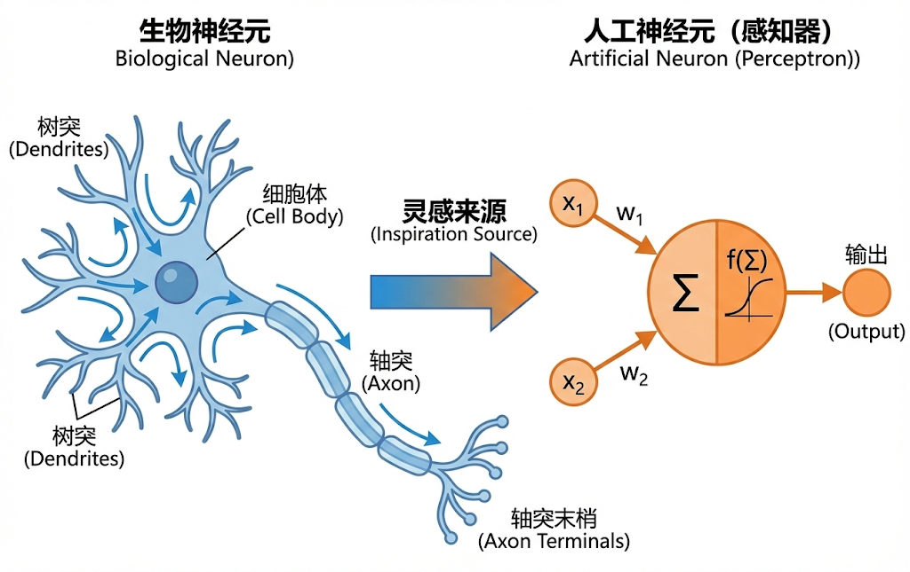
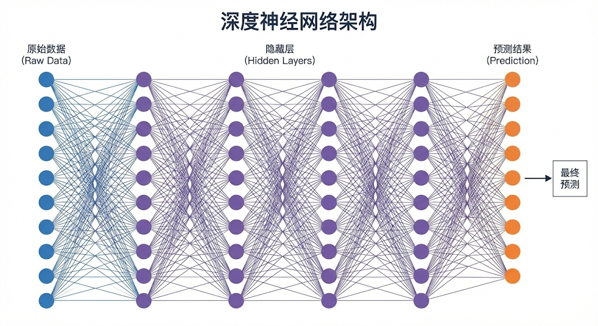

---
cssclasses:
  - ai
  - 基础理论
tags:
  - ai学习
  - 深度学习
  - 神经网络
title: 深度学习原理 - 神经网络的魔法
date: 2026-02-02
authors:
  - wqz
description: 揭秘神经网络、反向传播与深度学习的核心机制
collection: 第零部分：基础理论层
slug: deep-learning-core
collection_order: 2
---

# 深度学习原理 - 神经网络的魔法

:::note 这章要解决什么问题？
上一章我们说了“机器能学习”，这一章我们要看它**具体是用什么器官**学的。
为什么简单的线性公式不够用？为什么我们需要模仿人脑？
传说中的“神经网络”到底长什么样？
:::

---

## 1. 为什么我们需要“深度”学习？

在上一章的“猫狗识别”里，如果所有的猫都长得标准，所有的狗都长得标准，那简单的数学公式（比如画一条线把它们分开）就够了。

但现实世界太复杂了：

- 有的猫缩成一团（形状变了）。
- 有的猫躲在草丛里（颜色变了）。
- 有的照片是黑白的。

简单的线性分类器（Linear Classifier）遇到这些情况直接歇菜。这就好比你想用一把直尺去测量海岸线的长度——**工具太简单，无法描述复杂的现实。**

为了处理这种**非线性 (Non-linear)** 的复杂问题，我们需要一个更复杂的脑子——**神经网络 (Neural Networks)**。

---

## 2. 神经网络：模仿人脑的积木

深度学习的核心，就是**人工神经网络 (Artificial Neural Networks, ANN)**。

它的灵感来源是生物学。

### 2.1 神经元 (Neuron / Perceptron)

生物神经元的工作方式很简单：

1.  **树突 (Dendrites)**：接收信号（比如手碰到了火）。
2.  **细胞体 (Soma)**：处理信号（这信号够不够强？）。
3.  **轴突 (Axon)**：如果信号够强，就发射出去，传给下一个神经元（缩手！）。

我们在电脑里造的**人工神经元**也是一模一样的逻辑：

$$ \text{输出} = \text{激活函数}( \text{输入}\_1 \times \text{权重}\_1 + \text{输入}\_2 \times \text{权重}\_2 + \dots + \text{偏置} ) $$

拆解一下这个微小的机器：

- **输入 (Inputs)**：从上一层传过来的数据（比如照片像素）。
- **权重 (Weights)**：每个输入有多重要（比如“有胡须”这个特征很重要，权重就大）。
- **激活函数 (Activation Function)**：这是**灵魂**。它决定了这个神经元要不要“兴奋”。

### 2.2 为什么必须要有“激活函数”？

这就是很多人的知识盲区了。为什么不能直接把数字加起来传下去？

如果只有加减乘除（线性运算），你就算堆一万层神经网络，最后也等价于一层。就像你把一堆这直线叠在一起，它还是一条直线，弯不过来。

**激活函数引入了“弯曲”。**

- **ReLU (Rectified Linear Unit)**：最常用的激活函数。
  - _逻辑_：如果结果小于0，就变成0（死掉）；如果大于0，保持原样。
  - _作用_：让网络学会“忽略”某些没用的信号，只关注有用的。这就引入了**非线性**，让模型能理解复杂的形状。

---

## 3. 深度网络：一层包一层的特征

所谓“深度”学习（Deep Learning），就是**很多层**神经网络叠在一起。

每一层都在看不同的东西：

1.  **输入层 (Input Layer)**：看到原始像素（一堆 255, 0, 128...）。
2.  **隐藏层 1 (Hidden Layer 1)**：发现了一些**线条**和**边缘**。
3.  **隐藏层 2 (Hidden Layer 2)**：发现线条拼成了**形状**（眼睛、耳朵）。
4.  **隐藏层 3 (Hidden Layer 3)**：发现形状拼成了**对象**（这是猫脸）。
5.  **输出层 (Output Layer)**：大喊一声：“是猫！”

**这就是“深度 ＝ 抽象”。** 层数越多，模型能理解的概念就越抽象、越高级。

:::warning 工程注
理论上越深越好，但实际上**层数越深，训练越难**（比如梯度传着传着就没了），容易导致过拟合或训练失败。这也是后来 ResNet (残差连接) 等结构出现的原因。
:::

---

## 4. 反向传播 (Backpropagation)：魔法的核心

还记得上一章说的“下山”吗？

- **前向传播 (Forward Pass)**：数据从左进去，一层层传算，最后猜个答案。
- **反向传播 (Backward Pass)**：
  - 裁判（Loss Function）看了眼答案，说：“错了！误差是 0.8！”
  - 这个 0.8 的误差，会被**反向**传回去。
  - 输出层告诉隐藏层3：“是你算错了，你得改！”
  - 隐藏层3告诉隐藏层2：“我也被坑了，你也得改！”
  - ...
  - 一直传到第一层。

在这个过程中，利用**链式法则 (Chain Rule)**，我们算出了每一个权重参数对在这场错误里到底**负多大责任**（这就是上一章说的**梯度**）。责任大的狠狠改，责任小的稍微改。

**这一步是深度学习真正的技术门槛。** 在反向传播算法普及之前，多层网络根本没法高效训练。只有有了它，我们才能指挥这些数百万计的参数协同工作。

---

## 5. 总结

:::note 本章核心知识点

1.  **神经网络**是模仿人脑的结构，为了解决**复杂、非线性**的问题。
2.  **激活函数**（如 ReLU）是网络的灵魂，它赋予了网络“弯曲”现实的能力。
3.  **深度**意味着**抽象层级**。层数越多，理解越深刻。
4.  **反向传播**是训练的引擎，它把错误的责任精准地分摊给每一个神经元，逼着它们修正自己。
    :::

---

## **下一章预告**

现在我们有了最强的脑子（深度神经网络），但如果有几十亿个神经元全都连在一起，那个计算量就算把地球烧了也不够（全连接网络的弊端）。

能不能让网络变得更聪明一点？比如看照片时只盯着重点看？或者读文章时记住上下文？

我们将分两条路进阶：

- 看图专家：**CNN (卷积神经网络)**（略讲，但它是视觉基础）
- 语言专家：**Transformer**（重头戏！）

下一章，我们先插播一个视觉领域的传奇，看看 AI 是怎么“看”世界的。

---

**下一章**: [CNN卷积网络](/blog/cnn-bridge)
