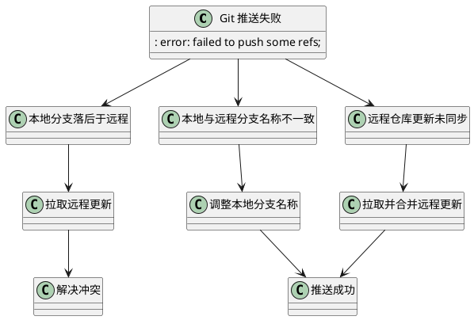

<!-- truncate -->

# Git 推送失败解决方案

# error: failed to push some refs to '仓库地址'




## 问题

​	在上传本地内容到GitHub时出现 `error: failed to push some refs to` 错误，这通常是由于本地分支与远程分支不一致，导致无法直接推送。


```cmd
error: failed to push some refs to 'https://github.com/wwwqqqzzz/Docsify_Blog.git'
```

## 问题分析

推送失败的原因一般是本地分支落后于远程分支，或者本地和远程的分支名称不一致。为了解决此问题，通常需要先拉取远程的最新内容并处理任何冲突，或者调整分支名称。

## 网上常见解决方法

1. **直接拉取远程更新**
   先从远程仓库拉取更新，然后查看是否有冲突并处理，再重新尝试推送：

   ```bash
   git pull
   ```

2. **方法一：使用 `--rebase` 拉取更新**
   通过 `--rebase` 将远程的更新与本地提交整合，以保持提交记录整洁。具体步骤如下：

   ```bash
   git pull --rebase origin master
   ```

   `--rebase` 选项会将本地的提交在拉取的更新之后重新应用。完成后，可以尝试推送：

   ```bash
   git push origin master
   ```

3. **方法二：简单拉取和推送**

   使用以下命令先拉取再推送：

   ```bash
   git pull origin master
   git push origin master
   ```

## 作者解决的方法

​	这个方法对我并没有凑效例如我,在 GitHub 上更改了默认分支（例如改为 `main`），但本地分支仍为 `master`，可以通过以下步骤解决分支名称不一致的问题：

### 1. 拉取远程更新并合并
首先，尝试将远程仓库的更新拉取下来并合并到本地分支：

```bash
git pull origin master --rebase
```

使用 `--rebase` 会将你本地的提交在拉取的更新之后进行重新应用，这样可以保持提交历史的整洁。  


但我在第一步我出现了**出现 `Current branch main is up to date.` 提示**，表示本地分支 `main` 已经与远程的 `master` 分支同步，没有需要合并的更改。但是，仍然无法推送时，可能是因为远程仓库的默认分支与本地不一致。

[解决分支名称不一致](#解决分支名称不一致)


### 2. 处理冲突（如果有）
在执行 `git pull --rebase` 时，可能会遇到冲突。如果发生冲突，Git 会提示哪些文件有冲突。此时你可以：

1. 手动编辑冲突的文件，解决冲突后保存。
2. 使用以下命令标记冲突已解决：
   ```bash
   git add <文件名>
   ```
3. 继续 rebase 操作：
   ```bash
   git rebase --continue
   ```

### 3. 推送更改
当拉取的更新合并完成、并解决了冲突后，你可以再次尝试推送：

```bash
git push origin master
```

### 如果问题依旧
如果仍然遇到问题，可以强制推送（**注意**：强制推送可能会覆盖远程的提交，谨慎使用）：

```bash
git push origin master --force
```

通常情况下，第一步和第二步即可解决问题。


------

​	

## 解决分支名称不一致

> 如果远程仓库的默认分支是 `master` 而本地分支是 `main`，这会导致推送失败。以下是两种解决方法：
>
> 1. **确认远程分支是否为 `master` 或 `main`**
>     使用以下命令检查远程分支名称：
> 
>    ```bash
>     git remote show origin
>    ```
> 
>    ​	查看远程仓库的默认分支是 `master` 还是 `main`，并确保你的本地分支与之对应。
>
>    
>
>    输出可以看到，远程仓库的默认分支是 `master`，而你的本地分支是 `main`，这造成了本地和远程分支的不一致，导致推送失败。为了解决这个问题，你可以选择以下[解决导致推送失](#解决导致推送失)：
>
> 2. **切换本地分支名称**（如有必要）
>
>    如果你的本地分支是 `main`，而远程仓库使用 `master`，你可以创建一个与远程仓库匹配的新分支：
>
>    ```bash
>     git checkout -b master
>    ```
> 
> 3. **尝试推送到远程 `master`**
>
>    ```bash
>     git push origin master
>    ```
> 
>    或者，如果你想强制推送，可以使用以下命令（仅在确保不会覆盖重要提交时使用）：
>
>    ```bash
>     git push origin master --force
>    ```
> 
> 以上步骤应能解决分支名称不一致带来的推送问题。如果仍然有问题，请提供更多输出信息，我会进一步帮你分析。


------


## 解决导致推送失

> 远程仓库的默认分支是 `master`，而你的本地分支是 `main`，这造成了本地和远程分支的不一致，导致推送失败。为了解决这个问题，你可以选择以下两种方法：
>
> ### 方法 1：将本地分支推送到远程的 `master` 分支
>
> 如果你想将本地的 `main` 分支推送到远程的 `master`，可以直接推送指定分支：
>
> ```bash
>git push origin main:master
> ```
> 
> 这个命令会把本地的 `main` 分支内容推送到远程的 `master` 分支上。如果推送成功，问题应该就解决了。
>
> 
>
> ### 方法 2：重命名本地分支为 `master` 并推送
>
> 如果你希望本地和远程的分支名称一致，可以重命名本地分支：
>
> ```bash
>git branch -m main master  # 将本地 main 分支重命名为 master
> ```
> 
> 
>
> 然后推送到远程：
>
> ```bash
>git push origin master  # 推送到远程 master 分支
> ```
> 
> 
>
> 接下来，你可能需要更新远程跟踪分支和上游配置：
>
> ```bash
>git branch --set-upstream-to=origin/master master
> ```
> 
> 
>
> 这将本地 `master` 分支与远程 `master` 分支关联起来，确保后续的 `pull` 和 `push` 都正常工作。
>
> 尝试这些方法之一，应该可以解决推送失败的问题。
