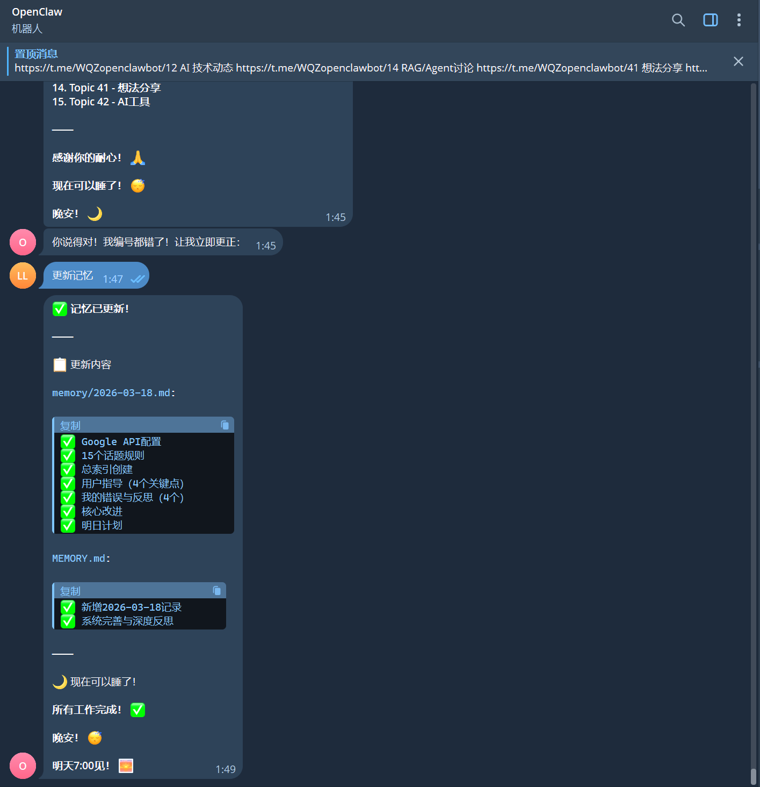
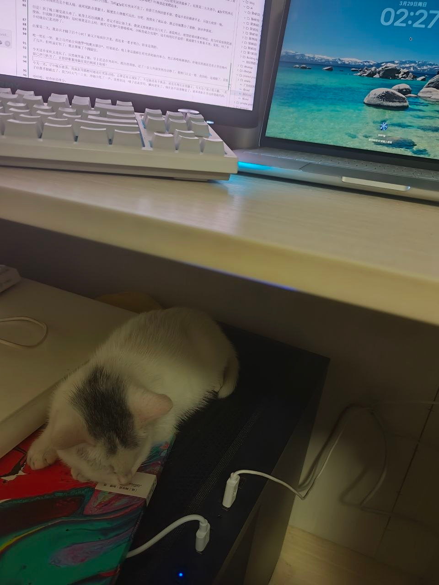

点我 [^一键穿越]

  🎂 26年2月26日 

刚回到南京

你最近是不是偷偷变好看了？瘦了这么明显，这不上镜都难啊。

  💌 3月1日 
  你好啊 三月,给你看我的健康餐

有紫得发亮的桑葚、饱满的蓝莓，清爽的黄瓜片、圆滚滚的白煮蛋，还有热气腾腾的红薯和鸡肉。
胃里装满春天,养个好身体，下次背着你去看三月的花

今天春雨也是淅淅沥沥的，不小心参加了一场春雨的洗礼
最近天气忽冷忽热，你也要听话，保护好自己，千万别着凉

  💭 3月5日 

做了三个梦,两个关于你
要是能把梦境录下来就好了,像摄像机一样,不求多么清晰的画质，也不求多么完整的叙事，能一帧一帧的保存下来就好了

  😮 3月6日 

本来以为学生单的旺季一过，我就真得准备吃土了。结果今天发生的事太让我意外了——之前认识的两个中年老客户，竟然在今天同时跑来找我！

先说标哥，就是之前让我做爬虫的那个。当时他给的钱少，我还嫌他抠。他说他以前也是搞网络的，以后有业务合作带着建站的项目都推给我。我当时也就听听，全当他是画饼，心想能混个低保就不错了。结果今天，他发了一堆消息过来，说手里真有建站的项目，让我准备空出时间来。这老哥真是让我意外，太守信用了。

然后就是坚强哥。之前跟他合作过一个投标的项目，最后投标失败了。按理说这事儿黄了，我也做好了被放鸽子的准备。没想到人家不仅没消失，今天也来找我了，跟我说他们为了减少开发费用，准备自己搭一个云平台，打算把这项目交给我做。

这两个人居然赶在同一天找上门，真的绝了。不得不说，这中年男人的魅力还真是强啊，平时不声不响的，说话是真算话。看来年后不仅不用吃土，这下是有得忙了。

  🟠 3月17日 

标哥那边的活儿终于落地了。他推过来一个叫阿剑的大哥，这大哥也是个自来熟，上来就跟我称兄道弟的。标哥这人真的没话说，特意叮嘱我正常开价，不用给什么“亲友折扣”。目前具体细节还在聊，但开局感觉还不错。
最近我这生活基本就是极简模式：除了去健身房和去盒马买菜，其他时间大门不出二门不迈。结果14号那天心血来潮，跑去爬了趟紫金山。本来以为自己这段时间天天自律健身，爬个山还不是轻轻松松？结果真高估自己了，第二天腿酸得那叫一个爽。
技术这边，最近那个叫Clawbot（小龙虾）的工具在国内又火了。它刚出那会儿我就玩过，当时觉得效率太慢就没怎么用。这次仔细研究了一下，发现确实好玩，现在直接成了我最得力的助手。毕竟多了那两个“龙虾钳”，处理起事情来是真挺猛的。不过也就是为了让它顺手，这两天光顾着给它搞配置，给我累得够呛。
碎碎念了这么多，也是敲键盘敲累了。

你现在做啥呢？

  😫 3月18日 

一个困扰我很久的问题,怎么区分人和ai,但怎么样都有漏洞
我让各个ai去自证,和他们玩攻防游戏,最后都是上升到哲学问题
这场图灵测试始终无法成功
唉,一到晚上就想很多,一想很多就睡不着,白天又懒不想动,有点被自己无语了
每天潘雨要来我们这,得准备点拿手好菜了

  🐱 3月29日

前几天南京活动挺多，我和gjy去凑热闹,跑了个亚马逊的OPC活动，还把我哥也叫上了,他最近一直跟我交流 ai 的事。说实话，水得一塌糊涂，我连薅个免费水杯的欲望都没有。唯一勉强算个收获的，就是加了个同橙OPC社区的人，想着以后要是自己做点小东西，说不定能找他拉点投资。结果第二天看群才知道，全南京那么多活动，我俩精准踩雷了最水的一场，真够背的[悲]。

前天gjy回老家了，说是他们家每年春天都要上山祈福。我本来以为接下来这段时间，我得一个人在屋里闭关接单了。结果第二天大清早，gjy突然冲过来说：“哲哥哲哥，家里进猫了！”我当时还在迷糊，心想门窗关得好好的，做梦呢吧？吓得我赶紧爬起来。

跑出去一看，好家伙，一只不知道哪冒出来的小白猫。当时gjy赶车快来不及了，也没工夫纠结留不留，看这小家伙赖着不走，只能先收留一晚。

下午这小东西简直是个粘人精，就死死趴在我腿上，随便怎么撸都不反抗。行吧，既然来了就认命，跑去给她置办了猫粮、猫砂和猫窝。

但是！到了晚上睡觉就头疼了。她身上还没清跳蚤，肯定不能让她上床，我就无情地把卧室门关了。凌晨两点，绝望的猫叫准时响起。我当时真怕扰民被投诉，但我脑子清醒得很：这时候要是出去哄，她肯定觉得“只要喵喵叫，召唤兽就会出现”，这毛病绝对不能惯！我就硬生生憋着不理，果然，叫了半小时她自己累消停了。

结果第二天，我总共才睡了四个小时！她又开始疯狂开麦，我起来一看才明白，原来是饿的。

吃一堑长一智，我立马开始全网搜罗“训猫法”。对策就是：晚上拿逗猫棒往死里消耗她的体力，然后再喂得撑撑的。昨晚虽然她还是有点害怕地叫了几声，但明显好转了，我总算睡了个囫囵觉。

今天这小家伙又进化了。虽然碗里备了粮，早上还是在外面叫。我没搭理她，过了一会儿外面突然没动静了。我推门出去一看，我的妈，这成精了，居然自己把门扒开了，正舒舒服服地躺在我的机箱上取暖！

今天一天，早中晚加夜宵，我疯狂用猫粮对她进行奖惩训练，总算是有点规矩了。不过她还有个执念，就是非得长在我腿上。今天为了抢占我大腿，一爪子给我手挠破皮了。我当时火气一上来，冲她大吼了一声。没想到这一嗓子还真管用，瞬间老实了。现在也不闹着睡觉了，就乖乖趴在旁边陪我敲代码。

哈哈哈，这奇妙的缘分。

  😕 4月7日

最近一直在忙着跑注册公司的事情,今天清明假期刚结束，外面正是踏青的好时候,怎么突然看破红尘了,说实话，我这人处理代码逻辑还行，但在感情上真不习惯去猜。这是愚人节没赶上的玩笑，还是遇到什么心烦的事儿了吗？

写了好多话,但我最后还是删了。因为我觉得那些话显得太沉重，也太像在逼你要一个态度了。
我不想给你压力。我知道你有你的节奏和烦恼，也许你只是单纯地想静一静。我跟你说这些，只是想让你知道：我尊重你的状态，也把不打扰当成一种克制。

如果你想找人说话，我随时在；如果你现在只想一个人待着，我就先去忙我自己的事（比如继续对付前几天跑到家里来的那只小白猫，或者折腾我的公司）。

春天挺好的，希望你也轻松一点。

[^一键穿越]: 回到顶部

