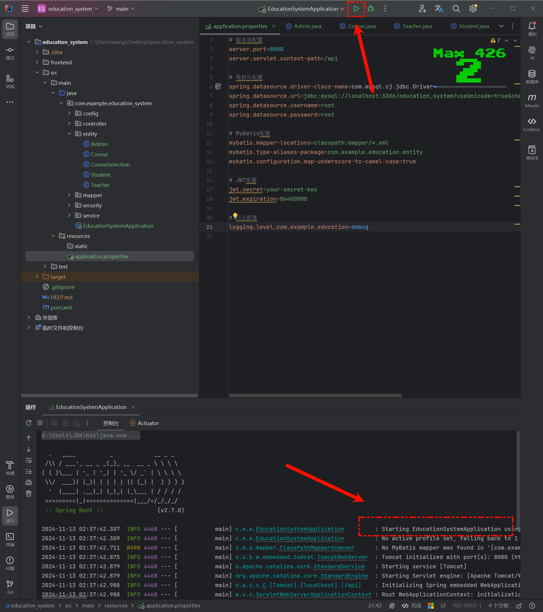

<!-- truncate -->

# AI开�教务管�系�

## èµ·å› 

### �因

�师给我们布置大作业,�是我想到结�ai的方�进行开�

| Prompt                                                       | Image                                                        |
| ------------------------------------------------------------ | ------------------------------------------------------------ |
| 本课程期末考核采用大作业的形�，旨在考核�学们对�点知识内容的�解情况以��践动手�作能力，�时考察�学们的编程�想和通过编程解决问题的能力，�点考察Spring框�技术和Mybatis框�技术，如�制�转的基本�想��赖注入���切�编程�SpringMVC技术的应用��久层设计和��等�br/>一�作业题目��求如下<br/>1.作业的基本�求���学设计并��一个基�SSM框�（Spring+SpringMVC+MyBatis）或SpringBoot的教务信�管�系统�br/>2.技术�求：数�库最好为MySQL，也�以是其他关系�数�库，编程语言为Java，web�务器软件为Tomcat，必须使用Spring框�和Mybatis框�（�许使用SpringBoot）�br/>3.工作��求：该系统包�三个角色：�师，学生，管�员。管�员的业务有�br/>�）添加，删除，修改，查看学生的信�br/>�）添加，删除，修改，查看�师的信�br/>�）添加，删除，修改，查看管�员的信�<br/>�）添加，删除，修改，查看课程的信�br/>�）登�br/>�师的业务有�br/>�）登�br/>�）录入，修改，查看选了自己教的课程的学生的�绩信�<br/>�）查看自己的个人信�，其中包括自己教的课�br/>学生的业务有�br/>�）登�br/>�）选择课程<br/>�）查看自己的个人信�，包括所选课程的�绩<br/>系统数�库的�个数�库表（�师表，学生表，管�员表等）的信�字段自行设计，但�能因为多字段或少字段影�上述功能。数�库对象（例如主键，外键等）的使用也是考察的�点。数�库表和字段的命�必须有�义，�能出�毫无�义的字段�或表��br/>系统的界��求整��观，并且能清晰地展示信�。使用HTML+CSS+JavaScript结�JSP完��端页�的设计和��，也�以用其他高级�端技术���br/>系统的�端�求代�结���，对应的方法和类有相应的注释，类�使用帕斯�命�法，���和方法�用驼峰命�法，能够正确��上文�求的业务�br/>4.�交内容：使用金山表�在线�交作业，�求�交数�库脚本��代�和系统�行讲解视频，具体内容�金山表��br/>二�考核时间安�<br/>2024�2�日下�点�完�大作业，�交到收作业的金山表��br/>三�考核说�<br/>�求�学开�独立完�大作业，�得相互抄袭。�则，一旦��全部按0分处�。逾期�交者，按缺考处����<br/>四�评分标�br/>1. 总�绩由平时�绩和大作业�绩组�，其中平时�绩�30％，平时�绩主�由学生平时考勤情况和课�作业完�情况组�，课程结��缺勤次数少�总课时的三分之一，在确认无记录错误情况�，�醒学生确认其考勤情况，确认缺课次数达到总课时的三分之一��消其考试�绩�br/>2. 大作业�绩总分�00分，��如下�br/>1）使用HTML+CSS+JavaScript结�JSP完��端页�的设计和��，也�以用其他高级�端技术��。（20分）<br/>2）使用SSM框�（Spring+SpringMVC+MyBatis）或SpringBoot���端。（60分）<br/>3）使用MySQL或其他关系�数�库完�数�库的设计和��。（20分） |  |

### 选择

��:���样的Prompt

| AI��       | 优点                                                         | 缺点                                                         | 图片�例                                                     |
| ------------ | ------------------------------------------------------------ | ------------------------------------------------------------ | ------------------------------------------------------------ |
| ChatGPT      | 有针对��领域的机器�生�步骤具体且整�是按阶段帮你��,更�一个�师在一步一步教�所以更适�用�交� | 稳定性���能是���文字长度,导致�答质�时好时�         |  |
| Claude       | Code�器,直�生�代�,而且质�很高.                          | 对�问答,有时候会一直��还�常��费�答长度有�,我�问了6个问�他就�给�问�|  |
| Gemini       | 动画�错,看�很���出�的�都是网上�以�考得到的,生�的�还有�稿,还是很�错的 | 创造性���够�活,我�问的详细一点�给出好一点的结�       |  |
| Bing copilot | 动画和界�是我最喜欢的一�让我感觉很舒�生�的内容还是中英文都有�也是�以引用网上资料�| 内容中规中矩,就是想找��记录一开始没找到.还有,我问�问�,�务器�然就维护�|  |
| 通义�问     | 有个指令中心,我�知�这么问的时��以在里�找,中文交�更适�交�,所以我还是喜欢把一些中文文档�给他,帮我讲解 | 写的内容有点简�并�能很好的��                            |  |
| 文心一言     | 表格化的�错,会先帮你整�内容,�能具体��,有个百�箱功��以切到更�适的场景 | 最傻的一��以更适�日常的交�                             |  |

### 结�

�所�综��看,最�我选择了Claude,他的�答很符�我的��所以用�写Code,ChatGPT交�更顺�用�写文�

## �作

### 第一步：基础�境�建

#### 1. �置开���

1. **开�工�*：本篇使用IDEA�开���VSCode�开��端�
2. **框�选择**：Spring Boot
3. **数��*：使�MySQL�
4. **�务�*：使�Tomcat�Spring Boot，�以直�内�Tomcat）�

#### 2. 创建项目

##### �端

- 如�使用的是 Spring Boot，�以通过 Spring Initializr �生�项目�

  - >首先进入[Spring Initializr](https://start.spring.io/),然�按照图上的进行���赖�以暂时�添�如�你想用Java 8 的�还是建议你用IDE�创� 

- 如�使用的是 SSM，�以在 IDE 中手动创建项目结�，并添加所需�赖�

  - >把�务器URL�� `https://start.aliyun.com/` 就�以使用Java 8 �
    >
    >
    >
    >�样的我们这里添加对应的 `Maven` �赖,这个�续也�以在 `POM` 文件里加也行,之�创建就好
    >
    >

##### �端

�在开始之��确�自己有 `node` �`Vue` 的��

```bash
node -v

npm -version

vue --version
```


�有了�境�我们就�以开始创建`Vue`项目�这里我们创建`Vue3`的项�

�首先,我们�以管�员身份�行`cmd`


��� `cd` 到项目里 

��我们使用命令`vue create frontend`�创建项�


这里我们选最�一�


用空格��制选择,选择图中内容��


�之�,我们选择`Vue3`

�是���存为这个项目作为一个模��存？我们输入`n`,然��车


看到这个界�,说�我们的项目已�创建�功了,也�以在文件夹中看到,我们创建的项��以输入�色的命���动项�这里就�演示�


#### 3. 项目结�

这里我们让AI为我们�供一个完整的教务管�系统项目结��tree �

```css
education-system/
├── pom.xml
├── src/
�  ├── main/
�  �  ├── java/
�  �  �  └── com/
�  �  �      └── example/
�  �  �          └── education/
�  �  �              ├── EducationSystemApplication.java
�  �  �              ├── config/
�  �  �              �  ├── SecurityConfig.java
�  �  �              �  ├── JwtAuthenticationEntryPoint.java
�  �  �              �  └── JwtRequestFilter.java
�  �  �              ├── controller/
�  �  �              �  ├── AdminController.java
�  �  �              �  ├── TeacherController.java
�  �  �              �  ├── StudentController.java
�  �  �              �  ├── CourseController.java
�  �  �              �  └── CourseSelectionController.java
�  �  �              ├── entity/
�  �  �              �  ├── Admin.java
�  �  �              �  ├── Teacher.java
�  �  �              �  ├── Student.java
�  �  �              �  ├── Course.java
�  �  �              �  └── CourseSelection.java
�  �  �              ├── mapper/
�  �  �              �  ├── AdminMapper.java
�  �  �              �  ├── TeacherMapper.java
�  �  �              �  ├── StudentMapper.java
�  �  �              �  ├── CourseMapper.java
�  �  �              �  └── CourseSelectionMapper.java
�  �  �              ├── service/
�  �  �              �  ├── AdminService.java
�  �  �              �  ├── TeacherService.java
�  �  �              �  ├── StudentService.java
�  �  �              �  ├── CourseService.java
�  �  �              �  └── CourseSelectionService.java
�  �  �              ├── security/
�  �  �              �  ├── CustomUserDetailsService.java
�  �  �              �  └── JwtUtils.java
�  �  �              └── EducationSystemApplication.java
�  �  └── resources/
�  �      ├── application.properties
�  �      └── mapper/
�  �          ├── AdminMapper.xml
�  �          ├── TeacherMapper.xml
�  �          ├── StudentMapper.xml
�  �          ├── CourseMapper.xml
�  �          └── CourseSelectionMapper.xml
�  └── test/
�      └── java/
�          └── com/
�              └── example/
�                  └── education/
�                      └── EducationSystemApplicationTests.java
└── frontend/
    ├── package.json
    ├── src/
    �  ├── main.js
    �  ├── App.vue
    �  ├── router.js
    �  ├── store.js
    �  ├── components/
    �  �  ├── Navbar.vue
    �  �  ├── AdminDashboard.vue
    �  �  ├── TeacherDashboard.vue
    �  �  ├── StudentDashboard.vue
    �  �  ├── CourseList.vue
    �  �  └── CourseSelection.vue
    �  └── views/
    �      ├── Login.vue
    �      ├── Register.vue
    �      ├── AdminPanel.vue
    �      ├── TeacherPanel.vue
    �      └── StudentPanel.vue
    └── public/
        ├── index.html
        └── favicon.ico
```

那么我们也就照�这个结��创建文�

| �端                                                         | �端                                                         |
| ------------------------------------------------------------ | ------------------------------------------------------------ |
|  |  |

#### 4. 设计数��

我们打开 `Navicat` 点击新建查询,然�将代�进�点击�行,刷新�表格就生�好�

```mysql
-- 创建数��
CREATE DATABASE IF NOT EXISTS education_system DEFAULT CHARSET utf8mb4;
USE education_system;

-- 管�员表
CREATE TABLE admin (
    id BIGINT PRIMARY KEY AUTO_INCREMENT COMMENT '管�员ID',
    username VARCHAR(50) NOT NULL UNIQUE COMMENT '用户�,
    password VARCHAR(100) NOT NULL COMMENT '密�',
    name VARCHAR(50) NOT NULL COMMENT '姓�',
    phone VARCHAR(20) COMMENT '�系电�',
    email VARCHAR(100) COMMENT '邮箱',
    create_time DATETIME DEFAULT CURRENT_TIMESTAMP COMMENT '创建时间',
    update_time DATETIME DEFAULT CURRENT_TIMESTAMP ON UPDATE CURRENT_TIMESTAMP COMMENT '更新时间'
) COMMENT '管�员表';

-- 教师�
CREATE TABLE teacher (
    id BIGINT PRIMARY KEY AUTO_INCREMENT COMMENT '教师ID',
    username VARCHAR(50) NOT NULL UNIQUE COMMENT '用户�,
    password VARCHAR(100) NOT NULL COMMENT '密�',
    name VARCHAR(50) NOT NULL COMMENT '姓�',
    title VARCHAR(50) COMMENT '�称',
    department VARCHAR(100) COMMENT '所�院�,
    phone VARCHAR(20) COMMENT '�系电�',
    email VARCHAR(100) COMMENT '邮箱',
    create_time DATETIME DEFAULT CURRENT_TIMESTAMP COMMENT '创建时间',
    update_time DATETIME DEFAULT CURRENT_TIMESTAMP ON UPDATE CURRENT_TIMESTAMP COMMENT '更新时间'
) COMMENT '教师�;

-- 学生�
CREATE TABLE student (
    id BIGINT PRIMARY KEY AUTO_INCREMENT COMMENT '学生ID',
    username VARCHAR(50) NOT NULL UNIQUE COMMENT '用户�,
    password VARCHAR(100) NOT NULL COMMENT '密�',
    name VARCHAR(50) NOT NULL COMMENT '姓�',
    student_no VARCHAR(50) NOT NULL UNIQUE COMMENT '学�',
    class_name VARCHAR(100) COMMENT '�级',
    major VARCHAR(100) COMMENT '专业',
    phone VARCHAR(20) COMMENT '�系电�',
    email VARCHAR(100) COMMENT '邮箱',
    create_time DATETIME DEFAULT CURRENT_TIMESTAMP COMMENT '创建时间',
    update_time DATETIME DEFAULT CURRENT_TIMESTAMP ON UPDATE CURRENT_TIMESTAMP COMMENT '更新时间'
) COMMENT '学生�;

-- 课程�
CREATE TABLE course (
    id BIGINT PRIMARY KEY AUTO_INCREMENT COMMENT '课程ID',
    name VARCHAR(100) NOT NULL COMMENT '课程�称',
    code VARCHAR(50) NOT NULL UNIQUE COMMENT '课程代�',
    credit DECIMAL(3,1) NOT NULL COMMENT '学分',
    hours INT NOT NULL COMMENT '课时',
    teacher_id BIGINT NOT NULL COMMENT '�课教师ID',
    max_student INT NOT NULL DEFAULT 100 COMMENT '最大选课人数',
    description TEXT COMMENT '课程�述',
    create_time DATETIME DEFAULT CURRENT_TIMESTAMP COMMENT '创建时间',
    update_time DATETIME DEFAULT CURRENT_TIMESTAMP ON UPDATE CURRENT_TIMESTAMP COMMENT '更新时间',
    FOREIGN KEY (teacher_id) REFERENCES teacher(id)
) COMMENT '课程�;

-- 选课�
CREATE TABLE course_selection (
    id BIGINT PRIMARY KEY AUTO_INCREMENT COMMENT '选课ID',
    student_id BIGINT NOT NULL COMMENT '学生ID',
    course_id BIGINT NOT NULL COMMENT '课程ID',
    score DECIMAL(5,2) COMMENT '�绩',
    select_time DATETIME DEFAULT CURRENT_TIMESTAMP COMMENT '选课时间',
    create_time DATETIME DEFAULT CURRENT_TIMESTAMP COMMENT '创建时间',
    update_time DATETIME DEFAULT CURRENT_TIMESTAMP ON UPDATE CURRENT_TIMESTAMP COMMENT '更新时间',
    FOREIGN KEY (student_id) REFERENCES student(id),
    FOREIGN KEY (course_id) REFERENCES course(id),
    UNIQUE KEY `uk_student_course` (student_id, course_id)
) COMMENT '选课�;

-- �入测试数�
INSERT INTO admin (username, password, name, phone, email) 
VALUES ('admin', '$2a$10$N.zmdr9k7uOCQb376NoUnuTJ8iAt6Z5EHsM8lE9lBOsl7iKTVKIUi', '管��, '13800138000', 'admin@example.com');

INSERT INTO teacher (username, password, name, title, department, phone, email)
VALUES 
('teacher1', '$2a$10$N.zmdr9k7uOCQb376NoUnuTJ8iAt6Z5EHsM8lE9lBOsl7iKTVKIUi', '张�师', '副教�, '计算机系', '13800138001', 'teacher1@example.com'),
('teacher2', '$2a$10$N.zmdr9k7uOCQb376NoUnuTJ8iAt6Z5EHsM8lE9lBOsl7iKTVKIUi', '��师', '教�', '数学�, '13800138002', 'teacher2@example.com');

INSERT INTO student (username, password, name, student_no, class_name, major, phone, email)
VALUES 
('student1', '$2a$10$N.zmdr9k7uOCQb376NoUnuTJ8iAt6Z5EHsM8lE9lBOsl7iKTVKIUi', '���, '2021001', '计算�101', '计算机科学�技�, '13800138003', 'student1@example.com'),
('student2', '$2a$10$N.zmdr9k7uOCQb376NoUnuTJ8iAt6Z5EHsM8lE9lBOsl7iKTVKIUi', '刘��, '2021002', '计算�101', '计算机科学�技�, '13800138004', 'student2@example.com');
```


#### 5. 添加�赖

将�赖添加到 `pom.xml` ,你也�以直�全部�制粘贴

```xml
<?xml version="1.0" encoding="UTF-8"?>
<project xmlns="http://maven.apache.org/POM/4.0.0" xmlns:xsi="http://www.w3.org/2001/XMLSchema-instance"
         xsi:schemaLocation="http://maven.apache.org/POM/4.0.0 https://maven.apache.org/xsd/maven-4.0.0.xsd">
    <modelVersion>4.0.0</modelVersion>
    <groupId>com.example</groupId>
    <artifactId>education_system</artifactId>
    <version>0.0.1-SNAPSHOT</version>
    <name>education_system</name>
    <description>education_system</description>
    <properties>
        <java.version>1.8</java.version>
        <project.build.sourceEncoding>UTF-8</project.build.sourceEncoding>
        <project.reporting.outputEncoding>UTF-8</project.reporting.outputEncoding>
        <spring-boot.version>2.6.13</spring-boot.version>
    </properties>
    <dependencies>
        <dependency>
            <groupId>org.springframework.boot</groupId>
            <artifactId>spring-boot-starter-security</artifactId>
        </dependency>
        <dependency>
            <groupId>org.springframework.boot</groupId>
            <artifactId>spring-boot-starter-validation</artifactId>
        </dependency>
        <dependency>
            <groupId>org.springframework.boot</groupId>
            <artifactId>spring-boot-starter-web</artifactId>
        </dependency>
        <dependency>
            <groupId>org.mybatis.spring.boot</groupId>
            <artifactId>mybatis-spring-boot-starter</artifactId>
            <version>2.2.2</version>
        </dependency>

        <dependency>
            <groupId>com.mysql</groupId>
            <artifactId>mysql-connector-j</artifactId>
            <scope>runtime</scope>
        </dependency>
        <dependency>
            <groupId>org.projectlombok</groupId>
            <artifactId>lombok</artifactId>
            <optional>true</optional>
        </dependency>
        <dependency>
            <groupId>org.springframework.boot</groupId>
            <artifactId>spring-boot-starter-test</artifactId>
            <scope>test</scope>
        </dependency>
        <dependency>
            <groupId>org.springframework.security</groupId>
            <artifactId>spring-security-test</artifactId>
            <scope>test</scope>
        </dependency>
    </dependencies>
    <dependencyManagement>
        <dependencies>
            <dependency>
                <groupId>org.springframework.boot</groupId>
                <artifactId>spring-boot-dependencies</artifactId>
                <version>${spring-boot.version}</version>
                <type>pom</type>
                <scope>import</scope>
            </dependency>
        </dependencies>
    </dependencyManagement>

    <build>
        <plugins>
            <plugin>
                <groupId>org.apache.maven.plugins</groupId>
                <artifactId>maven-compiler-plugin</artifactId>
                <version>3.8.1</version>
                <configuration>
                    <source>1.8</source>
                    <target>1.8</target>
                    <encoding>UTF-8</encoding>
                </configuration>
            </plugin>
            <plugin>
                <groupId>org.springframework.boot</groupId>
                <artifactId>spring-boot-maven-plugin</artifactId>
                <version>${spring-boot.version}</version>
                <configuration>
                    <mainClass>com.example.education_system.EducationSystemApplication</mainClass>
                    <skip>true</skip>
                </configuration>
                <executions>
                    <execution>
                        <id>repackage</id>
                        <goals>
                            <goal>repackage</goal>
                        </goals>
                    </execution>
                </executions>
            </plugin>
        </plugins>
    </build>

</project>
```

添加完��记得更新


#### 6. �置Spring boot文件

我们找到 `application.properties` 文件,�置Spring boot

```properties
# �务器��
server.port=8080
server.servlet.context-path=/api

# 数�库��
spring.datasource.driver-class-name=com.mysql.cj.jdbc.Driver
spring.datasource.url=jdbc:mysql://localhost:3306/education_system?useUnicode=true&characterEncoding=utf-8&serverTimezone=Asia/Shanghai
spring.datasource.username=root
spring.datasource.password=root

# MyBatis�置
mybatis.mapper-locations=classpath:mapper/*.xml
mybatis.type-aliases-package=com.example.education.entity
mybatis.configuration.map-underscore-to-camel-case=true

# JWT�置
jwt.secret=your-secret-key
jwt.expiration=86400000

# 日志�置
logging.level.com.example.education=debug
```

�置好�,我们就�以�动了,这样表示�动�功


#### 7. �体�

�让我们��体类开始�

�这里我们定义了管�员�教师�学生�课程和选课信�的�体类。使用了Lombok注解�简化代��

报错的代�我们需�导入类.快�键是 `ALT` + `Enter` 

```java
// Admin.java
@Data
@Builder
@NoArgsConstructor
@AllArgsConstructor
public class Admin {
    private Long id;
    private String username;
    private String password;
    private String name;
    private String phone;
    private String email;
    private Date createTime;
    private Date updateTime;
}

// Teacher.java 
@Data
@Builder
@NoArgsConstructor
@AllArgsConstructor
public class Teacher {
    private Long id;
    private String username;
    private String password;
    private String name;
    private String title;
    private String department;
    private String phone;
    private String email;
    private Date createTime;
    private Date updateTime;
}

// Student.java
@Data
@Builder
@NoArgsConstructor
@AllArgsConstructor
public class Student {
    private Long id;
    private String username;
    private String password;
    private String name;
    private String studentNo;
    private String className;
    private String major;
    private String phone;
    private String email;
    private Date createTime;
    private Date updateTime;
}

// Course.java
@Data
@Builder
@NoArgsConstructor
@AllArgsConstructor
public class Course {
    private Long id;
    private String name;
    private String code;
    private BigDecimal credit;
    private Integer hours;
    private Long teacherId;
    private Integer maxStudent;
    private String description;
    private Date createTime;
    private Date updateTime;
}

// CourseSelection.java
@Data
@Builder
@NoArgsConstructor
@AllArgsConstructor
public class CourseSelection {
    private Long id;
    private Long studentId;
    private Long courseId;
    private BigDecimal score;
    private Date selectTime;
    private Date createTime;
    private Date updateTime;
}
```

��下�我们���数�访问层�

#### 8. Mapper��

��下�我们���数�访问层�

�这里定义了�个�体的Mapper��,包括�删改查等基本�作�

```java
// AdminMapper.java
@Mapper
public interface AdminMapper {
    Admin getAdminByUsername(String username);
    int insertAdmin(Admin admin);
    int updateAdmin(Admin admin);
    int deleteAdminById(Long id);
}

// TeacherMapper.java
@Mapper
public interface TeacherMapper {
    Teacher getTeacherByUsername(String username);
    List<Teacher> listTeachers();
    int insertTeacher(Teacher teacher);
    int updateTeacher(Teacher teacher);
    int deleteTeacherById(Long id);
}

// StudentMapper.java 
@Mapper
public interface StudentMapper {
    Student getStudentByUsername(String username);
    Student getStudentByStudentNo(String studentNo);
    List<Student> listStudents();
    int insertStudent(Student student);
    int updateStudent(Student student);
    int deleteStudentById(Long id);
}

// CourseMapper.java
@Mapper
public interface CourseMapper {
    Course getCourseById(Long id);
    List<Course> listCourses();
    int insertCourse(Course course);
    int updateCourse(Course course);
    int deleteCourseById(Long id);
}

// CourseSelectionMapper.java
@Mapper
public interface CourseSelectionMapper {
    CourseSelection getCourseSelectionById(Long id);
    List<CourseSelection> listCourseSelectionsByStudentId(Long studentId);
    List<CourseSelection> listCourseSelectionsByCourseId(Long courseId);
    int insertCourseSelection(CourseSelection courseSelection);
    int updateCourseSelection(CourseSelection courseSelection);
    int deleteCourseSelectionById(Long id);
}
```

#### 9. Service��

��下�我们���务层的逻辑�

�在�务层,我们��了�个�体的CRUD�作�

```Java
// AdminService.java
@Service
@Transactional
public class AdminService {
