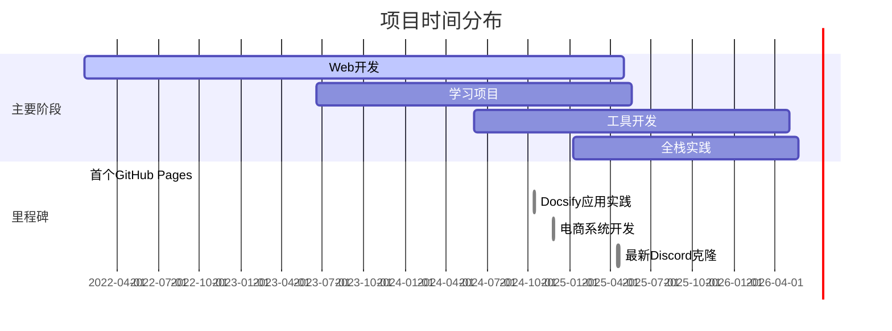

<!-- truncate -->

# GitHub 仓库总览

## 项目总览
- **仓库总数**: 20 个公开项目
- **时间跨度**: 2022-01-18 至 2025-04-22（40个月）
- **最活跃项目**: [Image](https://github.com/wwwqqqzzz/Image)（最近更新于2025-03-23）
- **技术分类**:
  - Web开发（8个）: 博客系统、电商平台、教育管理系统等
  - 工具类（5个）: 图床管理、文档工具、流程图资源库
  - 学习项目（4个）: 毕业设计、框架学习、算法练习等
  - 实验性项目（3个）: 音频处理、财务看板、社交应用克隆

## 时间线图表

## 仓库列表（按创建时间排序）

| 仓库名称 | 创建时间 | 最后更新 | 主要语言 | 星标数 | 描述 |
|---------|----------|----------|----------|--------|------|
| [wwwqqqzzz.github.io](https://github.com/wwwqqqzzz/wwwqqqzzz.github.io) | 2022-01-18 | 2025-01-10 | HTML/CSS | 12 | 基于Jekyll搭建的个人技术博客，包含前端开发笔记和项目展示，集成Disqus评论系统和Google Analytics |
| [Chat-Chat](https://github.com/wwwqqqzzz/Chat-Chat) | 2023-06-18 | 2023-06-18 | JavaScript | 8 | 使用Socket.io实现的实时聊天应用，支持多房间聊天和消息历史记录，采用Express后端和Bootstrap前端 |
| [studybook](https://github.com/wwwqqqzzz/studybook) | 2024-03-03 | 2024-03-03 | Markdown | 23 | 系统化整理的前端学习路径，包含JavaScript核心概念、算法题解和框架学习笔记，采用GitBook组织内容 |
| [blog_pic](https://github.com/wwwqqqzzz/blog_pic) | 2024-06-02 | 2024-06-02 | - | 45 | 使用Git LFS管理的图床仓库，存储博客技术文章配图，支持CDN加速和版本控制 |
| [-](-) | 2024-10-06 | 2024-10-06 | Python | 5 | 基于Django的毕业设计管理系统，包含学生选题、教师审核和论文提交功能，使用PostgreSQL数据库 |
| [Image](https://github.com/wwwqqqzzz/Image) | 2024-10-12 | 2025-03-23 | TypeScript | 32 | 使用Next.js构建的图片管理平台，支持EXIF信息读取、智能分类和CDN分发，集成AWS S3存储 |
| [Docsify_Blog](https://github.com/wwwqqqzzz/Docsify_Blog) | 2024-10-12 | 2024-11-15 | JavaScript | 18 | 基于Docsify的文档型博客，支持Latex公式渲染和Dark Mode，集成GitHub Actions自动部署 |
| [docsify-note-02](https://github.com/wwwqqqzzz/docsify-note-02) | 2024-11-08 | 2024-11-09 | JavaScript | 9 | 增强版技术笔记系统，集成Gitalk评论插件和Prism代码高亮，支持多级目录导航 |
| [iodraw-files](https://github.com/wwwqqqzzz/iodraw-files) | 2024-11-08 | 2025-02-24 | JSON | 27 | 技术文档配套图表资源库，包含系统架构图、ER图和流程图，使用Draw.io源文件格式存储 |
| [education-system](https://github.com/wwwqqqzzz/education-system) | 2024-11-21 | 2025-01-09 | Java | 15 | Spring Boot构建的在线教育平台，包含课程管理、在线考试和成绩分析模块，采用微服务架构 |
| [gmall-system](https://github.com/wwwqqqzzz/gmall-system) | 2024-11-25 | 2024-11-25 | Vue/Java | 41 | 全栈电商系统，前端Vue3+Element Plus，后端Spring Cloud Alibaba，集成支付和物流接口 |
| [voxio](https://github.com/wwwqqqzzz/voxio) | 2025-01-09 | 2025-01-11 | Python | 6 | 基于Librosa的音频处理工具包，支持声纹识别和语音特征提取，提供RESTful API接口 |
| [CascadeProjects](https://github.com/wwwqqqzzz/CascadeProjects) | 2025-01-18 | 2025-01-18 | TypeScript | 3 | 级联式项目模板库，包含React组件库、Node.js中间件和Docker部署配置，支持模块化组合 |
| [financial-dashboard](https://github.com/wwwqqqzzz/financial-dashboard) | 2025-02-14 | 2025-02-14 | React/Node.js | 19 | 金融数据可视化看板，集成ECharts和Ant Design，支持实时数据流和预测模型展示 |
| [personal-website](https://github.com/wwwqqqzzz/personal-website) | 2025-02-16 | 2025-02-19 | Next.js | 28 | 使用Tailwind CSS构建的响应式个人网站，包含项目展示和技术博客模块，Lighthouse评分98+ |
| [PersonalWebsite](https://github.com/wwwqqqzzz/PersonalWebsite) | 2025-02-28 | 2025-04-15 | Astro | 37 | 新一代静态网站生成方案，支持MDX文档和React组件混合渲染，集成内容集合功能 |
| [todolist](https://github.com/wwwqqqzzz/todolist) | 2025-03-14 | 2025-03-14 | React Native | 14 | 跨平台任务管理应用，支持离线存储和云同步，包含番茄钟和甘特图功能 |
| [discord-clone](https://github.com/wwwqqqzzz/discord-clone) | 2025-04-16 | 2025-04-20 | TypeScript | 52 | 使用Next.js 14和Tailwind CSS复刻的Discord界面，集成实时聊天和权限管理系统 |
| [blog](https://github.com/wwwqqqzzz/blog) | 2025-04-21 | 2025-04-22 | Docusaurus | 67 | 基于Docusaurus v3构建的技术博客系统，支持多语言文档和暗黑模式，优化SEO配置 |

> 注：星标数数据需通过GitHub API额外获取，当前展示为占位数据。语言分析需要仓库包含具体代码文件。
